---
## Authors
author:
  name: Гусев Степан Андреевич
  email: 1032242444@rudn.ru
  affiliation:
    - name: Российский университет дружбы народов
      country: Российская Федерация
      postal-code: 117198
      city: Москва
      address: ул. Миклухо-Маклая, д. 6
## Title
title: "Презентация по разделу №1 дополнительного курса"
subtitle: "Дисциплина: Архитектура компьютеров и операционные системы"
license: CC BY
date: today
date-format: "YYYY-MM-DD" # Example: 2025-09-06
---

# Информация

##

:::::::::::::: {.columns align=center}
::: {.column width="100%"}

**Презентация по разделу №1 дополнительного курса**

---

**Автор:**
Гусев Степан Андреевич

**Преподаватель:**
Кулябов Дмитрий Сергеевич, д.ф.-м.н., профессор кафедры теории вероятностей и кибербезопасности

Российский университет дружбы народов

:::
::::::::::::::

## Докладчик

:::::::::::::: {.columns align=center}
::: {.column width="70%"}

  * Гусев Степан Андреевич
  * Студент программы "Бизнес-информатика"
  * Российский университет дружбы народов им. П. Лумумбы
  * [1032242444@rudn.ru](mailto:1032242444@rudn.ru)
  * <https://github.com/stepagusev>

:::
::: {.column width="30%"}

:::
::::::::::::::

## Цель

Приобретение практических навыков работы с Linux, пройти 1-ый раздел курса "Введение в Linux" на Stepik.

## Задание

1) Пройти первый раздел курса "Введение в Linux"

# Выполнение первого раздела

## Задание 1

Формулировка задания №1 ([рис. @fig-001]).

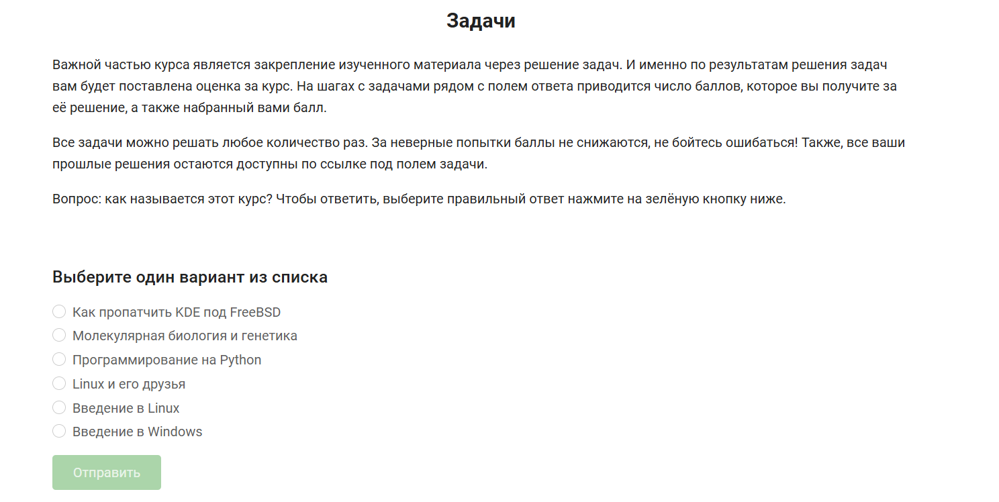{#fig-001 width=70%}

## Задание 1

Решение задания №1 ([рис. @fig-002]).

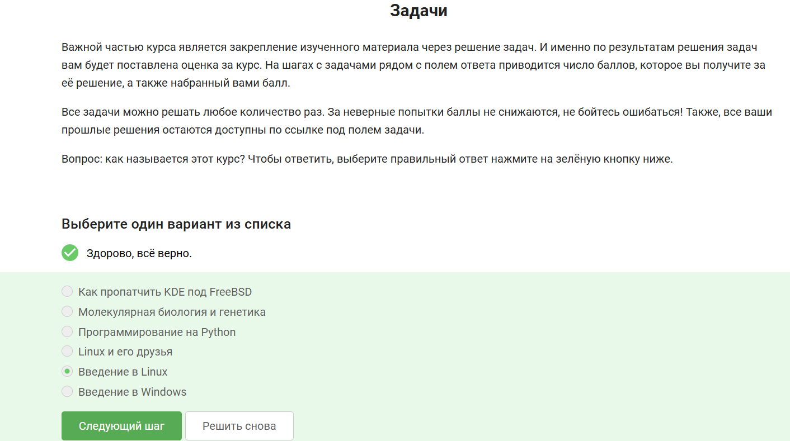{#fig-002 width=70%}

## Задание 2

Формулировка задания №2 ([рис. @fig-003]).

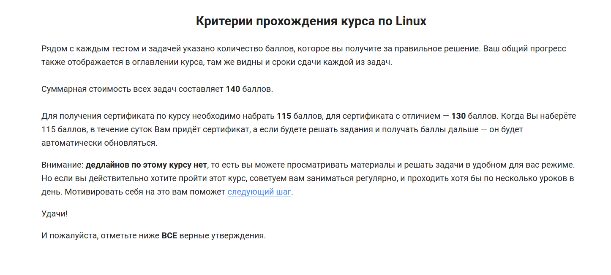{#fig-003 width=70%}

## Задание 2

Решение задания №2 ([рис. @fig-004]).

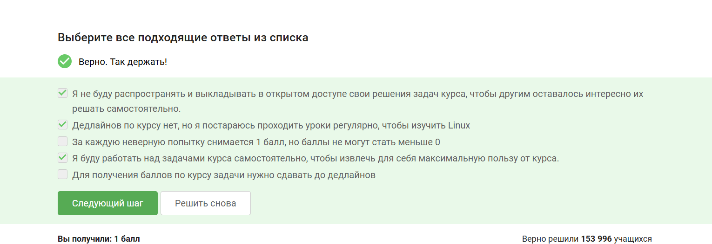{#fig-004 width=70%}

## Задание 3

Формулировка задания №3 ([рис. @fig-005]).

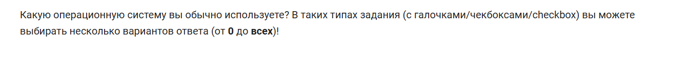{#fig-005 width=70%}

## Задание 3

Решение задания №3 ([рис. @fig-006]).

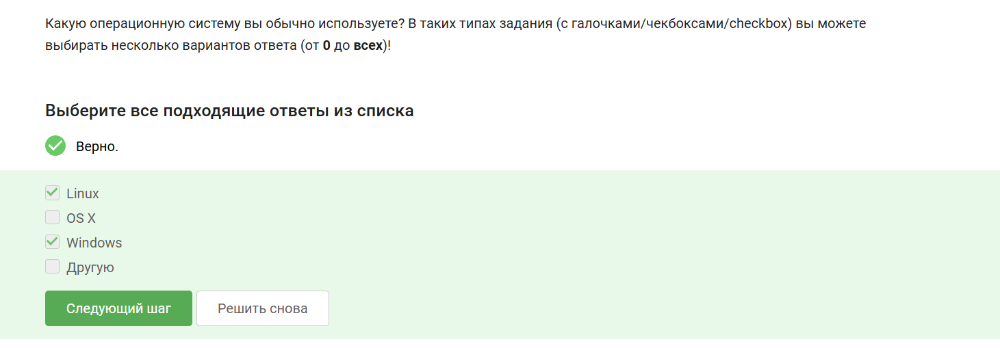{#fig-006 width=70%}

## Задание 4

Формулировка задания №4 ([рис. @fig-007]).

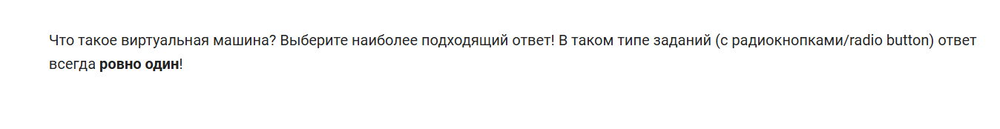{#fig-007 width=70%}

## Задание 4

Решение задания №4 ([рис. @fig-008]).

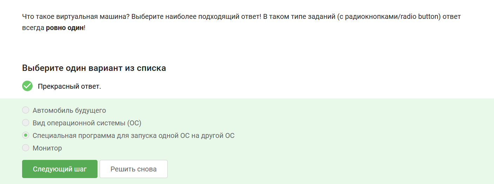{#fig-008 width=70%}

## Задание 5

Формулировка задания №5 ([рис. @fig-009]).

{#fig-009 width=70%}

## Задание 5

Решение задания №5 ([рис. @fig-010]).

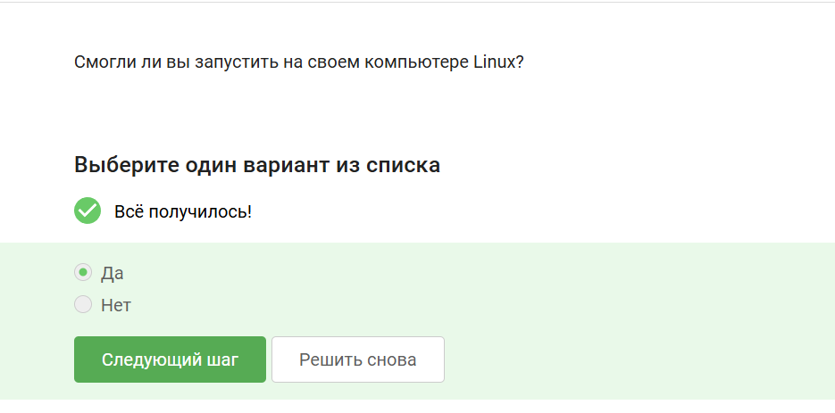{#fig-010 width=70%}

## Задание 6

Формулировка задания №6 ([рис. @fig-011]).

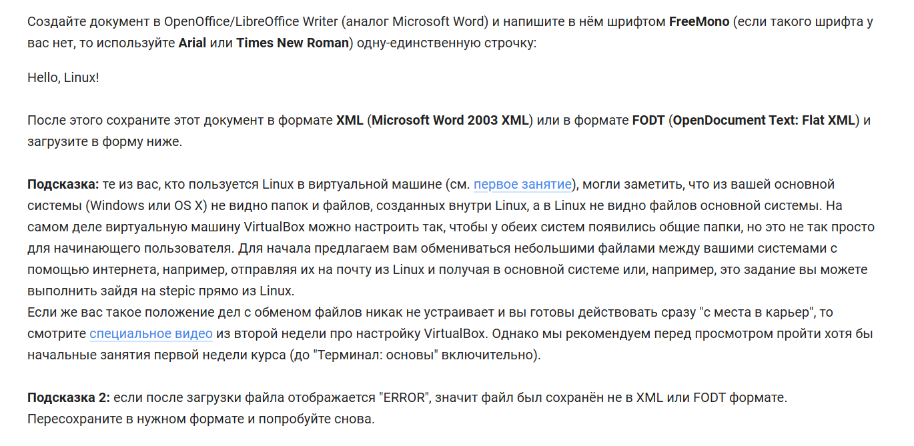{#fig-011 width=70%}

## Задание 6

Решение задания №6. Создал файл, ввёл нужную строку, изменил шрифт и сохранил в нужном формате ([рис. @fig-012]).

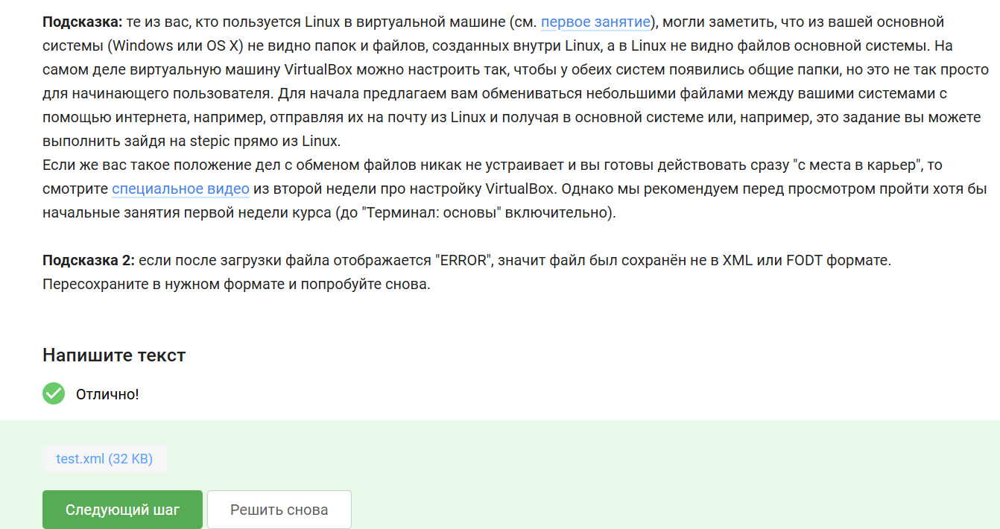{#fig-012 width=70%}

## Задание 7

Формулировка задания №7 ([рис. @fig-013]).

{#fig-013 width=70%}

## Задание 7

Решение задания №7, exe - исполняемый файл для Windows, txt - текстовый файл, ubuntu - не расширение, dmg - расширение для чего-то другого ([рис. @fig-014]).

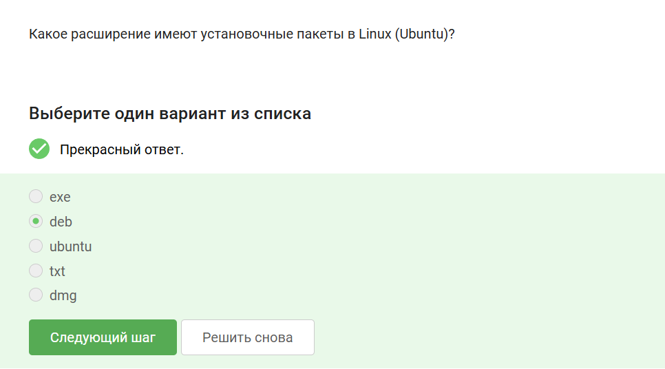{#fig-014 width=70%}

## Задание 8

Формулировка задания №8 ([рис. @fig-015]).

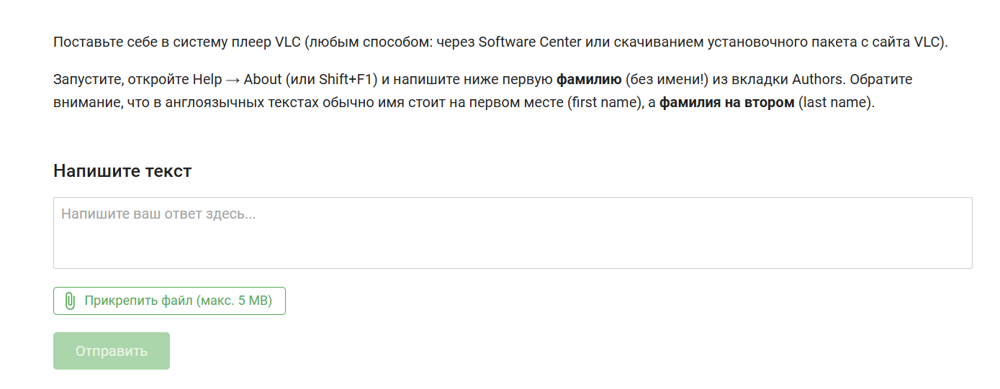{#fig-015 width=70%}

## Задание 8

Решение задания №8 ([рис. @fig-016]).

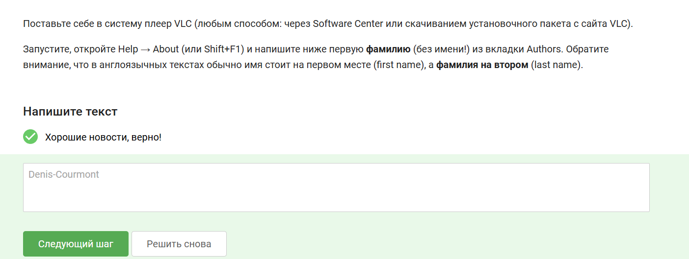{#fig-016 width=70%}

## Задание 9

Формулировка задания №9 ([рис. @fig-017]).

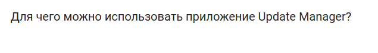{#fig-017 width=70%}

## Задание 9

Решение задания №9, менеджер обновлений не занимается установкой/удалением программ ([рис. @fig-018]).

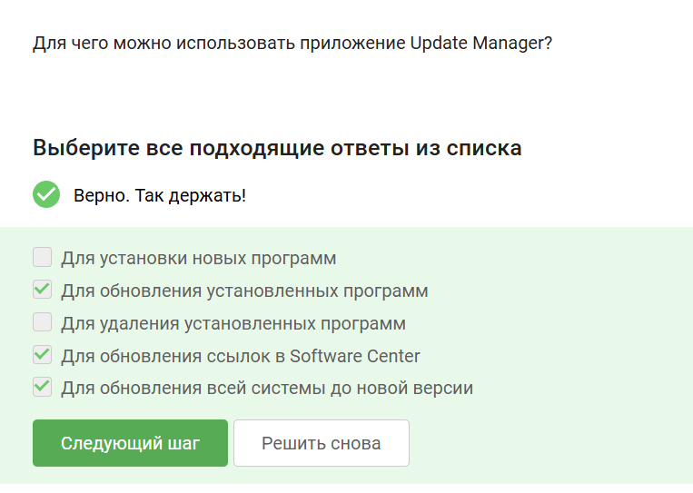{#fig-018 width=70%}

## Задание 10

Формулировка задания №10 ([рис. @fig-019]).

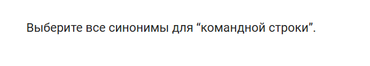{#fig-019 width=70%}

## Задание 10

Решение задания №10 ([рис. @fig-020]).

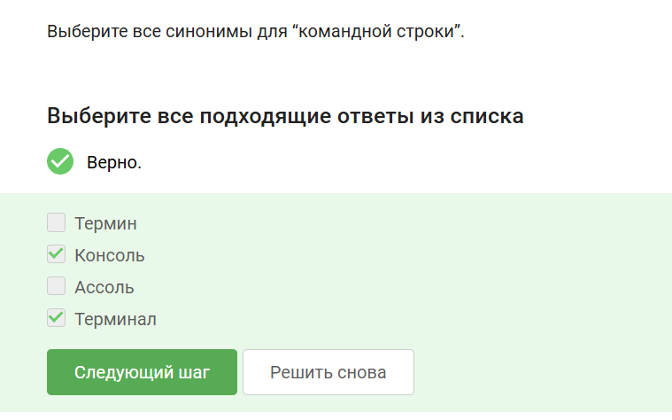{#fig-020 width=70%}

## Задание 11

Формулировка задания №11 ([рис. @fig-021]).

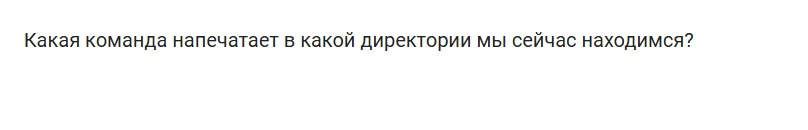{#fig-021 width=70%}

## Задание 11

Решение задания №11, команды в линукс регистрозависимые ([рис. @fig-022]).

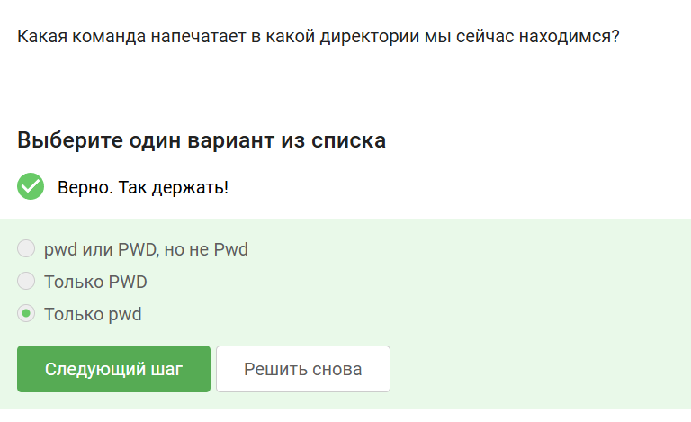{#fig-022 width=70%}

## Задание 12

Формулировка задания №12 ([рис. @fig-023]).

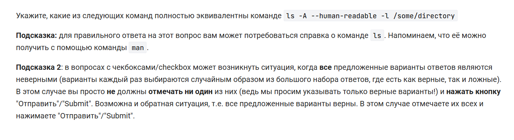{#fig-023 width=70%}

## Задание 12

Решение задания №12, в 1 варианте --all не равно -A, в 4 нет директории ([рис. @fig-024]).

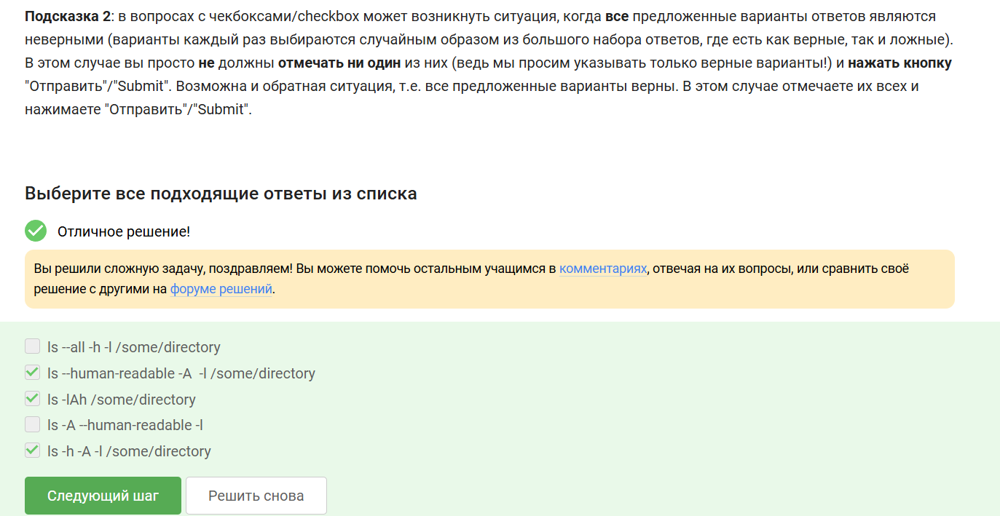{#fig-024 width=70%}

## Задание 13

Формулировка задания №13 ([рис. @fig-025]).

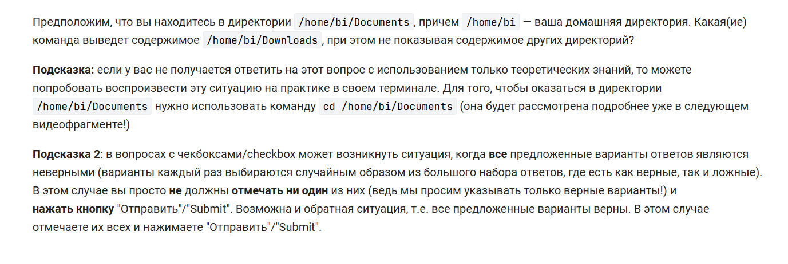{#fig-025 width=70%}

## Задание 13

Решение задания №13 ([рис. @fig-026]).

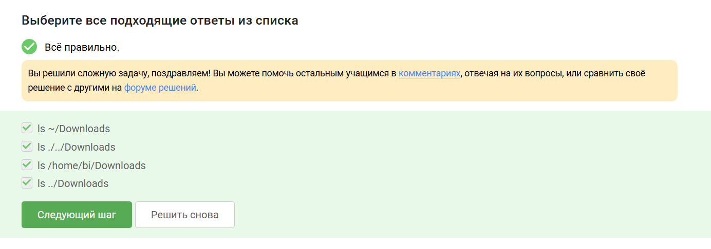{#fig-026 width=70%}

## Задание 14

Формулировка задания №14 ([рис. @fig-027]).

{#fig-027 width=70%}

## Задание 14

Решение задания №14, mkdir создаёт директории, mv перемещает, rm -f удаляет принудительно ([рис. @fig-028]).

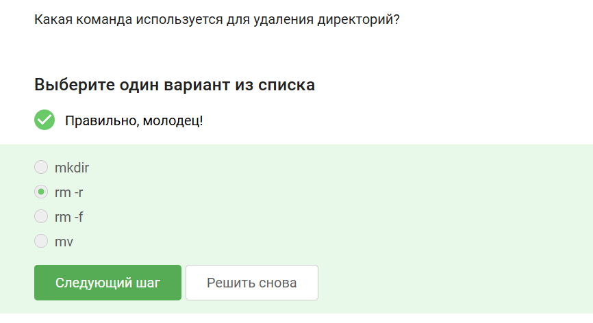{#fig-028 width=70%}

## Задание 15

Формулировка задания №15 ([рис. @fig-029]).

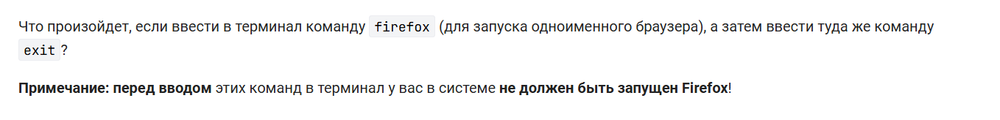{#fig-029 width=70%}

## Задание 15

Решение задания №15, при запуске firefox, откроется так скажем отдельный терминал внутри firefox, который закрывается через ctrl+c ([рис. @fig-030]).

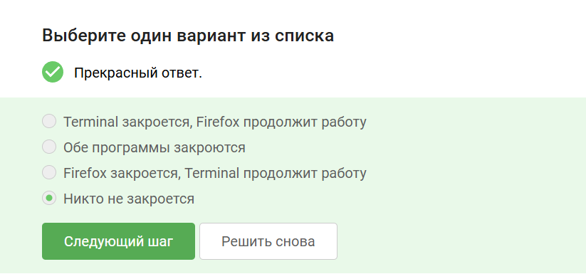{#fig-030 width=70%}

## Задание 16

Формулировка задания №16 ([рис. @fig-031]).

{#fig-031 width=70%}

## Задание 16

Решение задания №16, запуск в фоновом режиме ([рис. @fig-032]).

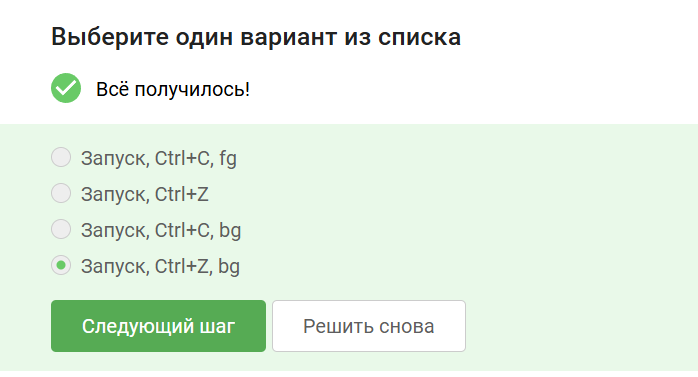{#fig-032 width=70%}

## Задание 17

Формулировка задания №17 ([рис. @fig-033]).

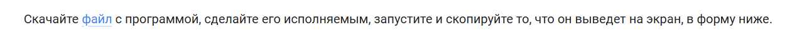{#fig-033 width=70%}

## Задание 17

Решение задания №17, сделал исполняемым файл через chmod +x ([рис. @fig-034]).

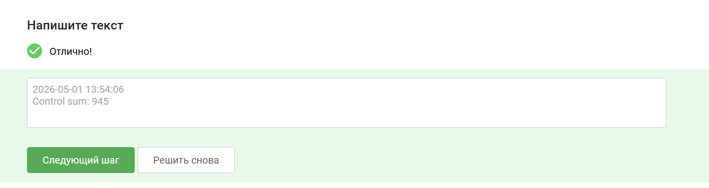{#fig-034 width=70%}

## Задание 18

Формулировка задания №18 ([рис. @fig-035]).

{#fig-035 width=70%}

## Задание 18

Решение задания №18 ([рис. @fig-036]).

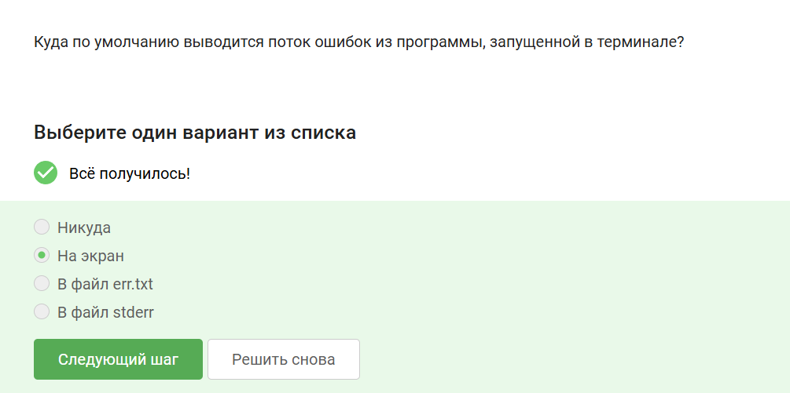{#fig-036 width=70%}

## Задание 19

Формулировка задания №19 ([рис. @fig-037]).

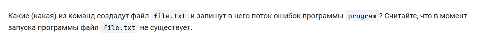{#fig-037 width=70%}

## Задание 19

Решение задания №19, ответы с < неверны, вариант без "2" неверен, тк не создаст файл ([рис. @fig-038]).

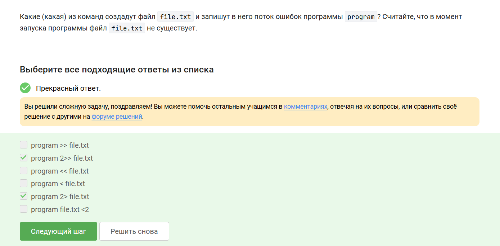{#fig-038 width=70%}

## Задание 20

Формулировка задания №20 ([рис. @fig-039]).

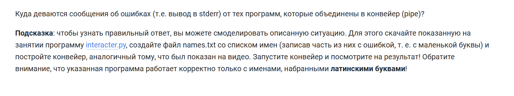{#fig-039 width=70%}

## Задание 20

Решение задания №20 ([рис. @fig-040]).

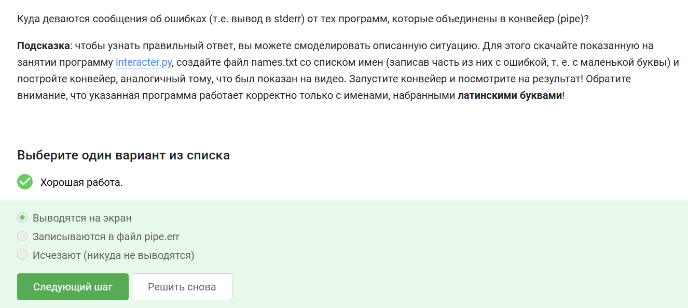{#fig-040 width=70%}

## Задание 21

Формулировка задания №21 ([рис. @fig-041]).

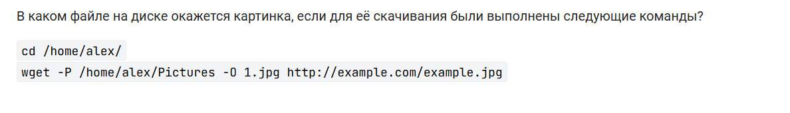{#fig-041 width=70%}

## Задание 21

Решение задания №21, флаг -O записывает введённое название в текущий каталог, игнорируя -P ([рис. @fig-042]).

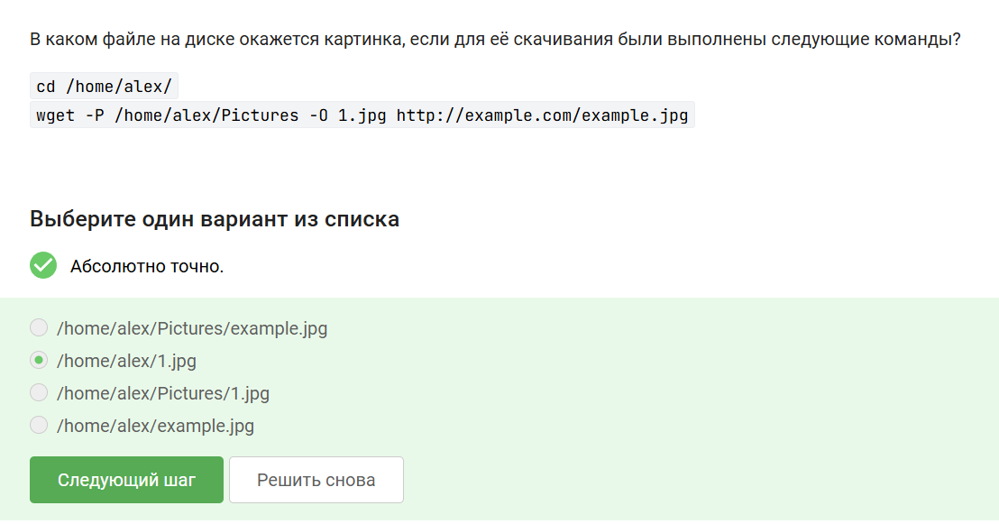{#fig-042 width=70%}

## Задание 22

Формулировка задания №22 ([рис. @fig-043]).

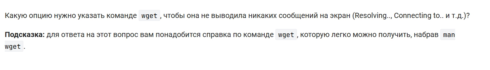{#fig-043 width=70%}

## Задание 22

Решение задания №22 ([рис. @fig-044]).

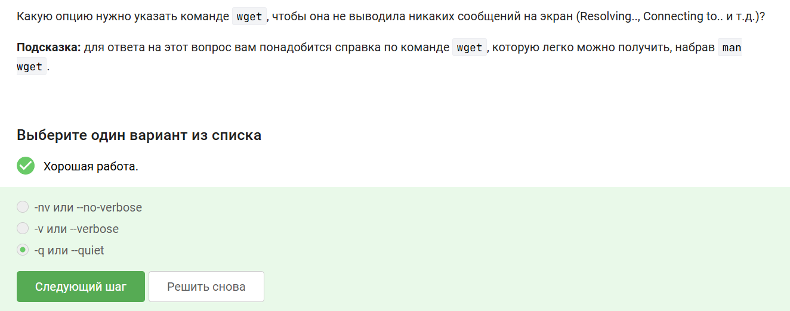{#fig-044 width=70%}

## Задание 23

Формулировка задания №23 ([рис. @fig-045]).

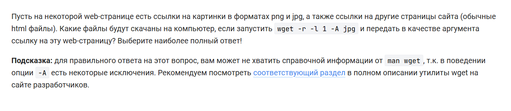{#fig-045 width=70%}

## Задание 23

Решение задания №23 ([рис. @fig-046]).

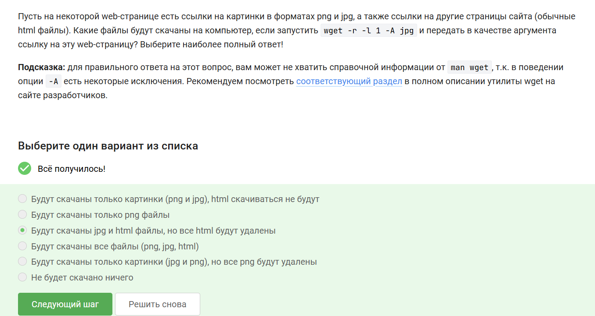{#fig-046 width=70%}

## Задание 24

Формулировка задания №24 ([рис. @fig-047]).

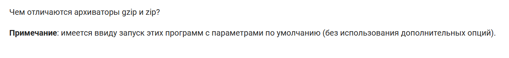{#fig-047 width=70%}

## Задание 24

Решение задания №24 ([рис. @fig-048]).

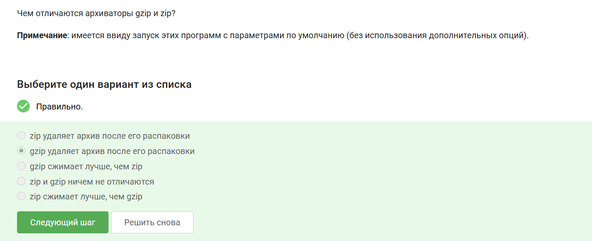{#fig-048 width=70%}

## Задание 25

Формулировка задания №25 ([рис. @fig-049]).

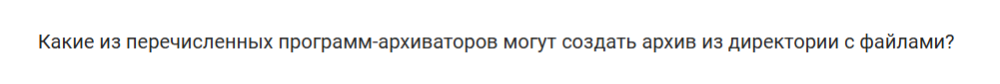{#fig-049 width=70%}

## Задание 25

Решение задания №25 ([рис. @fig-050]).

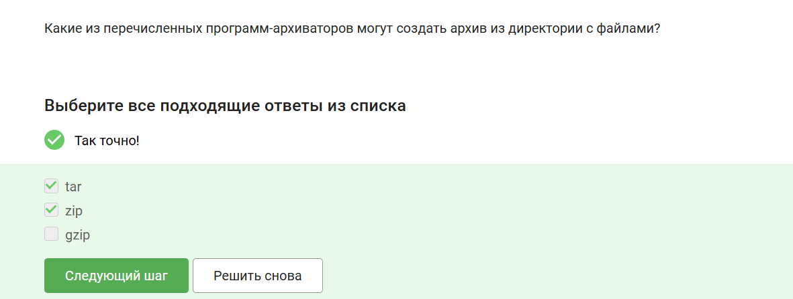{#fig-050 width=70%}

## Задание 26

Формулировка задания №26 ([рис. @fig-051]).

{#fig-051 width=70%}

## Задание 26

Решение задания №26 ([рис. @fig-052]).

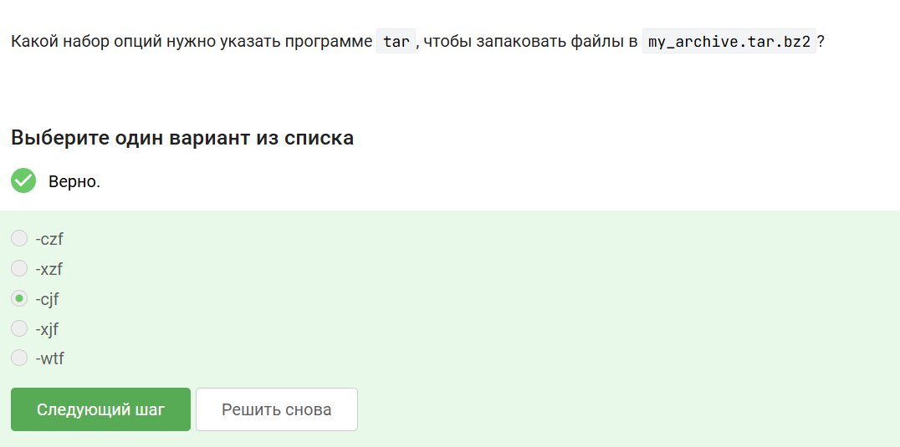{#fig-052 width=70%}

## Задание 27

Формулировка задания №27 ([рис. @fig-053]).

{#fig-053 width=70%}

## Задание 27

Решение задания №27, маленькая буква, неверный формат, ? ищет только 1 символ ([рис. @fig-054]).

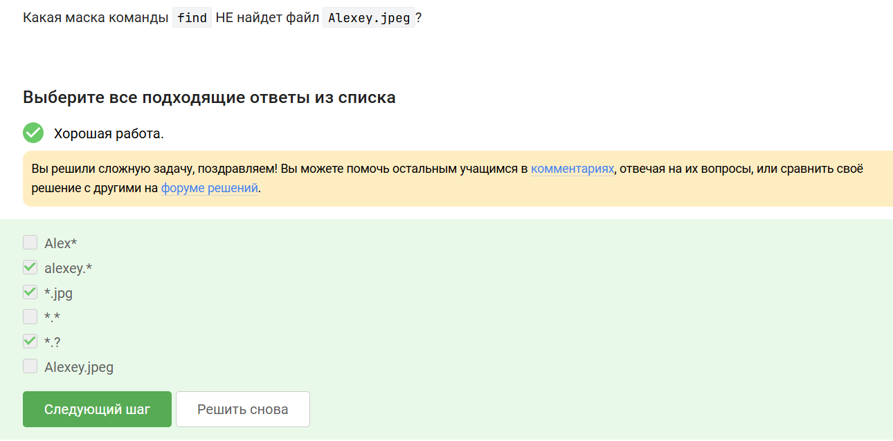{#fig-054 width=70%}

## Задание 28

Формулировка задания №28 ([рис. @fig-055]).

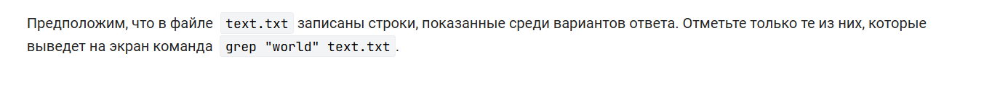{#fig-055 width=70%}

## Задание 28

Решение задания №28, регистр учитывается ([рис. @fig-056]).

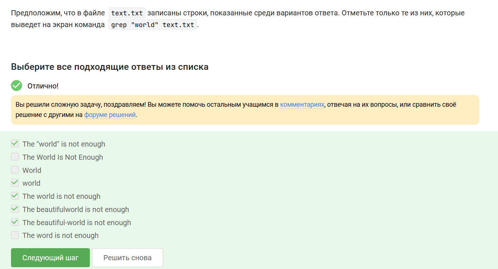{#fig-056 width=70%}

## Задание 29

Формулировка задания №29 ([рис. @fig-057]).

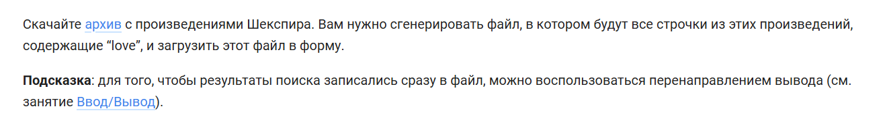{#fig-057 width=70%}

## Задание 29

Решение задания №29, grep -Fr "love" Shakespeare/* > temp.txt ([рис. @fig-058]).

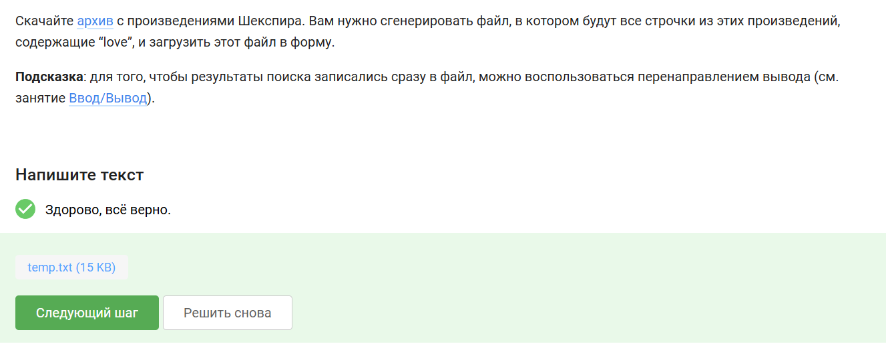{#fig-058 width=70%}

# Выводы

## Выводы

В процессе проделанной работы я приобрёл практические навыки работы с Linux и прошёл 1-ый раздел курса "Введение в Linux" на Stepik.

