---
## Authors
author:
  name: Гусев Степан Андреевич
  email: 1032242444@rudn.ru
  affiliation:
    - name: Российский университет дружбы народов
      country: Российская Федерация
      postal-code: 117198
      city: Москва
      address: ул. Миклухо-Маклая, д. 6
## Title
title: "Презентация по лабораторной работе №1"
subtitle: "Дисциплина: Архитектура компьютеров и операционные системы"
license: CC BY
date: today
date-format: "YYYY-MM-DD" # Example: 2025-09-06
---

# Информация

##

:::::::::::::: {.columns align=center}
::: {.column width="100%"}

**Презентация по лабораторной работе №1**

---

**Автор:**
Гусев Степан Андреевич

**Преподаватель:**
Кулябов Дмитрий Сергеевич, д.ф.-м.н., профессор кафедры теории вероятностей и кибербезопасности

Российский университет дружбы народов

:::
::::::::::::::

## Докладчик

:::::::::::::: {.columns align=center}
::: {.column width="70%"}

  * Гусев Степан Андреевич
  * Студент программы "Бизнес-информатика"
  * Российский университет дружбы народов им. П. Лумумбы
  * [1032242444@rudn.ru](mailto:1032242444@rudn.ru)
  * <https://github.com/stepagusev>

:::
::: {.column width="30%"}

:::
::::::::::::::

## Цель

Приобретение практических навыков установки операционной системы на виртуальную машину, настройка минимально необходимых для дальнейшей работы сервисов.

## Задание

1) Создание образа виртуальной машины
2) Установка операционной системы
3) Действия после установки
4) Настройка раскладки клавиатуры
5) Установка имени пользователя и названия хоста
6) Установка программного обеспечения для создания документации

# Выполнение лабораторной работы

## Установка Linux на VirtualBox

Запустил менеджер виртуальных машин, создал новую виртуальную машину, задал имя ВМ, указал место установки и указал файл образа ISO.

{#fig-001 width=70%}

## Установка Linux на VirtualBox

Выделил 4192мб оперативной памяти и 4 ЦПУ, нажал «Использовать EFI».

{#fig-002 width=70%}

## Установка Linux на VirtualBox

Создал новый виртуальный диск размером 80гб и формата VDI, нажал «Готово».

{#fig-003 width=70%}

## Установка Linux на VirtualBox

Перешёл в настройки ВМ, в разделе «Общее, Функции» указал двунаправленный общий буфер обмена и Drag-and-Drop.

{#fig-004 width=70%}

## Установка Linux на VirtualBox

В разделе «Дисплей» выбрал графический контроллер VMSVGA, включил 3D-ускорение и выделил 256мб видеопамяти.

{#fig-005 width=70%}

## Установка Linux на VirtualBox

В разделе «Носители» нажал «Живой CD/DVD».

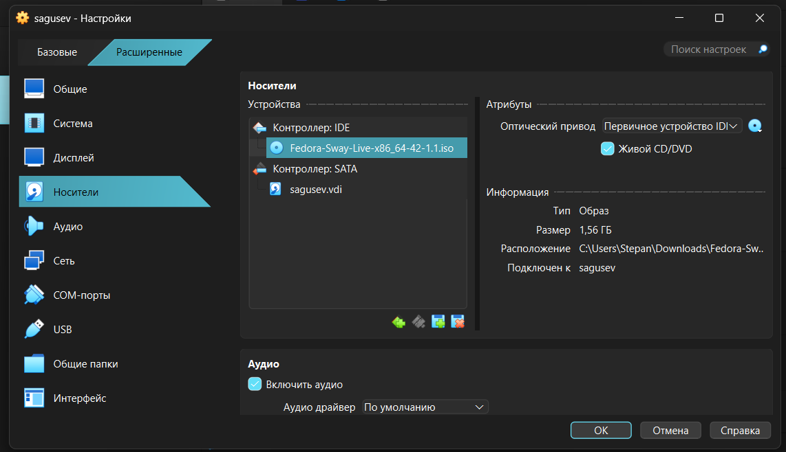{#fig-006 width=70%}

## Запуск приложения для установки системы

Запустил ВМ, нажал Win+Enter, чтобы открыть терминал и прописал liveinst.

{#fig-007 width=70%}

## Установка системы на диск

Открылось окно с выбором языка, нажал «Продолжить».

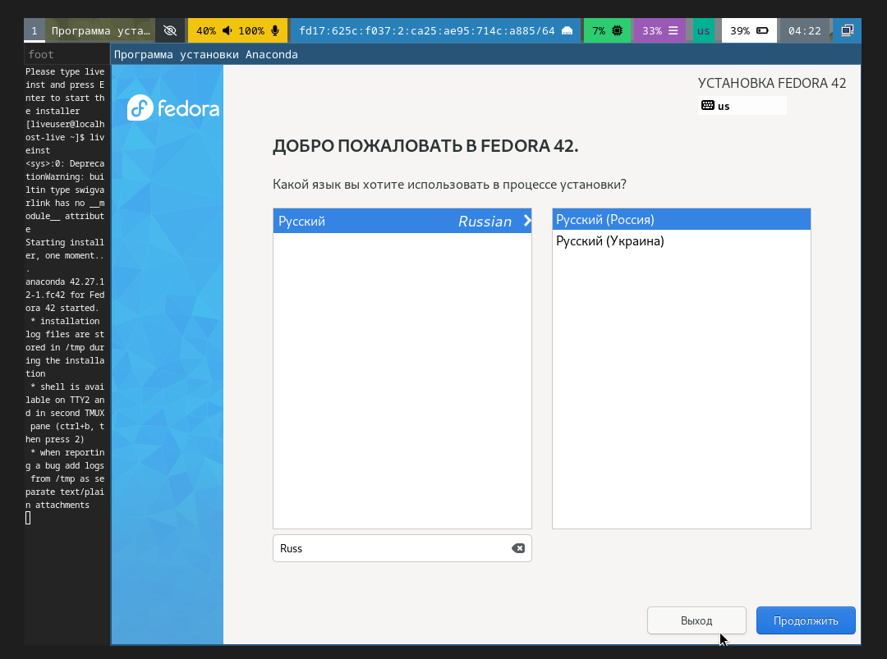{#fig-008 width=70%}

## Установка системы на диск

Открылось окно с параметрами.

{#fig-009 width=70%}

## Установка системы на диск

В раскладке клавиатуры оставил всё по умолчанию.

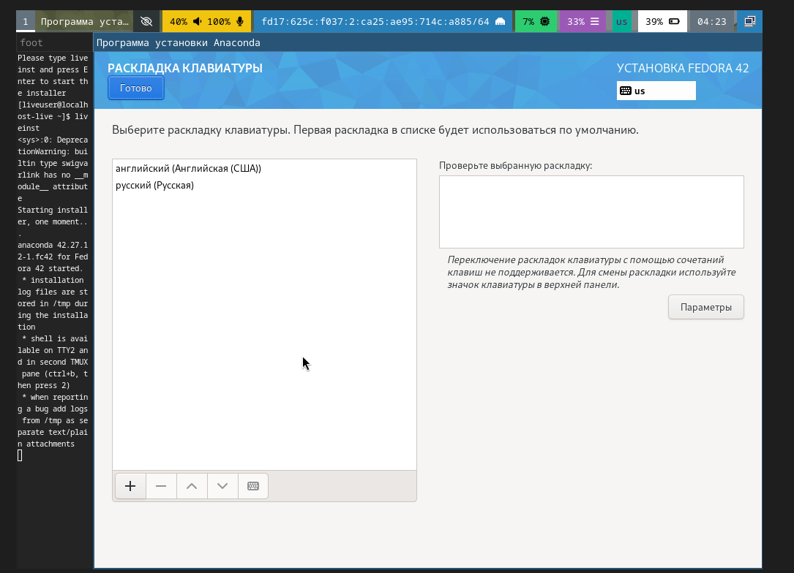{#fig-010 width=70%}

## Установка системы на диск

В «Дата и время» выбрал Московский регион.

{#fig-011 width=70%}

## Установка системы на диск

В «Место установки» оставил всё по умолчанию.

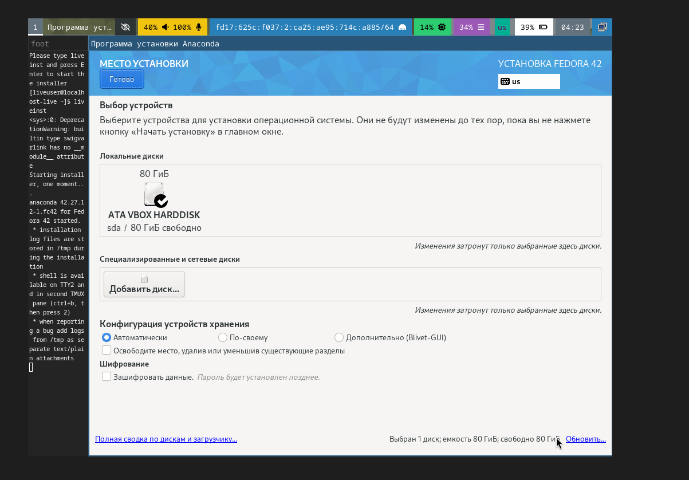{#fig-012 width=70%}

## Установка системы на диск

Установил имя и пароль для пользователя root.

{#fig-013 width=70%}

## Установка системы на диск

Установил имя и пароль для своего пользователя.

{#fig-014 width=70%}

## Установка системы на диск

Нажал «начать установку».

{#fig-015 width=70%}

## Установка системы на диск

Нажал «завершить установку» и выключил ВМ.

{#fig-016 width=70%}

## Установка системы на диск

В меню «Носители» изъял диск из виртуального привода.

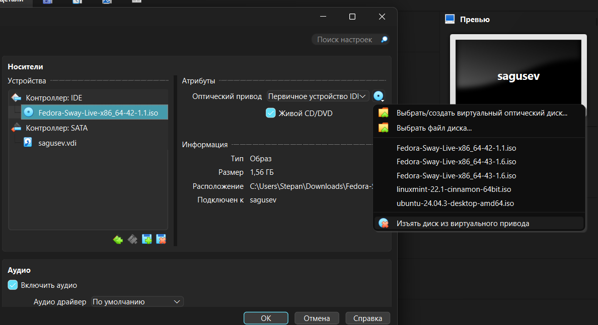{#fig-017 width=70%}

## Установка системы на диск

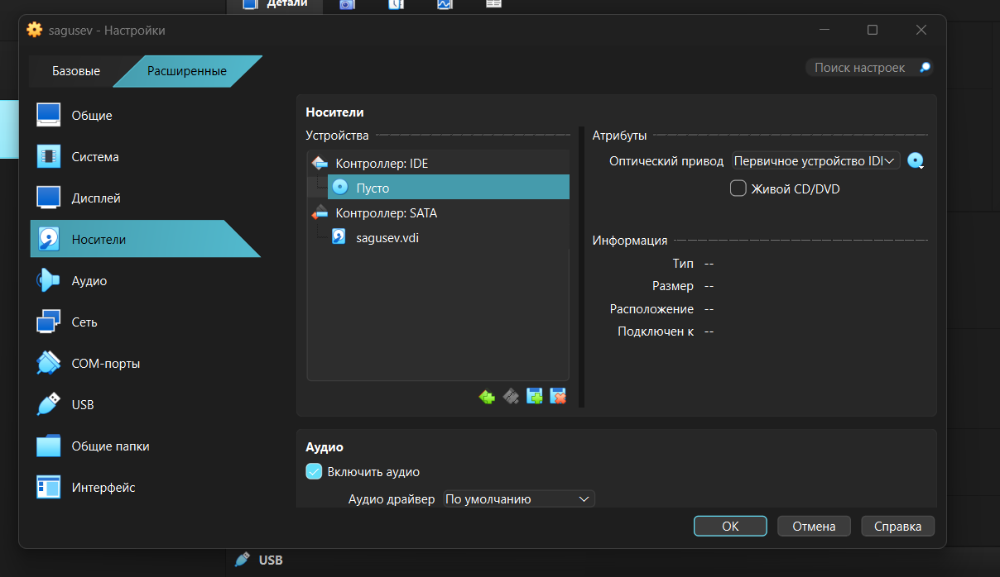{#fig-018 width=70%}

## После установки 

Вошёл в ОС под заданной учётной записью.

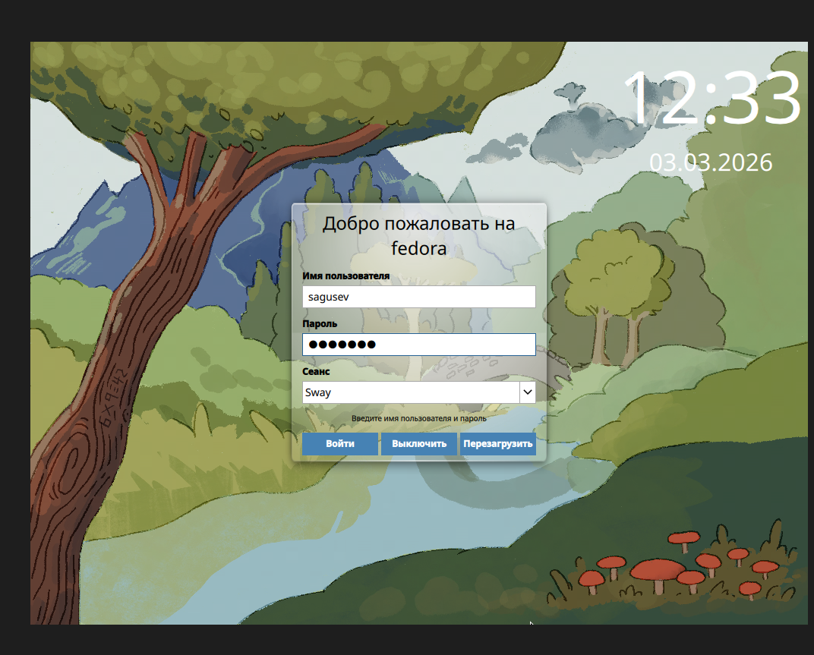{#fig-019 width=70%}

## После установки 

Запустил терминал и прописал sudo -i, чтобы переключиться на роль супер-пользователя.

{#fig-020 width=70%}

## Обновления

Установил средства разработки.

{#fig-021 width=70%}

## Обновления

Обновил все пакеты.

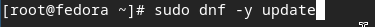{#fig-022 width=70%}

## Повышение комфорта работы

Установил программы для удобства работы в консоли.

{#fig-023 width=70%}

## Автоматическое обновление

Установил ПО.

{#fig-024 width=70%}

## Автоматическое обновление

С помощью текстового редактора nano открыл файл конфигурации.

{#fig-025 width=70%}

## Автоматическое обновление

Запустил таймер.

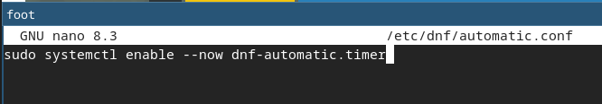{#fig-026 width=70%}

## Отключение SE Linux

В файле конфигурации заменил значение «SELINUX», после перезагрузил ВМ.

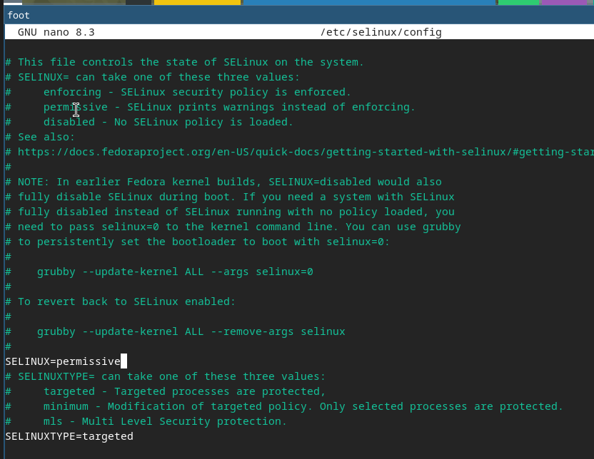{#fig-027 width=70%}

## Настройка раскладки клавиатуры

Вошёл в ОС, запустил терминал, запустил tmux.

{#fig-028 width=70%}

## Настройка раскладки клавиатуры

Создал конфигурационный файл.

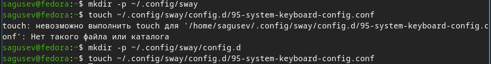{#fig-029 width=70%}

## Настройка раскладки клавиатуры

Отредактировал конфигурационный файл.

{#fig-030 width=70%}

Переключился на супер-пользователя.

{#fig-031 width=70%}

## Настройка раскладки клавиатуры

Отредактировал другой конфигурационный файл.

{#fig-032 width=70%}

## Настройка раскладки клавиатуры

Перезагрузил виртуальную машину.

{#fig-033 width=70%}

## Установка драйверов для VirtualBox

Вошёл в ОС, запустил терминал, запустил tmux.

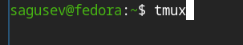{#fig-034 width=70%}

## Установка драйверов для VirtualBox

Переключился на супер-пользователя.

{#fig-035 width=70%}

## Установка драйверов для VirtualBox

Установил средства разработки.

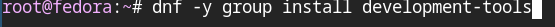{#fig-036 width=70%}

## Установка драйверов для VirtualBox

Установил пакет DKMS.

{#fig-037 width=70%}

## Установка драйверов для VirtualBox

Подключил образ диска дополнений гостевой ОС.

{#fig-038 width=70%}

## Установка драйверов для VirtualBox

Подмонтировал диск.

{#fig-039 width=70%}

## Установка драйверов для VirtualBox

Установил драйвера.

{#fig-040 width=70%}

## Установка драйверов для VirtualBox

Перезагрузил виртуальную машину.

{#fig-041 width=70%}

## Подключение общей папки

Внутри ВМ добавил своего пользователя в группу bvoxsf.

{#fig-042 width=70%}

## Подключение общей папки

В хостовой системе подключил разделяемую папку.

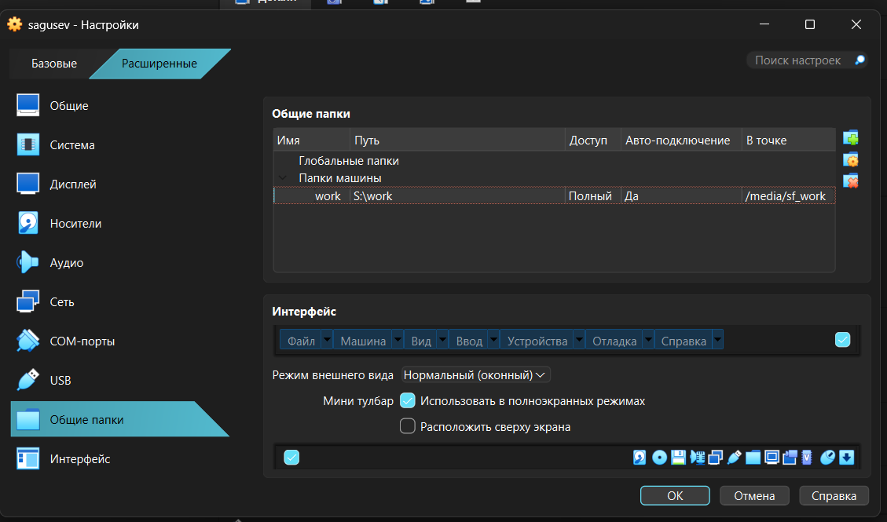{#fig-043 width=70%}

## Установка имени пользователя и названия хоста

При установке ВМ я не допустил ошибок, поэтому ничего исправлять не нужно было.

## Установка программного обеспечения для создания документации

Вошёл в ОС, запустил терминал, запустил tmux.

{#fig-044 width=70%}

## Установка программного обеспечения для создания документации

Переключился на роль супер-пользователя.

{#fig-045 width=70%}

## Установка программного обеспечения для создания документации

Скачал архив с pandoc-crossref.

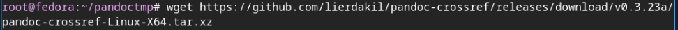{#fig-046 width=70%}

## Установка программного обеспечения для создания документации

Распаковал архив.

{#fig-047 width=70%}

## Установка программного обеспечения для создания документации

Скачал архив с pandoc.

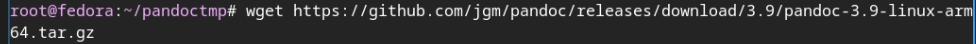{#fig-048 width=70%}

## Установка программного обеспечения для создания документации

Распаковал архив.

{#fig-049 width=70%}

## Установка программного обеспечения для создания документации

Скопировал бинарный файл pandoc в /usr/local/bin.

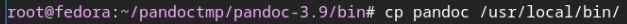{#fig-050 width=70%}

## Установка программного обеспечения для создания документации

Скопировал бинарный файл pandoc-crossref в /usr/local/bin.

{#fig-051 width=70%}

## Установка программного обеспечения для создания документации

Проверил, что копирование прошло успешно.

{#fig-052 width=70%}

## Установка программного обеспечения для создания документации

Установил дистрибутив TeXlive.

{#fig-053 width=70%}

# Выводы

## Выводы

В процессе проделанной работы я приобрёл практические навыки установки операционной системы на виртуальную машину и настроил минимально необходимые для дальнейшей работы сервисы.

# Выполнение дополнительного задания

## Выполнение дополнительного задания

В терминале ввёл команду dmesg | less.

{#fig-054 width=70%}

## Выполнение дополнительного задания

Посмотрел последовательность загрузки системы.

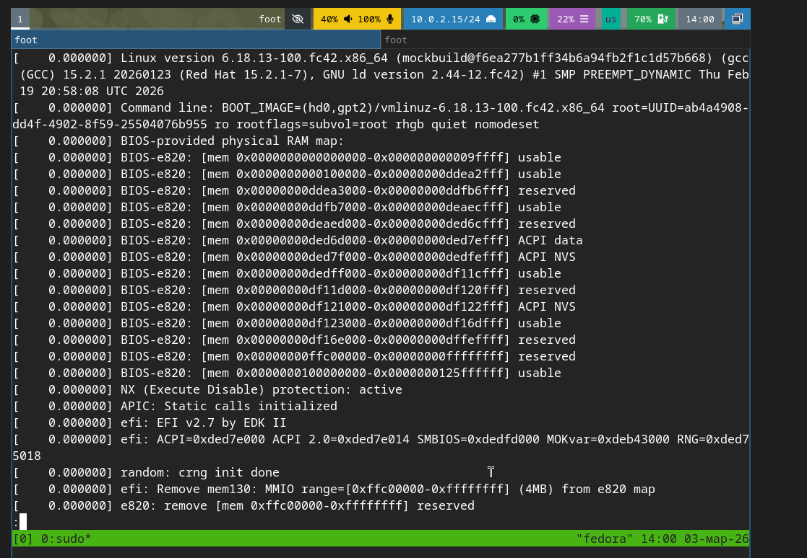{#fig-055 width=70%}

## Выполнение дополнительного задания

Получил информацию о версии ядра Linux.

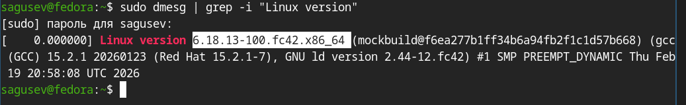{#fig-056 width=70%}

## Выполнение дополнительного задания

Получил информацию о частоте процессора.

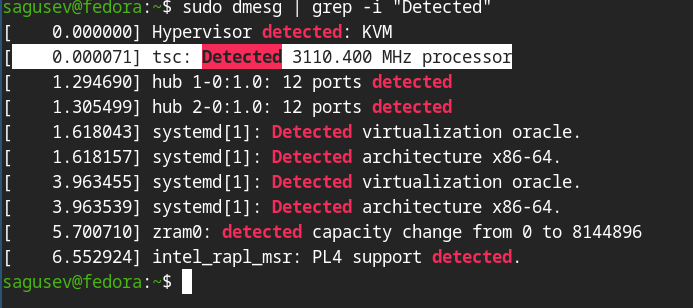{#fig-057 width=70%}

## Выполнение дополнительного задания

Получил информацию о модели процессора.

{#fig-058 width=70%}

## Выполнение дополнительного задания

Получил информацию о объёме доступной оперативной памяти.

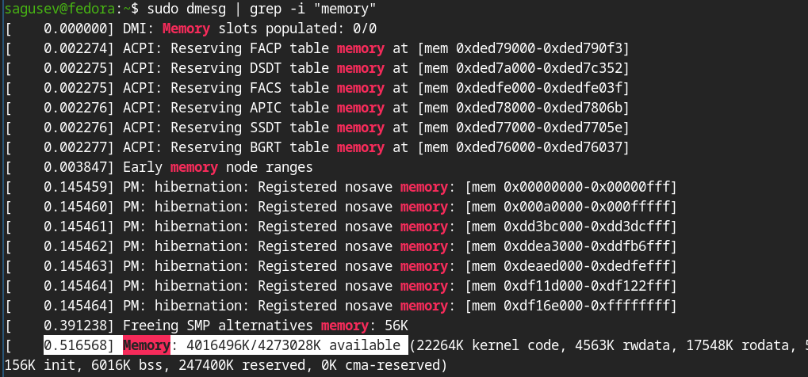{#fig-059 width=70%}

## Выполнение дополнительного задания

Получил информацию о типе гипервизора.

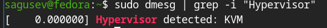{#fig-060 width=70%}

## Выполнение дополнительного задания

Получил информацию о типе файловой системы корневого раздела.

{#fig-061 width=70%}

## Выполнение дополнительного задания

Получил информацию о последовательности монтирования файловых систем.

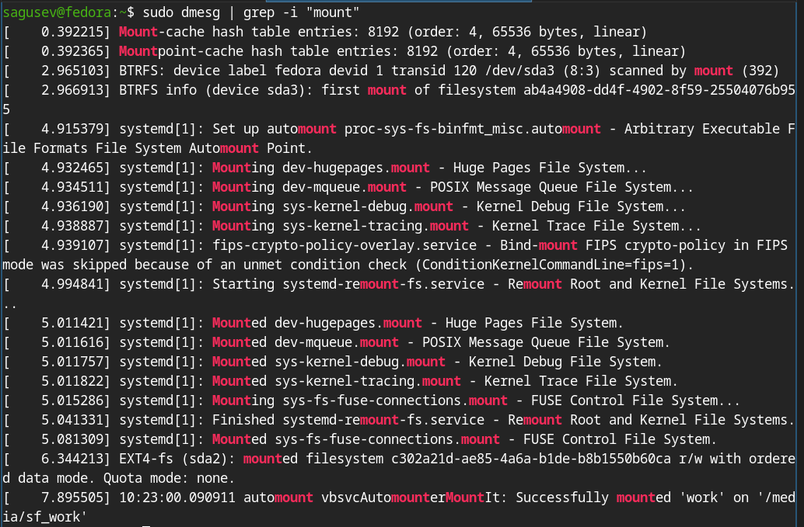{#fig-062 width=70%}
