---
## Author
author:
  name: Степан Андреевич Гусев
  email: 1032242444@rudn.ru
  affiliation:
    - name: Российский университет дружбы народов
      country: Российская Федерация
      postal-code: 117198
      city: Москва
      address: ул. Миклухо-Маклая, д. 6

## Title
title: "Отчёт по лабораторной работе №1"
subtitle: "Архитектура компьютеров и операционные системы"
license: "CC BY"
---

# Цель работы

Приобретение практических навыков установки операционной системы на виртуальную машину, настройка минимально необходимых для дальнейшей работы сервисов.

# Задание

1) Создание образа виртуальной машины
2) Установка операционной системы
3) Действия после установки
4) Настройка раскладки клавиатуры
5) Установка имени пользователя и названия хоста
6) Установка программного обеспечения для создания документации

# Выполнение лабораторной работы

## Установка Linux на VirtualBox

Запустил менеджер виртуальных машин, создал новую виртуальную машину, задал имя ВМ, указал место установки и указал файл образа ISO ([рис. @fig-001]).

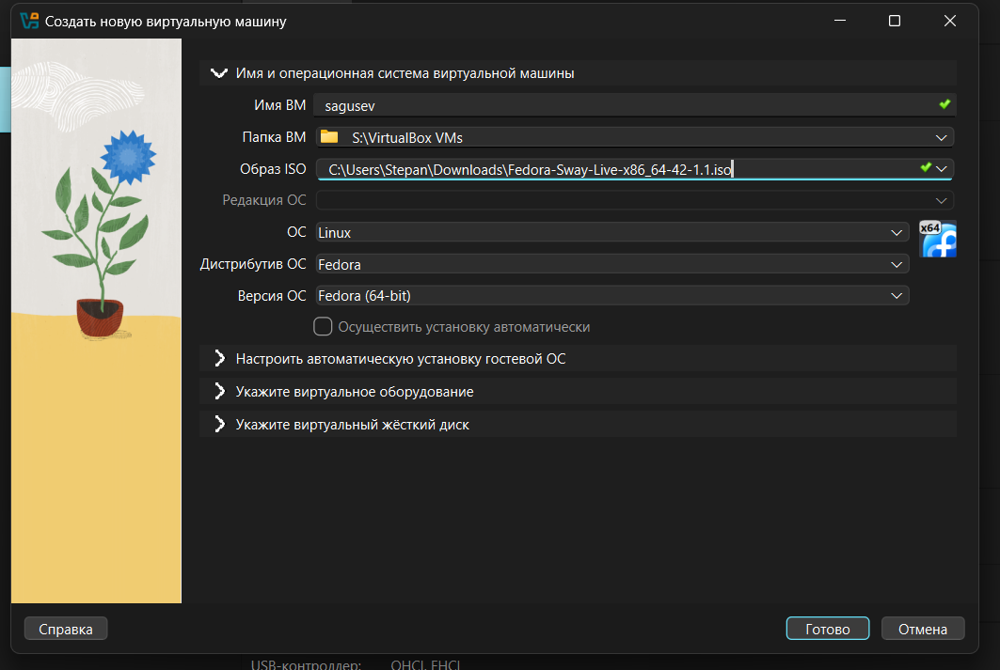{#fig-001 width=70%}

Выделил 4192мб оперативной памяти и 4 ЦПУ, нажал «Использовать EFI» ([рис. @fig-002]).

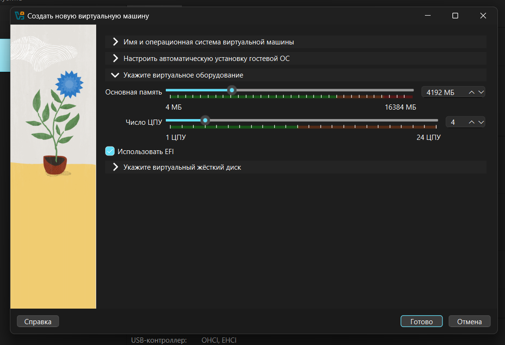{#fig-002 width=70%}

Создал новый виртуальный диск размером 80гб и формата VDI, нажал «Готово» ([рис. @fig-003]).

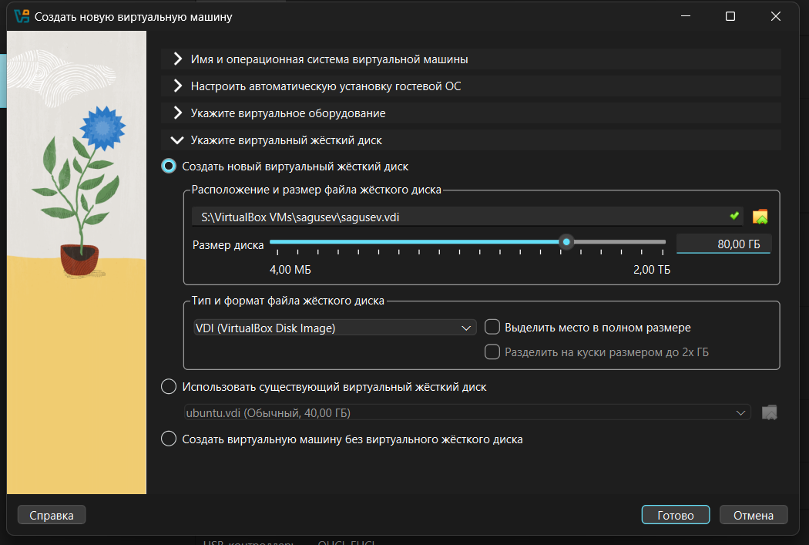{#fig-003 width=70%}

Перешёл в настройки ВМ, в разделе «Общее, Функции» указал двунаправленный общий буфер обмена и Drag-and-Drop ([рис. @fig-004]).

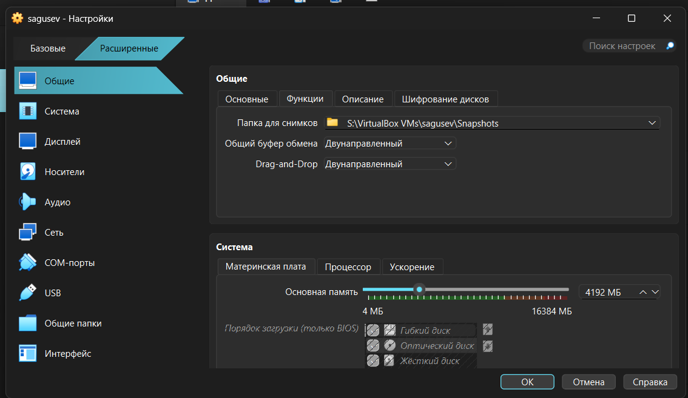{#fig-004 width=70%}

В разделе «Дисплей» выбрал графический контроллер VMSVGA, включил 3D-ускорение и выделил 256мб видеопамяти ([рис. @fig-005]).

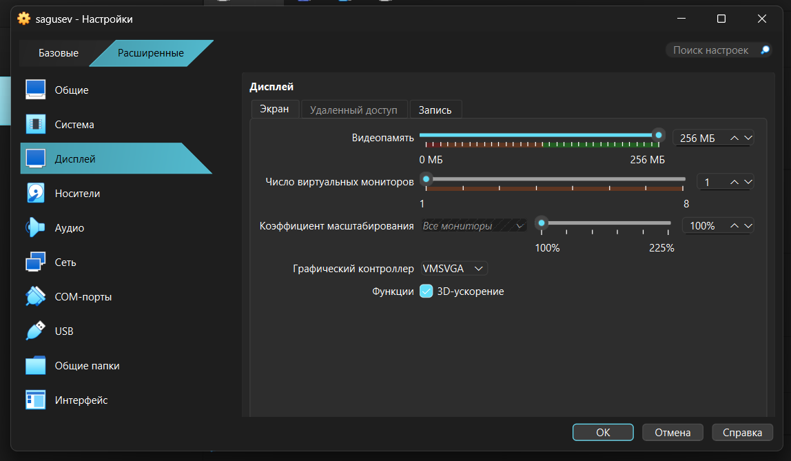{#fig-005 width=70%}

В разделе «Носители» нажал «Живой CD/DVD» ([рис. @fig-006]).

{#fig-006 width=70%}

## Запуск приложения для установки системы

Запустил ВМ, нажал Win+Enter, чтобы открыть терминал и прописал liveinst ([рис. @fig-007]).

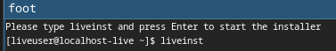{#fig-007 width=70%}

## Установка системы на диск

Открылось окно с выбором языка, нажал «Продолжить» ([рис. @fig-008]).

{#fig-008 width=70%}

Открылось окно с параметрами ([рис. @fig-009]).

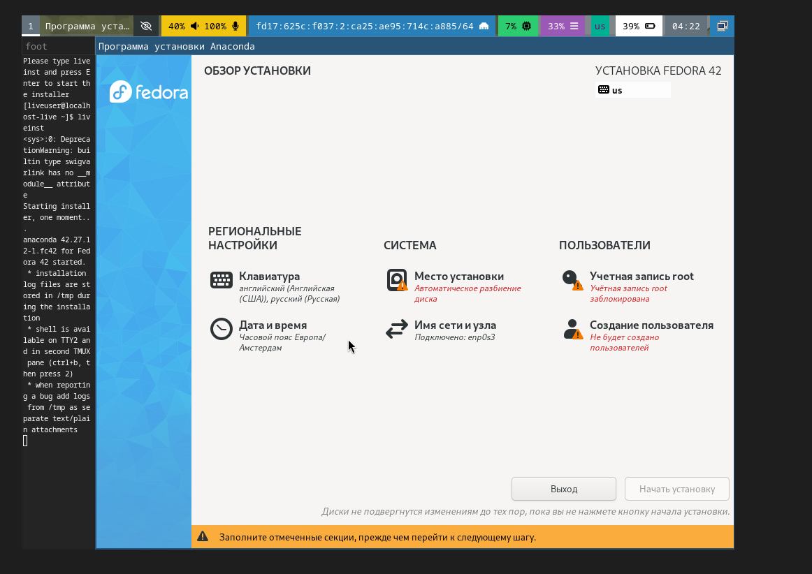{#fig-009 width=70%}

В раскладке клавиатуры оставил всё по умолчанию ([рис. @fig-010]).

{#fig-010 width=70%}

В «Дата и время» выбрал Московский регион ([рис. @fig-011]).

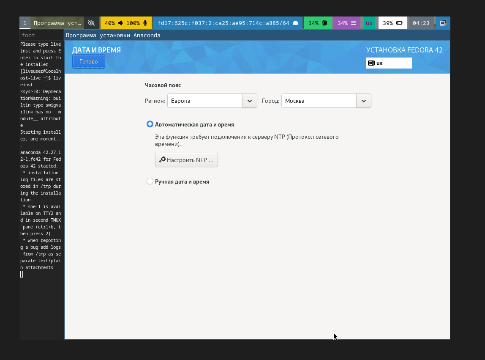{#fig-011 width=70%}

В «Место установки» оставил всё по умолчанию ([рис. @fig-012]).

{#fig-012 width=70%}

Установил имя и пароль для пользователя root ([рис. @fig-013]).

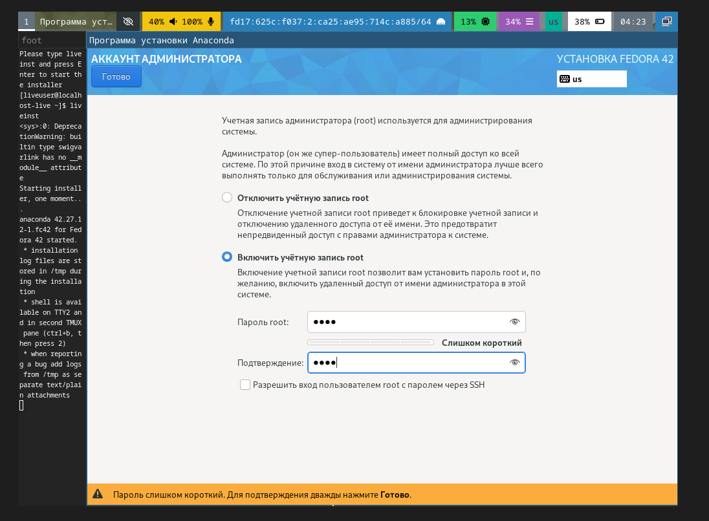{#fig-013 width=70%}

Установил имя и пароль для своего пользователя ([рис. @fig-014]).

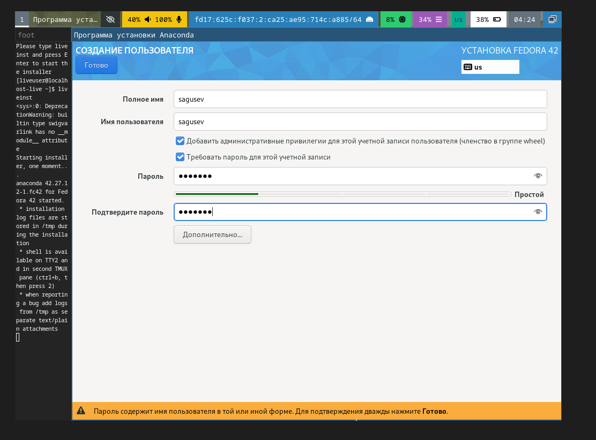{#fig-014 width=70%}

Нажал «начать установку» ([рис. @fig-015]).

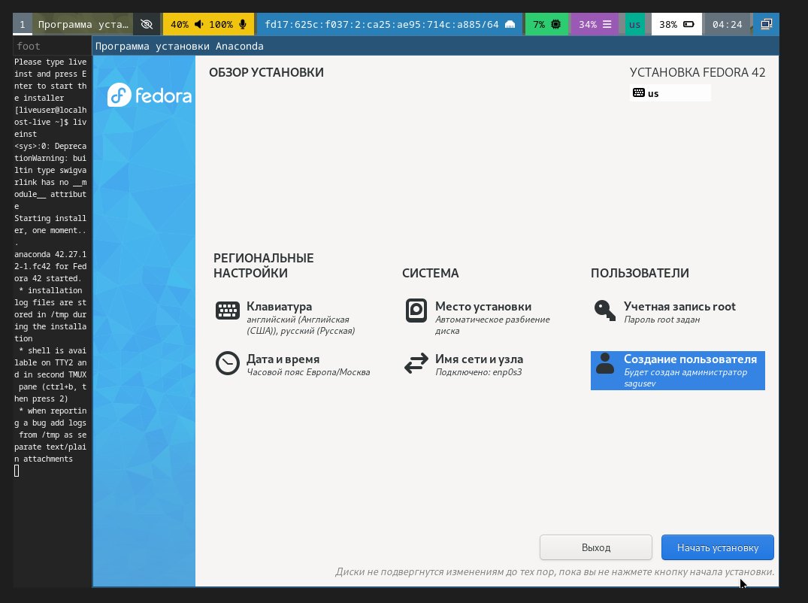{#fig-015 width=70%}

Нажал «завершить установку» и выключил ВМ ([рис. @fig-016]).

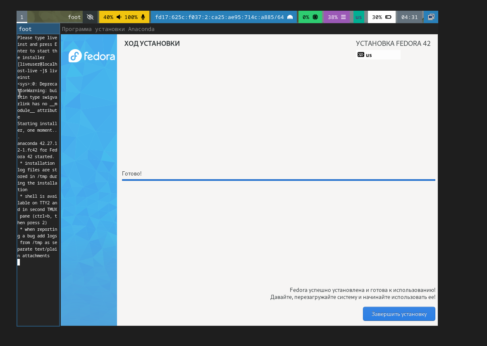{#fig-016 width=70%}

В меню «Носители» изъял диск из виртуального привода ([рис. @fig-017]), ([рис. @fig-018]).

{#fig-017 width=70%}

{#fig-018 width=70%}

## После установки 

Вошёл в ОС под заданной учётной записью ([рис. @fig-019]).

{#fig-019 width=70%}

Запустил терминал и прописал sudo -i, чтобы переключиться на роль супер-пользователя ([рис. @fig-020]).

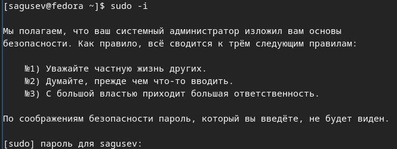{#fig-020 width=70%}

### Обновления

Установил средства разработки ([рис. @fig-021]).

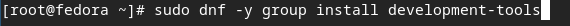{#fig-021 width=70%}

Обновил все пакеты ([рис. @fig-022]).

{#fig-022 width=70%}

### Повышение комфорта работы

Установил программы для удобства работы в консоли ([рис. @fig-023]).

{#fig-023 width=70%}

### Автоматическое обновление

Установил ПО ([рис. @fig-024]).

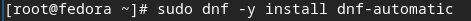{#fig-024 width=70%}

С помощью текстового редактора nano открыл файл конфигурации ([рис. @fig-025]).

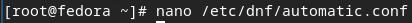{#fig-025 width=70%}

Запустил таймер ([рис. @fig-026]).

{#fig-026 width=70%}

### Отключение SE Linux

В файле конфигурации заменил значение «SELINUX», после перезагрузил ВМ ([рис. @fig-027]).

{#fig-027 width=70%}

## Настройка раскладки клавиатуры

Вошёл в ОС, запустил терминал, запустил tmux ([рис. @fig-028]).

{#fig-028 width=70%}

Создал конфигурационный файл ([рис. @fig-029]).

{#fig-029 width=70%}

Отредактировал конфигурационный файл ([рис. @fig-030]).

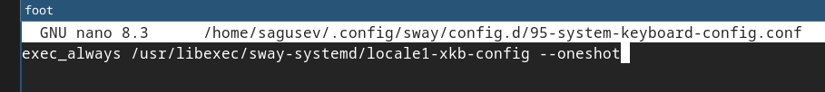{#fig-030 width=70%}

Переключился на супер-пользователя ([рис. @fig-031]).

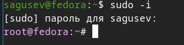{#fig-031 width=70%}

Отредактировал другой конфигурационный файл ([рис. @fig-032]).

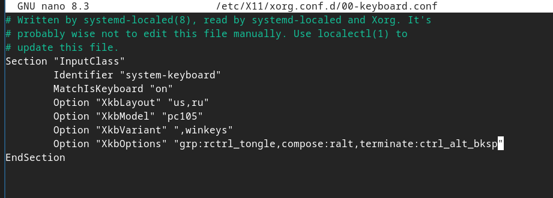{#fig-032 width=70%}

Перезагрузил виртуальную машину ([рис. @fig-033]).

{#fig-033 width=70%}

## Установка драйверов для VirtualBox

Вошёл в ОС, запустил терминал, запустил tmux ([рис. @fig-034]).

{#fig-034 width=70%}

Переключился на супер-пользователя ([рис. @fig-035]).

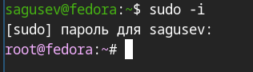{#fig-035 width=70%}

Установил средства разработки ([рис. @fig-036]).

{#fig-036 width=70%}

Установил пакет DKMS ([рис. @fig-037]).

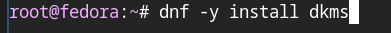{#fig-037 width=70%}

Подключил образ диска дополнений гостевой ОС ([рис. @fig-038]).

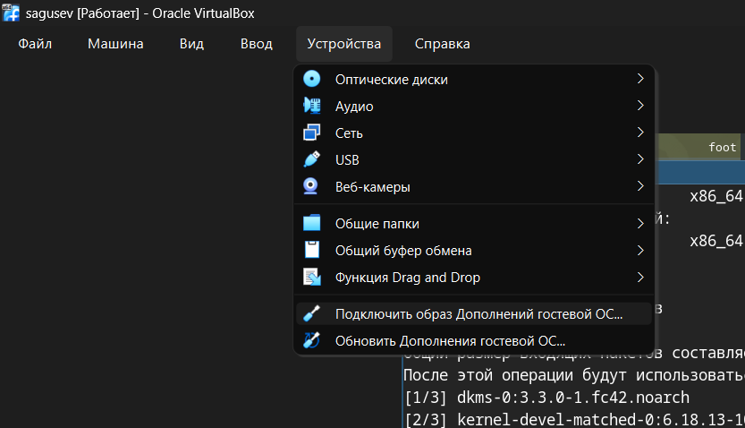{#fig-038 width=70%}

Подмонтировал диск ([рис. @fig-039]).

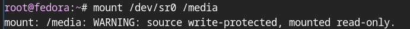{#fig-039 width=70%}

Установил драйвера ([рис. @fig-040]).

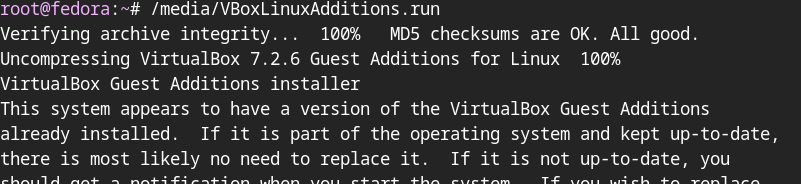{#fig-040 width=70%}

Перезагрузил виртуальную машину ([рис. @fig-041]).

{#fig-041 width=70%}

## Подключение общей папки

Внутри ВМ добавил своего пользователя в группу bvoxsf ([рис. @fig-042]).

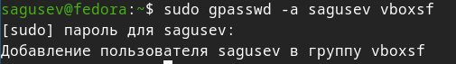{#fig-042 width=70%}

В хостовой системе подключил разделяемую папку ([рис. @fig-043]).

{#fig-043 width=70%}

## Установка имени пользователя и названия хоста

При установке ВМ я не допустил ошибок, поэтому ничего исправлять не нужно было.

## Установка программного обеспечения для создания документации

Вошёл в ОС, запустил терминал, запустил tmux ([рис. @fig-044]).

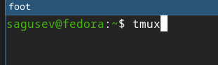{#fig-044 width=70%}

Переключился на роль супер-пользователя ([рис. @fig-045]).

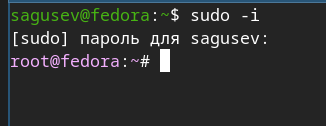{#fig-045 width=70%}

Скачал архив с pandoc-crossref ([рис. @fig-046]).

{#fig-046 width=70%}

Распаковал архив ([рис. @fig-047]).

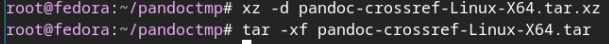{#fig-047 width=70%}

Скачал архив с pandoc ([рис. @fig-048]).

{#fig-048 width=70%}

Распаковал архив ([рис. @fig-049]).

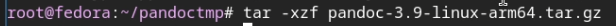{#fig-049 width=70%}

Скопировал бинарный файл pandoc в /usr/local/bin ([рис. @fig-050]).

{#fig-050 width=70%}

Скопировал бинарный файл pandoc-crossref в /usr/local/bin ([рис. @fig-051]).

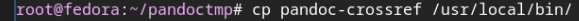{#fig-051 width=70%}

Проверил, что копирование прошло успешно ([рис. @fig-052]).

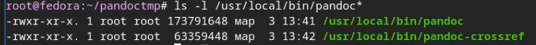{#fig-052 width=70%}

Установил дистрибутив TeXlive ([рис. @fig-053]).

{#fig-053 width=70%}

# Выводы

В процессе проделанной работы я приобрёл практические навыки установки операционной системы на виртуальную машину и настроил минимально необходимые для дальнейшей работы сервисы.

# Ответы на вопросы

1) Учетная запись содержит необходимые для идентификации пользователя при подключении к системе данные, а так же информацию для авторизации и учета: системного имени (user name) (оно может содержать только латинские буквы и знак нижнее подчеркивание, еще оно должно быть уникальным), идентификатор пользователя (UID) (уникальный идентификатор пользователя в системе, целое положительное число), идентификатор группы (CID) (группа, к к-рой относится пользователь. Она, как минимум, одна, по умолчанию - одна), полное имя (full name) (Могут быть ФИО), домашний каталог (home directory) (каталог, в который попадает пользователь после входа в систему и в к-ром хранятся его данные), начальная оболочка (login shell) (командная оболочка, к-рая запускается при входе в систему).

2) Для получения справки по команде: <команда> --help; для перемещения по файловой системе - cd; для просмотра содержимого каталога - ls; для определения объёма каталога - du <имя каталога>; для создания / удаления каталогов - mkdir/rmdir; для создания / удаления файлов - touch/rm; для задания определённых прав на файл / каталог - chmod; для просмотра истории команд - history

3) Файловая система - это порядок, определяющий способ организации и хранения и именования данных на различных носителях информации. Примеры: FAT32 представляет собой пространство, разделенное на три части: одна область для служебных структур, форма указателей в виде таблиц и зона для хранения самих файлов. ext3/ext4 - журналируемая файловая система, используемая в основном в ОС с ядром Linux.

4) С помощью команды df, введя ее в терминале. Это утилита, которая показывает список всех файловых систем по именам устройств, сообщает их размер и данные о памяти. Также посмотреть подмонтированные файловые системы можно с помощью утилиты mount.

5) Чтобы удалить зависший процесс, вначале мы должны узнать, какой у него id: используем команду ps. Далее в терминале вводим команду kill <id процесса>. Или можно использовать утилиту killall, что "убьет" все процессы, которые есть в данный момент, для этого не нужно знать id процесса.

# Выполнение дополнительного задания

В терминале ввёл команду dmesg | less ([рис. @fig-054]).

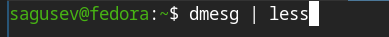{#fig-054 width=70%}

Посмотрел последовательность загрузки системы ([рис. @fig-055]).

{#fig-055 width=70%}

Получил информацию о версии ядра Linux ([рис. @fig-056]).

{#fig-056 width=70%}

Получил информацию о частоте процессора ([рис. @fig-057]).

{#fig-057 width=70%}

Получил информацию о модели процессора ([рис. @fig-058]).

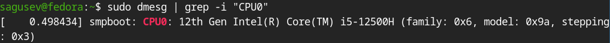{#fig-058 width=70%}

Получил информацию о объёме доступной оперативной памяти ([рис. @fig-059]).

{#fig-059 width=70%}

Получил информацию о типе гипервизора ([рис. @fig-060]).

{#fig-060 width=70%}

Получил информацию о типе файловой системы корневого раздела ([рис. @fig-061]).

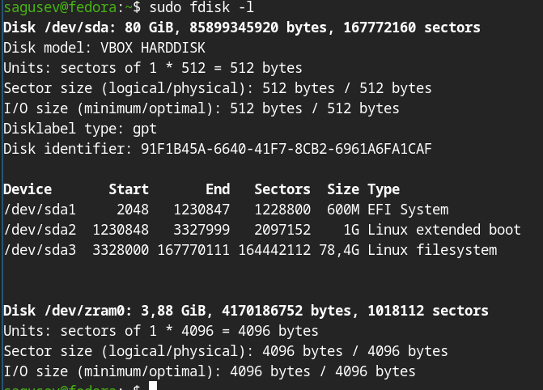{#fig-061 width=70%}

Получил информацию о последовательности монтирования файловых систем ([рис. @fig-062]).

{#fig-062 width=70%}

# Список литературы

1. Dash, P. Getting Started with Oracle VM VirtualBox / P. Dash. – Packt Publishing Ltd, 2013. – 86 сс.
2. Colvin, H. VirtualBox: An Ultimate Guide Book on Virtualization with VirtualBox. VirtualBox / H. Colvin. – CreateSpace Independent Publishing Platform, 2015. – 70 сс.
3. Vugt, S. van. Red Hat RHCSA/RHCE 7 cert guide : Red Hat Enterprise Linux 7 (EX200 and EX300) : Certification Guide. Red Hat RHCSA/RHCE 7 cert guide / S. van Vugt. – Pearson IT Certification, 2016. – 1008 сс.
4. Робачевский, А. Операционная система UNIX / А. Робачевский, С. Немнюгин, О. Стесик. – 2-е изд. – Санкт-Петербург : БХВ-Петербург, 2010. – 656 сс.
5. Немет, Э. Unix и Linux: руководство системного администратора. Unix и Linux / Э. Немет, Г. Снайдер, Т.Р. Хейн, Б. Уэйли. – 4-е изд. – Вильямс, 2014. – 1312 сс.
6. Колисниченко, Д.Н. Самоучитель системного администратора Linux : Системный администратор / Д.Н. Колисниченко. – Санкт-Петербург : БХВ-Петербург, 2011. – 544 сс.
7. Robbins, A. Bash Pocket Reference / A. Robbins. – O’Reilly Media, 2016. – 156 сс.
