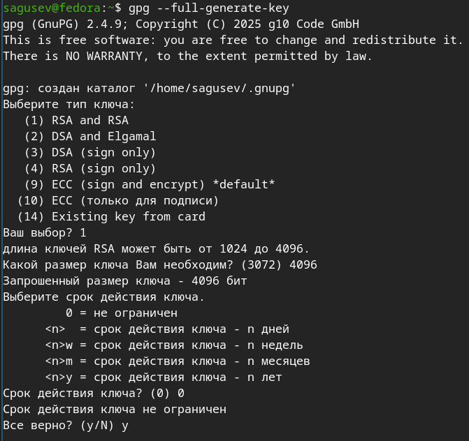
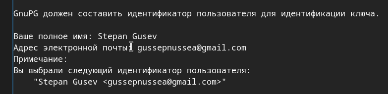
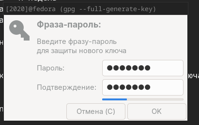
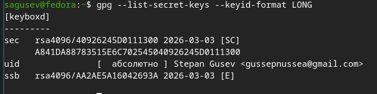
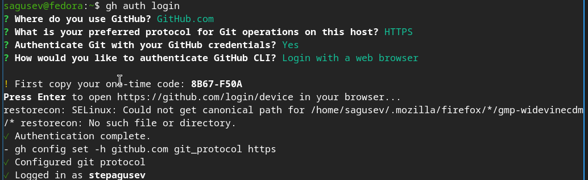

---
## Authors
author:
  name: Гусев Степан Андреевич
  email: 1032242444@rudn.ru
  affiliation:
    - name: Российский университет дружбы народов
      country: Российская Федерация
      postal-code: 117198
      city: Москва
      address: ул. Миклухо-Маклая, д. 6
## Title
title: "Презентация по лабораторной работе №2"
subtitle: "Дисциплина: Архитектура компьютеров и операционные системы"
license: CC BY
date: today
date-format: "YYYY-MM-DD" # Example: 2025-09-06
---

# Информация

##

:::::::::::::: {.columns align=center}
::: {.column width="100%"}

**Презентация по лабораторной работе №2**

---

**Автор:**
Гусев Степан Андреевич

**Преподаватель:**
Кулябов Дмитрий Сергеевич, д.ф.-м.н., профессор кафедры теории вероятностей и кибербезопасности

Российский университет дружбы народов

:::
::::::::::::::

## Докладчик

:::::::::::::: {.columns align=center}
::: {.column width="70%"}

  * Гусев Степан Андреевич
  * Студент программы "Бизнес-информатика"
  * Российский университет дружбы народов им. П. Лумумбы
  * [1032242444@rudn.ru](mailto:1032242444@rudn.ru)
  * <https://github.com/stepagusev>

:::
::: {.column width="30%"}

:::
::::::::::::::

## Цель

Изучить идеологию и применение средств контроля версий, освоить умения по работе с git.

## Задание

1) Создать базовую конфигурацию для работы с git.
2) Создать ключ SSH.
3) Создать ключ PGP.
4) Настроить подписи git.
5) Зарегистрироваться на Github.
6) Создать локальный каталог для выполнения заданий по предмету.

# Выполнение лабораторной работы

## Установка программного обеспечения

Установил git.

{#fig-001 width=70%}

## Установка программного обеспечения

Установил gh.

{#fig-002 width=70%}

## Базовая настройка git

Задал имя и email, настроил кодировку вывода сообщений, задал имя начальной ветки и задал параметры autocrlf и safecrlf.

{#fig-003 width=70%}

## Создание ключей SSH

Создал ключ SSH по алгоритму rsa с ключём размером 4096 бит.

{#fig-004 width=70%}

## Создание ключей SSH

Создал ключ SSH по алгоритму ed25519.

{#fig-005 width=70%}

## Создание ключей PGP

Сгенерировал ключ с нужными параметрами.

{#fig-006 width=70%}

## Создание ключей PGP

Указал имя и почту.

{#fig-007 width=70%}

## Создание ключей PGP

Задал фразу-пароль для защиты нового ключа.

{#fig-008 width=70%}

## Настройка Github

Github уже был создан в первом семестре.

## Добавление PGP ключа в Github

Вывел список ключей.

{#fig-009 width=70%}

## Добавление PGP ключа в Github

Скопировал ключ в буфер обмена.

{#fig-010 width=70%}

## Добавление PGP ключа в Github

Перешёл в настройки Github, нажал «New GPG key» и вставил ключ в поле ввода.

{#fig-011 width=70%}

## Настройка автоматических подписей коммитов git

Указал git применять введённый email при подписи коммитов.

{#fig-012 width=70%}

## Настройка gh

Авторизовался, ответив на вопросы.

{#fig-013 width=70%}

## Создание репозитория курса на основе шаблона

Создал каталог и репозиторий.

{#fig-014 width=70%}

## Создание репозитория курса на основе шаблона

Клонировал репозиторий.

{#fig-015 width=70%}

## Настройка каталога курса

Перешёл в каталог курса.

{#fig-016 width=70%}

## Настройка каталога курса

Удалил лишний файл.

{#fig-017 width=70%}

## Настройка каталога курса

Записал название папки в файл COURSE, на скриншоте допущена ошибка, которую я позже исправил.

{#fig-018 width=70%}

## Настройка каталога курса

Создал необходимые каталоги.

{#fig-019 width=70%}

## Настройка каталога курса

Отправил файлы на сервер.

{#fig-020 width=70%}

# Выводы

## Выводы

В процессе проделанной работы, я познакомился с идеологией и применений средств контроля версий, освоил навыки работы с git.
