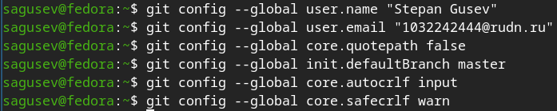
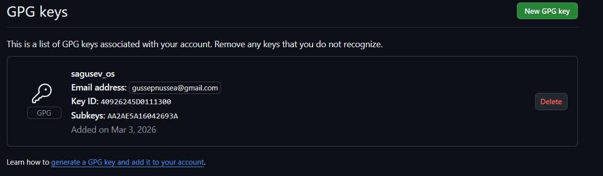
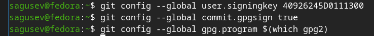
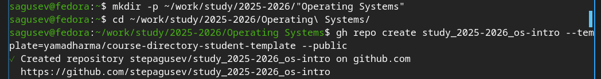
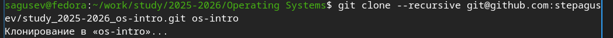
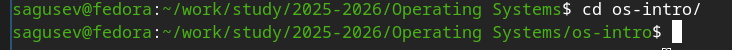
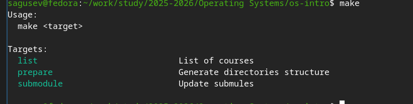
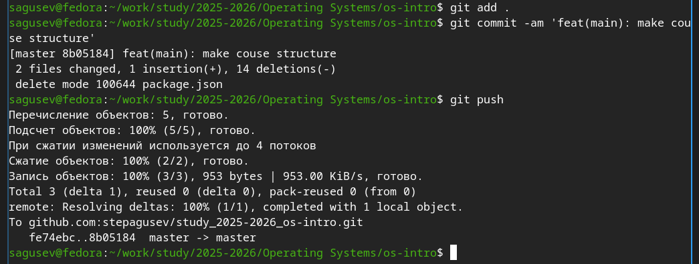

---
## Author
author:
  name: Степан Андреевич Гусев
  email: 1032242444@rudn.ru
  affiliation:
    - name: Российский университет дружбы народов
      country: Российская Федерация
      postal-code: 117198
      city: Москва
      address: ул. Миклухо-Маклая, д. 6

## Title
title: "Отчёт по лабораторной работе №2"
subtitle: "Архитектура компьютеров и операционные системы"
license: "CC BY"
---

# Цель работы

Изучить идеологию и применение средств контроля версий, освоить умения по работе с git.

# Задание

1) Создать базовую конфигурацию для работы с git.
2) Создать ключ SSH.
3) Создать ключ PGP.
4) Настроить подписи git.
5) Зарегистрироваться на Github.
6) Создать локальный каталог для выполнения заданий по предмету.

# Выполнение лабораторной работы

## Установка программного обеспечения

Установил git ([рис. @fig-001]).

{#fig-001 width=70%}

Установил gh ([рис. @fig-002]).

{#fig-002 width=70%}

## Базовая настройка git

Задал имя и email, настроил кодировку вывода сообщений, задал имя начальной ветки и задал параметры autocrlf и safecrlf ([рис. @fig-003]).

{#fig-003 width=70%}

## Создание ключей SSH

Создал ключ SSH по алгоритму rsa с ключём размером 4096 бит ([рис. @fig-004]).

{#fig-004 width=70%}

Создал ключ SSH по алгоритму ed25519 ([рис. @fig-005]).

{#fig-005 width=70%}

## Создание ключей PGP

Сгенерировал ключ с нужными параметрами ([рис. @fig-006]).

{#fig-006 width=70%}

Указал имя и почту ([рис. @fig-007]).

{#fig-007 width=70%}

Задал фразу-пароль для защиты нового ключа ([рис. @fig-008]).

{#fig-008 width=70%}

## Настройка Github

Github уже был создан в первом семестре.

## Добавление PGP ключа в Github

Вывел список ключей ([рис. @fig-009]).

{#fig-009 width=70%}

Скопировал ключ в буфер обмена ([рис. @fig-010]).

{#fig-010 width=70%}

Перешёл в настройки Github, нажал «New GPG key» и вставил ключ в поле ввода ([рис. @fig-011]).

{#fig-011 width=70%}

## Настройка автоматических подписей коммитов git

Указал git применять введённый email при подписи коммитов ([рис. @fig-012]).

{#fig-012 width=70%}

## Настройка gh

Авторизовался, ответив на вопросы ([рис. @fig-013]).

{#fig-013 width=70%}

## Создание репозитория курса на основе шаблона

Создал каталог и репозиторий ([рис. @fig-014]).

{#fig-014 width=70%}

Клонировал репозиторий ([рис. @fig-015]).

{#fig-015 width=70%}

## Настройка каталога курса

Перешёл в каталог курса ([рис. @fig-016]).

{#fig-016 width=70%}

Удалил лишний файл ([рис. @fig-017]).

{#fig-017 width=70%}

Записал название папки в файл COURSE, на скриншоте допущена ошибка, которую я позже исправил ([рис. @fig-018]).

{#fig-018 width=70%}

Создал необходимые каталоги ([рис. @fig-019]).

{#fig-019 width=70%}

Отправил файлы на сервер ([рис. @fig-020]).

{#fig-020 width=70%}

# Выводы

В процессе проделанной работы, я познакомился с идеологией и применений средств контроля версий, освоил навыки работы с git.

# Ответы на контрольные вопросы

1) Системы контроля версий (VCS) - программное обеспечение для облегчения работы с изменяющейся информацией. Они позволяют хранить несколько версий изменяющейся информации, одного и того же документа, может предоставить доступ к более ранним версиям документа. Используется для работы нескольких человек над проектом, позволяет посмотреть, кто и когда внес какое-либо изменение и т. д. VCS ррименяются для: Хранения понлой истории изменений, сохранения причин всех изменений, поиска причин изменений и совершивших изменение, совместной работы над проектами.

2) Хранилище - репозиторий, хранилище версий, в нем хранятся все документы, включая историю их изменения и прочей служебной информацией. commit - отслеживание изменений, сохраняет разницу в изменениях. История - хранит все изменения в проекте и позволяет при необходимости вернуться/обратиться к нужным данным. Рабочая копия - копия проекта, основанная на версии из хранилища, чаще всего последней версии.

3) Централизованные VCS (например: CVS, TFS, AccuRev) - одно основное хранилище всего проекта. Каждый пользователь копирует себе необходимые ему файлы из этого репозитория, изменяет, затем добавляет изменения обратно в хранилище. Децентрализованные VCS (например: Git, Bazaar) - у каждого пользователя свой вариант репозитория (возможно несколько вариантов), есть возможность добавлять и забирать изменения из любого репозитория. В отличие от классических, в распределенных (децентралиованных) системах контроля версий центральный репозиторий не является обязательным.

4) Сначала создается и подключается удаленный репозиторий, затем по мере изменения проекта эти изменения отправляются на сервер.

5) Участник проекта перед началом работы получает нужную ему версию проекта в хранилище, с помощью определенных команд, после внесения изменений пользователь размещает новую версию в хранилище. При этом предыдущие версии не удаляются. К ним можно вернуться в любой момент.

6) Хранение информации о всех изменениях в вашем коде, обеспечение удобства командной работы над кодом.

7) git init - Создание основного дерева репозитория
git pull - Получение обновлений (изменений) текущего дерева из центрального репозитория
git push - Отправка всех произведённых изменений локального дерева в центральный репозиторий
git status - Просмотр списка изменённых файлов в текущей директории
git diff - Просмотр текущих изменений
git add . - Сохранение текущих изменений: добавить все изменённые и/или созданные файлы и/или каталоги
git add 'имена_файлов' - добавить конкретные изменённые и/или созданные файлы и/или каталоги
git rm 'имена_файлов' - удалить файл и/или каталог из индекса репозитория (при этом файл и/или каталог остаётся в локальной директории)
git commit -am 'Описание коммита' - сохранить все добавленные изменения и все изменённые файлы
git commit - сохранить добавленные изменения с внесением комментария через встроенный редактор
git checkout -b 'имя_ветки' - создание новой ветки, базирующейся на текущей
git checkout 'имя_ветки' - переключение на некоторую ветку (при переключении на ветку, которой ещё нет в локальном репозитории, она будет создана и связана с удалённой)
git push origin 'имя_ветки' - отправка изменений конкретной ветки в центральный репозиторий
git merge --no-ff 'имя_ветки' - слияние ветки с текущим деревом
git branch -d 'имя_ветки' - удаление локальной уже слитой с основным деревом ветки
git branch -D 'имя_ветки' - принудительное удаление локальной ветки
git push origin : 'имя_ветки' - удаление ветки с центрального репозитория

8) git push -all отправляем из локального репозитория все сохраненные изменения в центральный репозиторий, предварительно создав локальный репозиторий и сделав предварительную конфигурацию.

9) Ветвление - один из параллельных участков в одном хранилище, исходящих из одной версии, обычно есть главная ветка. Между ветками, т. е. их концами возможно их слияние. Используются для разработки новых функций.

10) Во время работы над проектом могут создаваться файлы, которые не следуют добавлять в репозиторий. Например, временные файлы. Можно прописать шаблоны игнорируемых при добавлении в репозиторий типов файлов в файл .gitignore с помощью сервисов.

# Список литературы

1. Дмитрий Сергеевич Кулябов. Лабораторная работа №2 [Электронный ресурс]. РУДН, 2026. URL: https://esystem.rudn.ru/mod/page/view.php?id=1358324 (дата обращения: 04.03.2026).
