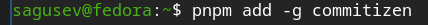
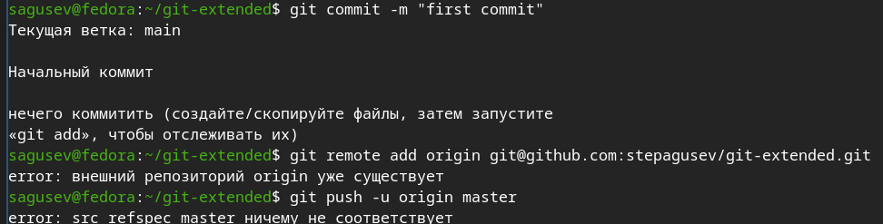
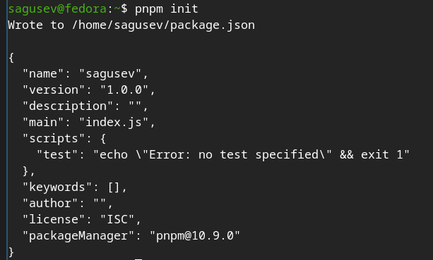
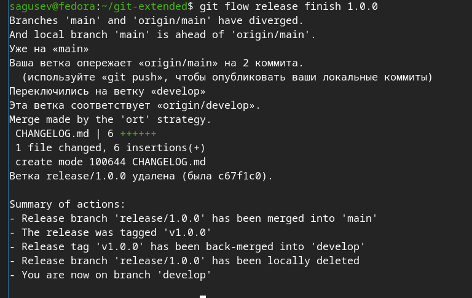
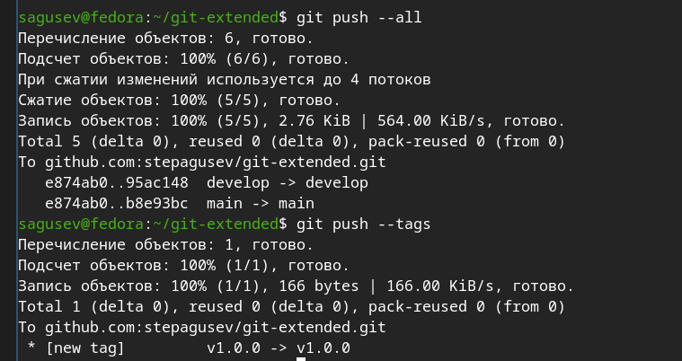
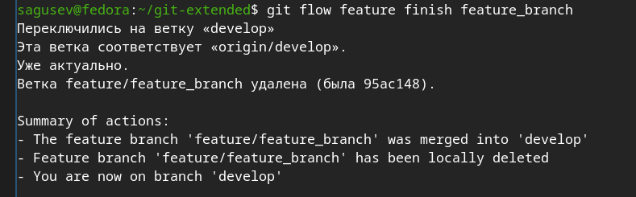
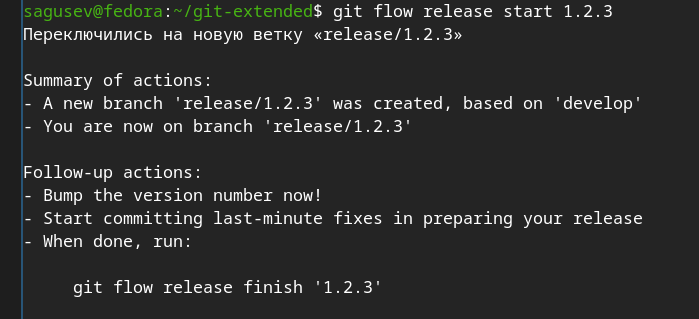
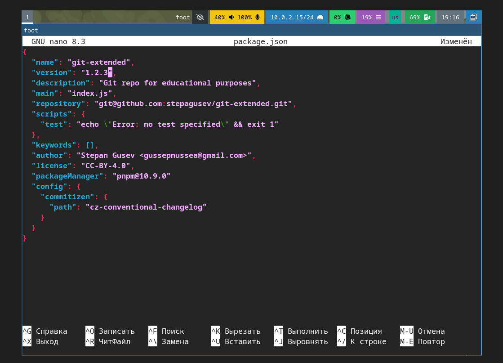
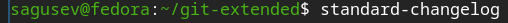
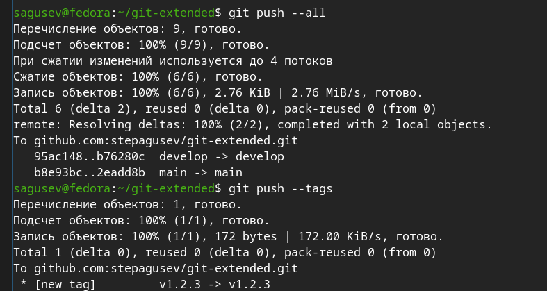

---
## Authors
author:
  name: Гусев Степан Андреевич
  email: 1032242444@rudn.ru
  affiliation:
    - name: Российский университет дружбы народов
      country: Российская Федерация
      postal-code: 117198
      city: Москва
      address: ул. Миклухо-Маклая, д. 6
## Title
title: "Презентация по лабораторной работе №4"
subtitle: "Дисциплина: Архитектура компьютеров и операционные системы"
license: CC BY
date: today
date-format: "YYYY-MM-DD" # Example: 2025-09-06
---

# Информация

##

:::::::::::::: {.columns align=center}
::: {.column width="100%"}

**Презентация по лабораторной работе №4**

---

**Автор:**
Гусев Степан Андреевич

**Преподаватель:**
Кулябов Дмитрий Сергеевич, д.ф.-м.н., профессор кафедры теории вероятностей и кибербезопасности

Российский университет дружбы народов

:::
::::::::::::::

## Докладчик

:::::::::::::: {.columns align=center}
::: {.column width="70%"}

  * Гусев Степан Андреевич
  * Студент программы "Бизнес-информатика"
  * Российский университет дружбы народов им. П. Лумумбы
  * [1032242444@rudn.ru](mailto:1032242444@rudn.ru)
  * <https://github.com/stepagusev>

:::
::: {.column width="30%"}

:::
::::::::::::::

## Цель

Получить навыки правильной работы с репозиториями git.

## Задание

1) Выполнить работу для тестового репозитория.
2) Преобразовать рабочий репозиторий в репозиторий с git-flow и conventional commits.

# Выполнение лабораторной работы

## Установка git-flow

Подключил репозитории Copr.

{#fig-001 width=70%}

## Установка git-flow

Установил git-flow.

{#fig-002 width=70%}

## Установка Node.js

Установил Node.js.

{#fig-003 width=70%}

## Установка Node.js

Установил pnpm.

{#fig-004 width=70%}

## Настройка Node.js

Добавил каталог с исполняемыми файлами, устанавливаемыми yarn, в переменную PATH, запустив pnpm setup.

{#fig-005 width=70%}

## Настройка Node.js

Выполнил source ~/.bashrc.

{#fig-006 width=70%}

## Общепринятые коммиты

Установил программу commitizen для помощи в форматировании коммитов.

{#fig-007 width=70%}

## Общепринятые коммиты

Установил программу standard-changelog для помощи в созданиии логов.

{#fig-008 width=70%}

## Создание репозитория git

Создал репозиторий на Github.

{#fig-009 width=70%}

## Создание репозитория git

Сделал первый коммит и выложил на Github.

{#fig-010 width=70%}

## Создание репозитория git

Создал конфигурацию для пакетов Node.js с помощью pnpm init.

{#fig-011 width=70%}

## Создание репозитория git

Открыл файл с помощью редактора nano.

{#fig-012 width=70%}

## Создание репозитория git

Сконфигурировал формат конфигов.

{#fig-013 width=70%}

## Создание репозитория git

Добавил новые файлы с помощью git add . .

{#fig-014 width=70%}

## Создание репозитория git

Выполнил коммит с помощью git cz.

{#fig-015 width=70%}

## Создание репозитория git

Отправил на Github с помощью git push.

{#fig-016 width=70%}

## Создание репозитория git

Инициализировал git-flow с помощью git-flow init и установил префикс для ярлыков v.

{#fig-017 width=70%}

## Создание репозитория git

Проверил, что я на ветке develop с помощью git branch.

{#fig-018 width=70%}

## Создание репозитория git

Загрузил весь репозиторий с помощью git push --all.

{#fig-019 width=70%}

## Создание репозитория git

Установил внешнюю ветку как вышестоящую для этой ветки.

{#fig-020 width=70%}

## Создание репозитория git

Создал релиз с версией 1.0.0.

{#fig-021 width=70%}

## Создание репозитория git

Создал журнал изменений.

{#fig-022 width=70%}

## Создание репозитория git

Добавил журнал изменений в индекс.

{#fig-023 width=70%}

## Создание репозитория git

Залил релизную ветку в основную ветку.

{#fig-024 width=70%}

## Создание репозитория git

Отправил данные на Github.

{#fig-025 width=70%}

## Создание репозитория git

Создал релиз на Github.

{#fig-026 width=70%}

## Работа с репозиторием git

Создал ветку для новой функциональности.

{#fig-027 width=70%}

## Работа с репозиторием git

Объединил ветки.

{#fig-028 width=70%}

## Работа с репозиторием git

Создал релиз с версией 1.2.3.

{#fig-029 width=70%}

## Работа с репозиторием git

Обновил номер версии в файле package.json ([рис. @fig-030]).

{#fig-030 width=70%}

Создал журнал изменений.

{#fig-031 width=70%}

## Работа с репозиторием git

Добавил журнал изменений в индекс.

{#fig-032 width=70%}

## Работа с репозиторием git

Залил релизную ветку в основную ветку.

{#fig-033 width=70%}

## Работа с репозиторием git

Отправил данные на Github.

{#fig-034 width=70%}

## Работа с репозиторием git

Создал релиз на Github с комментарием из журнала изменений ([рис. @fig-035]).

{#fig-035 width=70%}

# Выводы

## Выводы

Я получил навыки правильной работы с репозиториями git через git flow.
