---
## Author
author:
  name: Степан Андреевич Гусев
  email: 1032242444@rudn.ru
  affiliation:
    - name: Российский университет дружбы народов
      country: Российская Федерация
      postal-code: 117198
      city: Москва
      address: ул. Миклухо-Маклая, д. 6

## Title
title: "Отчёт по лабораторной работе №4"
subtitle: "Архитектура компьютеров и операционные системы"
license: "CC BY"
---

# Цель работы

Получить навыки правильной работы с репозиториями git.

# Задание

1) Выполнить работу для тестового репозитория.
2) Преобразовать рабочий репозиторий в репозиторий с git-flow и conventional commits.

# Выполнение лабораторной работы

## Установка программного обеспечения

### Установка git-flow

Подключил репозитории Copr ([рис. @fig-001]).

{#fig-001 width=70%}

Установил git-flow ([рис. @fig-002]).

{#fig-002 width=70%}

### Установка Node.js

Установил Node.js ([рис. @fig-003]).

{#fig-003 width=70%}

Установил pnpm ([рис. @fig-004]).

{#fig-004 width=70%}

### Настройка Node.js

Добавил каталог с исполняемыми файлами, устанавливаемыми yarn, в переменную PATH, запустив pnpm setup ([рис. @fig-005]).

{#fig-005 width=70%}

Выполнил source ~/.bashrc ([рис. @fig-006]).

{#fig-006 width=70%}

### Общепринятые коммиты

Установил программу commitizen для помощи в форматировании коммитов ([рис. @fig-007]).

{#fig-007 width=70%}

Установил программу standard-changelog для помощи в созданиии логов ([рис. @fig-008]).

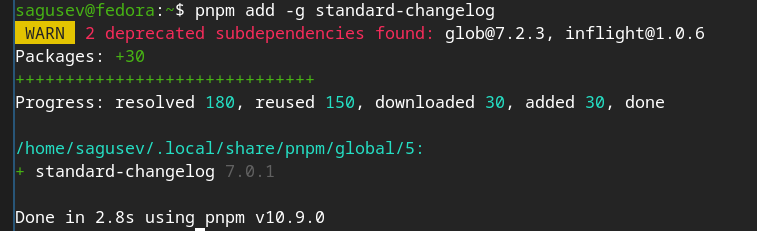{#fig-008 width=70%}

## Практический сценарий использования

### Создание репозитория git

Создал репозиторий на Github ([рис. @fig-009]).

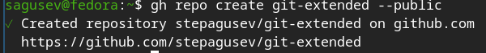{#fig-009 width=70%}

Сделал первый коммит и выложил на Github ([рис. @fig-010]).

{#fig-010 width=70%}

Создал конфигурацию для пакетов Node.js с помощью pnpm init ([рис. @fig-011]).

{#fig-011 width=70%}

Открыл файл с помощью редактора nano ([рис. @fig-012]).

{#fig-012 width=70%}

Сконфигурировал формат конфигов ([рис. @fig-013]).

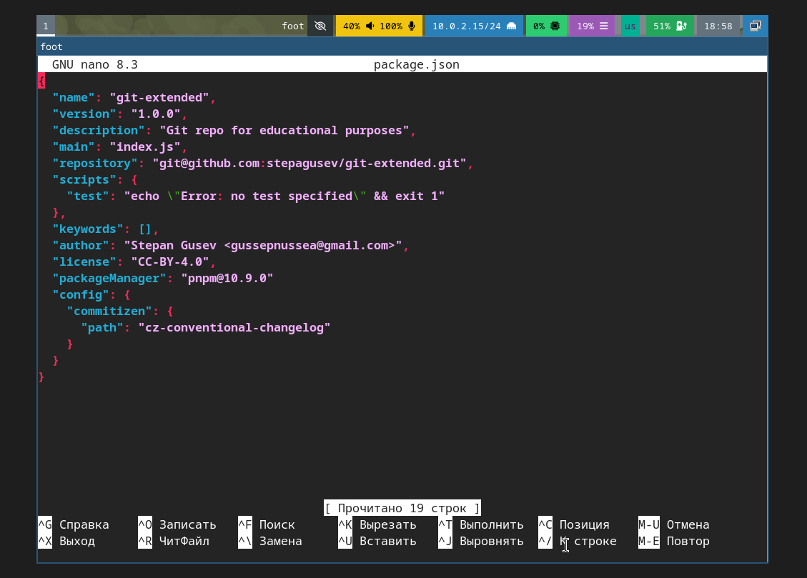{#fig-013 width=70%}

Добавил новые файлы с помощью git add . ([рис. @fig-014]).

{#fig-014 width=70%}

Выполнил коммит с помощью git cz ([рис. @fig-015]).

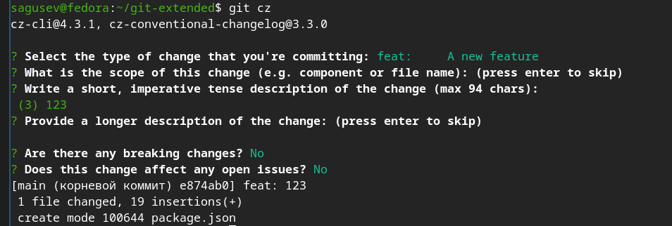{#fig-015 width=70%}

Отправил на Github с помощью git push ([рис. @fig-016]).

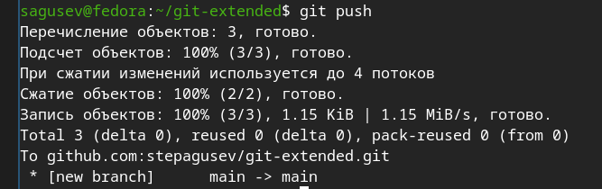{#fig-016 width=70%}

Инициализировал git-flow с помощью git-flow init и установил префикс для ярлыков v ([рис. @fig-017]).

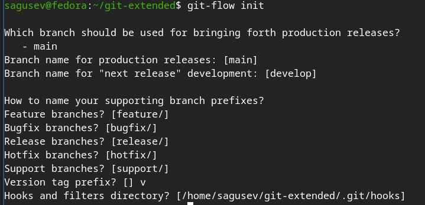{#fig-017 width=70%}

Проверил, что я на ветке develop с помощью git branch ([рис. @fig-018]).

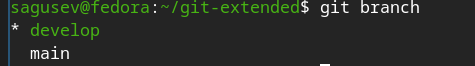{#fig-018 width=70%}

Загрузил весь репозиторий с помощью git push --all ([рис. @fig-019]).

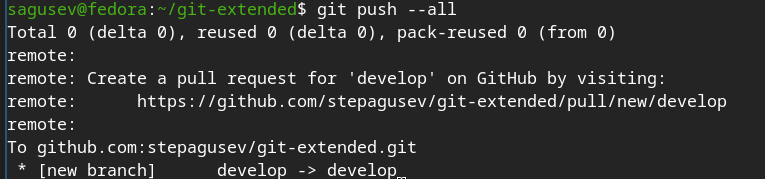{#fig-019 width=70%}

Установил внешнюю ветку как вышестоящую для этой ветки ([рис. @fig-020]).

{#fig-020 width=70%}

Создал релиз с версией 1.0.0 ([рис. @fig-021]).

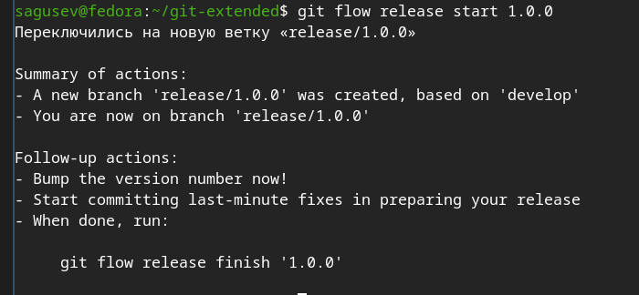{#fig-021 width=70%}

Создал журнал изменений ([рис. @fig-022]).

{#fig-022 width=70%}

Добавил журнал изменений в индекс ([рис. @fig-023]).

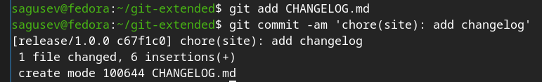{#fig-023 width=70%}

Залил релизную ветку в основную ветку ([рис. @fig-024]).

{#fig-024 width=70%}

Отправил данные на Github ([рис. @fig-025]).

{#fig-025 width=70%}

Создал релиз на Github ([рис. @fig-026]).

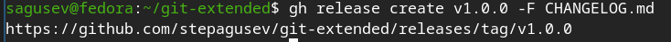{#fig-026 width=70%}

### Работа с репозиторием git

Создал ветку для новой функциональности ([рис. @fig-027]).

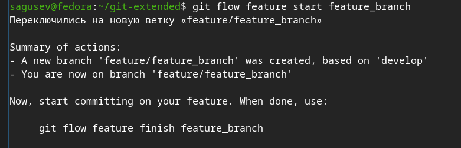{#fig-027 width=70%}

Объединил ветки ([рис. @fig-028]).

{#fig-028 width=70%}

Создал релиз с версией 1.2.3 ([рис. @fig-029]).

{#fig-029 width=70%}

Обновил номер версии в файле package.json ([рис. @fig-030]).

{#fig-030 width=70%}

Создал журнал изменений ([рис. @fig-031]).

{#fig-031 width=70%}

Добавил журнал изменений в индекс ([рис. @fig-032]).

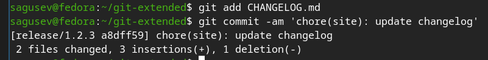{#fig-032 width=70%}

Залил релизную ветку в основную ветку ([рис. @fig-033]).

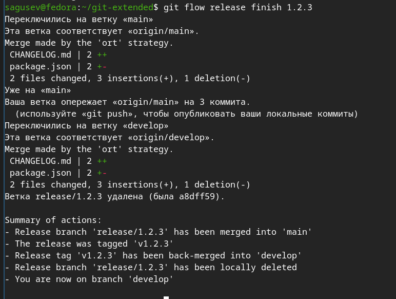{#fig-033 width=70%}

Отправил данные на Github ([рис. @fig-034]).

{#fig-034 width=70%}

Создал релиз на Github с комментарием из журнала изменений ([рис. @fig-035]).

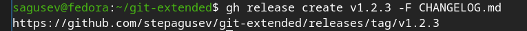{#fig-035 width=70%}

# Выводы

Я получил навыки правильной работы с репозиториями git через git flow.

# Список литературы

1. https://esystem.rudn.ru/mod/page/view.php?id=1358328
