---
## Authors
author:
  name: Гусев Степан Андреевич
  email: 1032242444@rudn.ru
  affiliation:
    - name: Российский университет дружбы народов
      country: Российская Федерация
      postal-code: 117198
      city: Москва
      address: ул. Миклухо-Маклая, д. 6
## Title
title: "Презентация по лабораторной работе №5"
subtitle: "Дисциплина: Архитектура компьютеров и операционные системы"
license: CC BY
date: today
date-format: "YYYY-MM-DD" # Example: 2025-09-06
---

# Информация

##

:::::::::::::: {.columns align=center}
::: {.column width="100%"}

**Презентация по лабораторной работе №5**

---

**Автор:**
Гусев Степан Андреевич

**Преподаватель:**
Кулябов Дмитрий Сергеевич, д.ф.-м.н., профессор кафедры теории вероятностей и кибербезопасности

Российский университет дружбы народов

:::
::::::::::::::

## Докладчик

:::::::::::::: {.columns align=center}
::: {.column width="70%"}

  * Гусев Степан Андреевич
  * Студент программы "Бизнес-информатика"
  * Российский университет дружбы народов им. П. Лумумбы
  * [1032242444@rudn.ru](mailto:1032242444@rudn.ru)
  * <https://github.com/stepagusev>

:::
::: {.column width="30%"}

:::
::::::::::::::

## Цель

Настроить менеджер паролей pass и познакомиться с управлением файлами конфигурации.

## Задание

1) Установка и настройка менеджера паролей pass.
2) Управление файлами конфигурации через chezmoi.

# Выполнение лабораторной работы

## Установка и настройка менеджера паролей pass

Установка pass и pass-otp.

{#fig-001 width=70%}

## Установка и настройка менеджера паролей pass

Установка gopass.

{#fig-002 width=70%}

## Установка и настройка менеджера паролей pass

Просмотрел список ключей.

{#fig-003 width=70%}

## Установка и настройка менеджера паролей pass

Инициализировал хранилище.

{#fig-004 width=70%}

## Установка и настройка менеджера паролей pass

Создал структуру git.

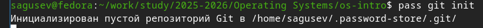{#fig-005 width=70%}

## Установка и настройка менеджера паролей pass

Ввёл фразу пароль.

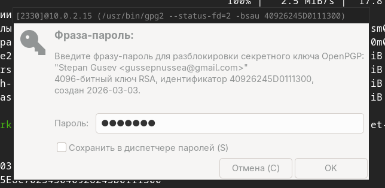{#fig-006 width=70%}

## Установка и настройка менеджера паролей pass

Задал адрес репозитория на хостинге.

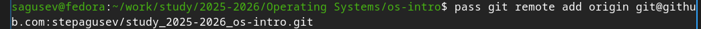{#fig-007 width=70%}

## Установка и настройка менеджера паролей pass

Синхронизировал репозитории.

{#fig-008 width=70%}

{#fig-009 width=70%}

## Установка и настройка менеджера паролей pass

Проверил статус синхронизации.

{#fig-010 width=70%}

## Настройка интерфейса с браузером

Запустил браузер firefox.

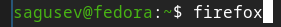{#fig-011 width=70%}

## Настройка интерфейса с браузером

Установил плагин для браузера firefox.

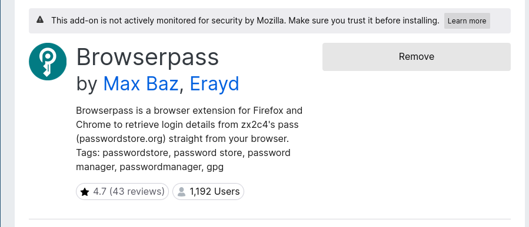{#fig-012 width=70%}

## Настройка интерфейса с браузером

Подключил репозиторий.

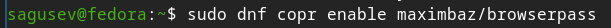{#fig-013 width=70%}

## Настройка интерфейса с браузером

Установил интерфейс browserpass для взаимодействия с браузером.

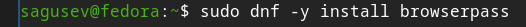{#fig-014 width=70%}

## Сохранение паролей

Добавил новый пароль.

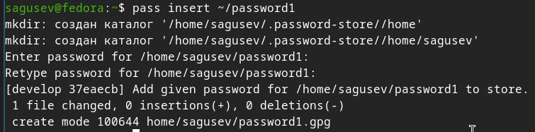{#fig-015 width=70%}

## Сохранение паролей

Отобразил пароль.

{#fig-016 width=70%}

## Сохранение паролей

Заменил существующий пароль.

{#fig-017 width=70%}

## Управление файлами конфигурации через chezmoi

Установил дополнительного ПО .

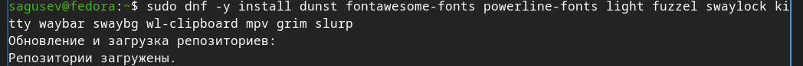{#fig-018 width=70%}

## Управление файлами конфигурации через chezmoi

Подключил репозиторий.

{#fig-019 width=70%}

## Управление файлами конфигурации через chezmoi

Установил шрифты.

{#fig-020 width=70%}

{#fig-021 width=70%}

## Управление файлами конфигурации через chezmoi

Установил бинарный файл chezmoi с помощью wget.

{#fig-022 width=70%}

## Управление файлами конфигурации через chezmoi

Создал свой репозиторий для конфигурационных файлов на основе шаблона.

{#fig-023 width=70%}

## Управление файлами конфигурации через chezmoi

Инициализировал chezmoi с моим репозиторием dotfiles.

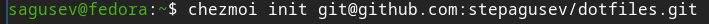{#fig-024 width=70%}

## Управление файлами конфигурации через chezmoi

Проверил, какие изменения внесёт chezmoi в домашний каталог.

{#fig-025 width=70%}

## Управление файлами конфигурации через chezmoi

Применил изменения.

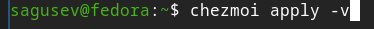{#fig-026 width=70%}

## Управление файлами конфигурации через chezmoi

На второй машине инициализировал chezmoi с моим репозиторием dotfiles.

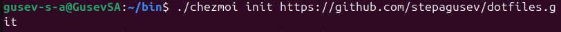{#fig-027 width=70%}

## Управление файлами конфигурации через chezmoi

Проверил, какие изменения внесёт chezmoi в домашний каталог.

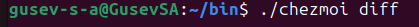{#fig-028 width=70%}

## Управление файлами конфигурации через chezmoi

Применил изменения.

{#fig-029 width=70%}

## Управление файлами конфигурации через chezmoi

Получил и применил последние изменения из моего репозитория.

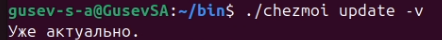{#fig-030 width=70%}

## Управление файлами конфигурации через chezmoi

Установил свои dotfiles на новый компьютер.

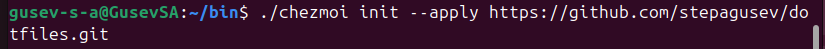{#fig-031 width=70%}

## Управление файлами конфигурации через chezmoi

Извлёк изменения из репозитория и применил их.

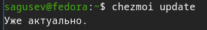{#fig-032 width=70%}

## Управление файлами конфигурации через chezmoi

Посмотрел, что изменится, не применяя изменения.

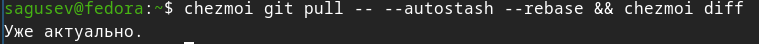{#fig-033 width=70%}

## Управление файлами конфигурации через chezmoi

Применил изменения.

{#fig-034 width=70%}

## Управление файлами конфигурации через chezmoi

Открыл файл конфигурации с помощью nano.

{#fig-035 width=70%}

## Управление файлами конфигурации через chezmoi

Добавил некоторые строки в файл, чтобы включить функцию автоматический фиксации и отправки изменений.

{#fig-036 width=70%}

# Выводы

## Выводы

Я установил и настроитл менеджер паролей pass и познакомился с управлением файлами конфигурации через chezmoi.
