---
## Author
author:
  name: Степан Андреевич Гусев
  email: 1032242444@rudn.ru
  affiliation:
    - name: Российский университет дружбы народов
      country: Российская Федерация
      postal-code: 117198
      city: Москва
      address: ул. Миклухо-Маклая, д. 6

## Title
title: "Отчёт по лабораторной работе №5"
subtitle: "Архитектура компьютеров и операционные системы"
license: "CC BY"
---

# Цель работы

Настроить менеджер паролей pass и познакомиться с управлением файлами конфигурации.

# Задание

1) Установка и настройка менеджера паролей pass.
2) Управление файлами конфигурации через chezmoi.

# Выполнение лабораторной работы

## Установка и настройка менеджера паролей pass

### Установка

Установка pass и pass-otp ([рис. @fig-001]).

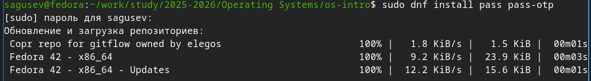{#fig-001 width=70%}

Установка gopass ([рис. @fig-002]).

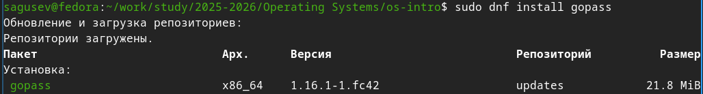{#fig-002 width=70%}

### Настройка

Просмотрел список ключей ([рис. @fig-003]).

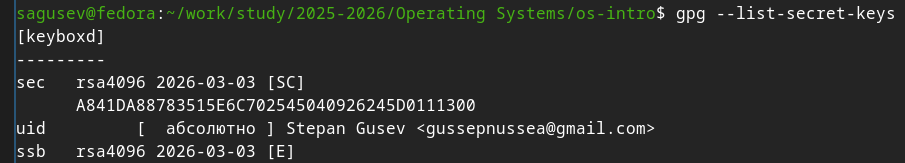{#fig-003 width=70%}

Инициализировал хранилище ([рис. @fig-004]).

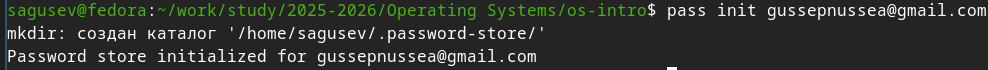{#fig-004 width=70%}

Создал структуру git ([рис. @fig-005]).

{#fig-005 width=70%}

Ввёл фразу пароль ([рис. @fig-006]).

{#fig-006 width=70%}

Задал адрес репозитория на хостинге ([рис. @fig-007]).

{#fig-007 width=70%}

Синхронизировал репозитории ([рис. @fig-008]), ([рис. @fig-009]).

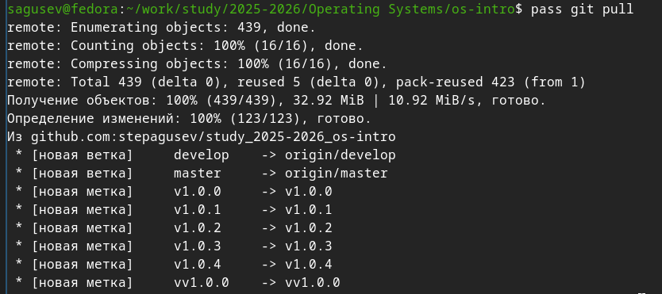{#fig-008 width=70%}

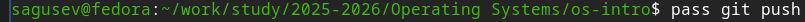{#fig-009 width=70%}

Проверил статус синхронизации ([рис. @fig-010]).

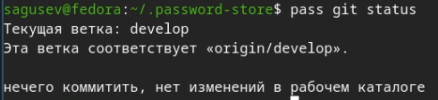{#fig-010 width=70%}

### Настройка интерфейса с браузером

Запустил браузер firefox ([рис. @fig-011]).

{#fig-011 width=70%}

Установил плагин для браузера firefox ([рис. @fig-012]).

{#fig-012 width=70%}

Подключил репозиторий ([рис. @fig-013]).

{#fig-013 width=70%}

Установил интерфейс browserpass для взаимодействия с браузером ([рис. @fig-014]).

{#fig-014 width=70%}

### Сохранение паролей

Добавил новый пароль ([рис. @fig-015]).

{#fig-015 width=70%}

Отобразил пароль ([рис. @fig-016]).

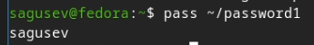{#fig-016 width=70%}

Заменил существующий пароль ([рис. @fig-017]).

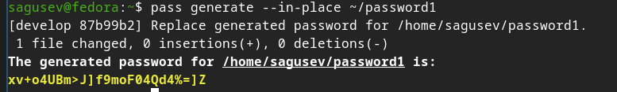{#fig-017 width=70%}

## Управление файлами конфигурации через chezmoi

### Установка дополнительного ПО

Установил дополнительного ПО ([рис. @fig-018]).

{#fig-018 width=70%}

Подключил репозиторий ([рис. @fig-019]).

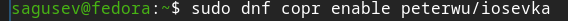{#fig-019 width=70%}

Установил шрифты ([рис. @fig-020]), ([рис. @fig-021]).

{#fig-020 width=70%}

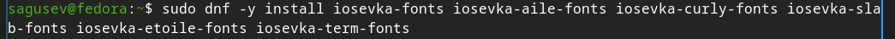{#fig-021 width=70%}

### Установка chezmoi

Установил бинарный файл chezmoi с помощью wget ([рис. @fig-022]).

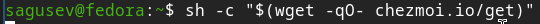{#fig-022 width=70%}

### Создание собственного репозитория с помощью утилит

Создал свой репозиторий для конфигурационных файлов на основе шаблона ([рис. @fig-023]).

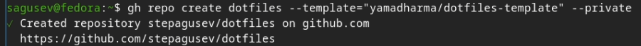{#fig-023 width=70%}

### Подключение репозитория к своей системе

Инициализировал chezmoi с моим репозиторием dotfiles ([рис. @fig-024]).

{#fig-024 width=70%}

Проверил, какие изменения внесёт chezmoi в домашний каталог ([рис. @fig-025]).

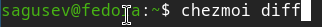{#fig-025 width=70%}

Применил изменения ([рис. @fig-026]).

{#fig-026 width=70%}

### Использование chezmoi на нескольких машинах

На второй машине инициализировал chezmoi с моим репозиторием dotfiles ([рис. @fig-027]).

{#fig-027 width=70%}

Проверил, какие изменения внесёт chezmoi в домашний каталог ([рис. @fig-028]).

{#fig-028 width=70%}

Применил изменения ([рис. @fig-029]).

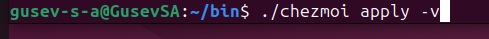{#fig-029 width=70%}

Получил и применил последние изменения из моего репозитория ([рис. @fig-030]).

{#fig-030 width=70%}

### Настройка новой машины одной командой

Установил свои dotfiles на новый компьютер ([рис. @fig-031]).

{#fig-031 width=70%}

### Ежедневные операции с chezmoi

Извлёк изменения из репозитория и применил их ([рис. @fig-032]).

{#fig-032 width=70%}

Посмотрел, что изменится, не применяя изменения ([рис. @fig-033]).

{#fig-033 width=70%}

Применил изменения ([рис. @fig-034]).

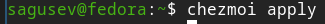{#fig-034 width=70%}

Открыл файл конфигурации с помощью nano ([рис. @fig-035]).

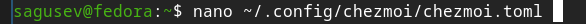{#fig-035 width=70%}

Добавил некоторые строки в файл, чтобы включить функцию автоматический фиксации и отправки изменений ([рис. @fig-036]).

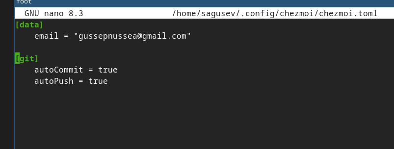{#fig-036 width=70%}

# Выводы

Я установил и настроитл менеджер паролей pass и познакомился с управлением файлами конфигурации через chezmoi.

# Список литературы

1. https://esystem.rudn.ru/mod/page/view.php?id=1358330#orgb06553f
