---
## Authors
author:
  name: Гусев Степан Андреевич
  email: 1032242444@rudn.ru
  affiliation:
    - name: Российский университет дружбы народов
      country: Российская Федерация
      postal-code: 117198
      city: Москва
      address: ул. Миклухо-Маклая, д. 6
## Title
title: "Презентация по лабораторной работе №6"
subtitle: "Дисциплина: Архитектура компьютеров и операционные системы"
license: CC BY
date: today
date-format: "YYYY-MM-DD" # Example: 2025-09-06
---

# Информация

##

:::::::::::::: {.columns align=center}
::: {.column width="100%"}

**Презентация по лабораторной работе №6**

---

**Автор:**
Гусев Степан Андреевич

**Преподаватель:**
Кулябов Дмитрий Сергеевич, д.ф.-м.н., профессор кафедры теории вероятностей и кибербезопасности

Российский университет дружбы народов

:::
::::::::::::::

## Докладчик

:::::::::::::: {.columns align=center}
::: {.column width="70%"}

  * Гусев Степан Андреевич
  * Студент программы "Бизнес-информатика"
  * Российский университет дружбы народов им. П. Лумумбы
  * [1032242444@rudn.ru](mailto:1032242444@rudn.ru)
  * <https://github.com/stepagusev>

:::
::: {.column width="30%"}

:::
::::::::::::::

## Цель

Приобретение практических навыков взаимодействия пользователя с системой посредством командной строки.

## Задание

1) Определить полное имя вашего домашнего каталога
2) Работа с командой ls
3) Работа с каталогами
4) С помощью команды man определить, какую опцию команды ls нужно использовать для просмотра содержимого не только указанного каталога, но и подкаталогов, входящих в него.
5) С помощью команды man определить набор опций команды ls, позволяющий отсортировать по времени последнего изменения выводимый список содержимого каталога с развёрнутым описанием файлов.
6) Использовать команду man для просмотра описания следующих команд: cd, pwd, mkdir, rmdir, rm. Пояснить основные опции этих команд.
7) Используя информацию, полученную при помощи команды history, выполнить модификацию и исполнение нескольких команд из буфера команд.

# Выполнение лабораторной работы

## Определить полное имя домашнего каталога

Определил полное имя домашнего каталога с помощью команды pwd.

{#fig-001 width=70%}

## Работа с командой ls

Перешёл в каталог /tmp с помощью команды cd.

{#fig-002 width=70%}

## Работа с командой ls

Вывел на экран содержимое каталога командой ls.

{#fig-003 width=70%}

## Работа с командой ls

Вывел на экран все файлы, в том числе и скрытые командой ls -a.

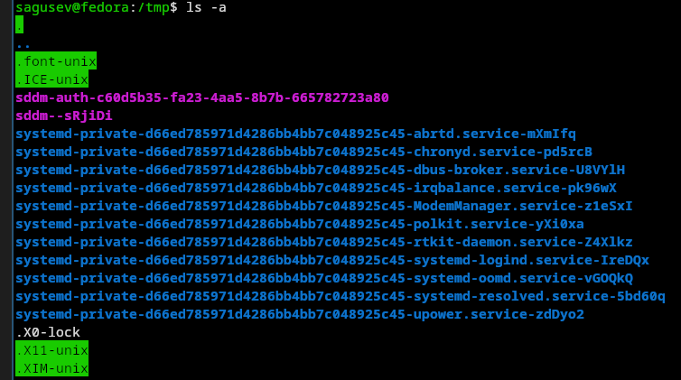{#fig-004 width=70%}

## Работа с командой ls

Вывел на экран все файлы и их тип командой ls -F.

{#fig-005 width=70%}

## Работа с командой ls

Вывел на экран все файлы и информацию о них командой ls -l.

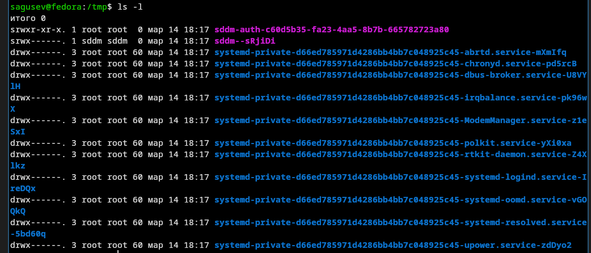{#fig-006 width=70%}

## Работа с командой ls

Определил, что в каталоге /var/spool есть подкаталог с именем cron.

{#fig-007 width=70%}

## Работа с командой ls

Перешёл в домашний каталог с помощью команды cd и вывел на экран его содержимое командой ls -l, чтобы определить, кто является владельцем файлов и подкаталогов.

{#fig-008 width=70%}

## Работа с каталогами

В домашнем каталоге создал новый каталог с именем newdir командой mkdir.

{#fig-009 width=70%}

## Работа с каталогами

В каталоге ~/newdir создайл новый каталог с именем morefun.

{#fig-010 width=70%}

## Работа с каталогами

В домашнем каталоге создал одной командой три новых каталога с именами letters, memos, misk, перечислив их через пробел.

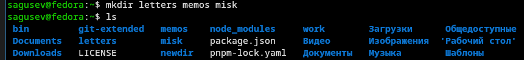{#fig-011 width=70%}

## Работа с каталогами

Удалил эти каталоги одной командой.

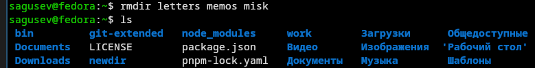{#fig-012 width=70%}

## Работа с каталогами

Попробовал удалить ранее созданный каталог ~/newdir командой rm, вышла ошибка и каталог не удалился, так как он был непустой.

{#fig-013 width=70%}

## Работа с каталогами

Удалил каталог ~/newdir/morefun из домашнего каталога и проверил, был ли он удалён.

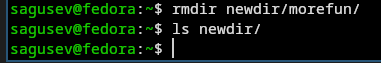{#fig-014 width=70%}

## Работа с командой man

С помощью команды man определил, что опцию '-R' команды ls нужно использовать для просмотра содержимого не только указанного каталога, но и подкаталогов, входящих в него.

{#fig-015 width=70%}

{#fig-016 width=70%}

## Работа с командой man

С помощью команды man определите набор опций команды ls, позволяющий отсортировать по времени последнего изменения выводимый список содержимого каталога с развёрнутым описанием файлов.

{#fig-017 width=70%}

{#fig-018 width=70%}

{#fig-019 width=70%}

## Работа с командой man

Использовал команду man для просмотра описания команд: cd, pwd, mkdir, rmdir, rm.

{#fig-020 width=70%}

## Работа с командой man

Команда cd имеет следующие опции: -L - переход с учётом символических ссылок, -P - переход по физическому пути, игнорируя символические ссылки.

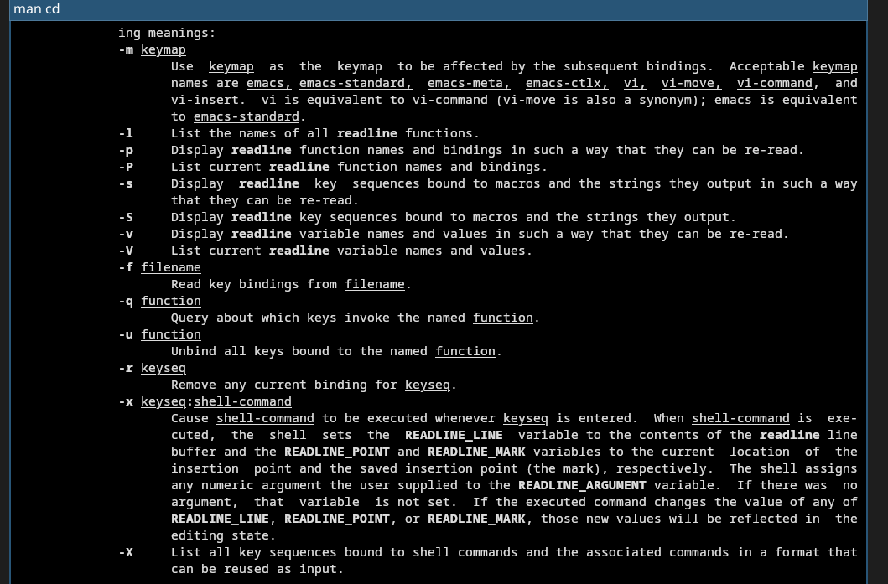{#fig-021 width=70%}

## Работа с командой man

Команда pwd имеет следующие опции: -L - выводит путь с учётом символических ссылок, если такие использовались для перехода в директорию, -P - выводит физический путь показывая реальное местоположение директории в файловой системе.

{#fig-022 width=70%}

## Работа с командой man

Команда mkdir имеет следующие опции: -v - более подробный вывод для каждой директории, -p - создаёт и родителей, если таковых ещё нет, -m - позволяет задать права доступа, аналогично chmod.

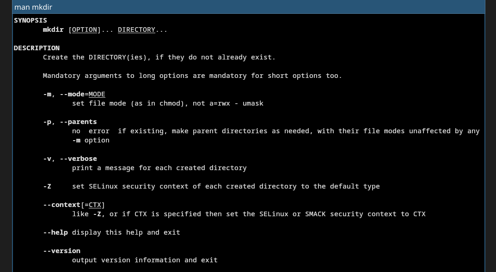{#fig-023 width=70%}

## Работа с командой man

Команда rmdir имеет следующие опции: -p - удаляет каталог и его родителей, -v - более подробный вывод для каждой директории.

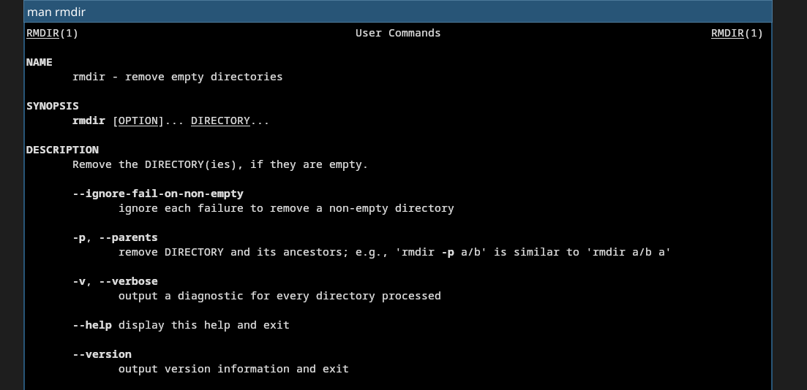{#fig-024 width=70%}

## Работа с командой man

Команда rm имеет следующие опции: -r - удаляет каталог и всё его содержимое, -f - удаляет принудительно, -d - удаляет пустые директории, -i - при удалении нескольких файлов запрашивает новый промпт перед удалением следующего файла.

{#fig-025 width=70%}

## Работа с командой man

Используя информацию, полученную при помощи команды history, выполнил модификацию и исполнение нескольких команд из буфера команд.

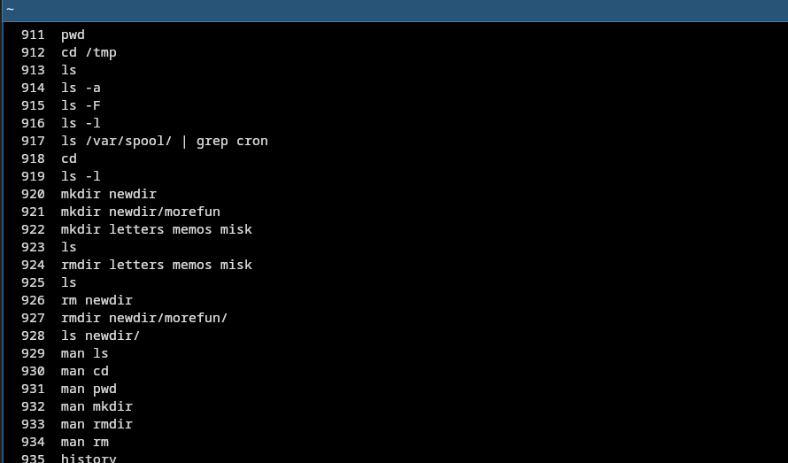{#fig-026 width=70%}

{#fig-027 width=70%}

## Работа с командой man

Заменил в команде ls опцию -а на -ltr.

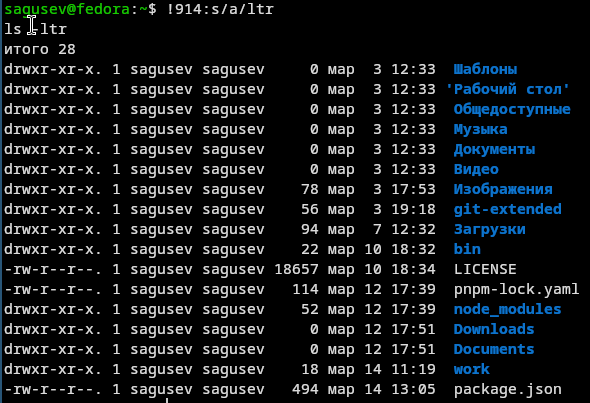{#fig-029 width=70%}

## Работа с командой man

Заменил в команде man команду rm на exit.

{#fig-030 width=70%}

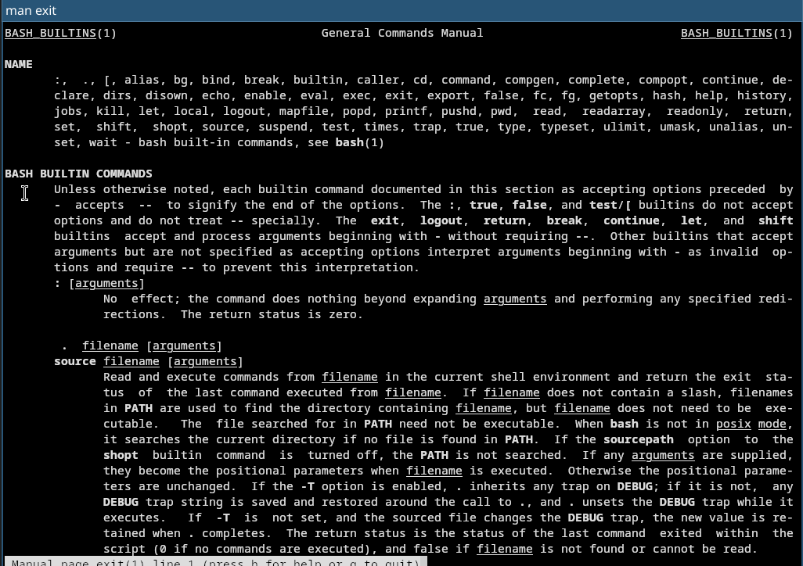{#fig-031 width=70%}

## Работа с командой man

Заменил в команде mkdir каталог newdir на notnewdir.

{#fig-032 width=70%}

# Выводы

## Выводы

Я приобрел практические навыки взаимодействия пользователя с системой посредством командной строки.
