---
## Author
author:
  name: Степан Андреевич Гусев
  email: 1032242444@rudn.ru
  affiliation:
    - name: Российский университет дружбы народов
      country: Российская Федерация
      postal-code: 117198
      city: Москва
      address: ул. Миклухо-Маклая, д. 6

## Title
title: "Отчёт по лабораторной работе №6"
subtitle: "Архитектура компьютеров и операционные системы"
license: "CC BY"
---

# Цель работы

Приобретение практических навыков взаимодействия пользователя с системой посредством командной строки.

# Задание

1. Определить полное имя вашего домашнего каталога.
2. Выполнить следующие действия:
- Перейдите в каталог /tmp.
- Выведите на экран содержимое каталога /tmp. Для этого используйте команду ls
с различными опциями. Поясните разницу в выводимой на экран информации.
- Определите, есть ли в каталоге /var/spool подкаталог с именем cron?
- Перейдите в Ваш домашний каталог и выведите на экран его содержимое. Определите, кто является владельцем файлов и подкаталогов?
3. Выполнить следующие действия:
- В домашнем каталоге создайте новый каталог с именем newdir.
- В каталоге ~/newdir создайте новый каталог с именем morefun.
- В домашнем каталоге создайте одной командой три новых каталога с именами.
letters, memos, misk. Затем удалите эти каталоги одной командой.
- Попробуйте удалить ранее созданный каталог ~/newdir командой rm. Проверьте,
был ли каталог удалён.
- Удалите каталог ~/newdir/morefun из домашнего каталога. Проверьте, был ли
каталог удалён.
4. С помощью команды man определить, какую опцию команды ls нужно использовать для просмотра содержимого не только указанного каталога, но и подкаталогов, входящих в него.
5. С помощью команды man определить набор опций команды ls, позволяющий отсортировать по времени последнего изменения выводимый список содержимого каталога с развёрнутым описанием файлов.
6. Использовать команду man для просмотра описания следующих команд: cd, pwd, mkdir, rmdir, rm. Пояснить основные опции этих команд.
7. Используя информацию, полученную при помощи команды history, выполнить модификацию и исполнение нескольких команд из буфера команд.

# Теоретическое введение

В операционной системе типа Linux взаимодействие пользователя с системой обычно осуществляется с помощью командной строки посредством построчного ввода команд. При этом обычно используется командные интерпретаторы языка shell: /bin/sh; /bin/csh; /bin/ksh.

Командой в операционной системе называется записанный по специальным правилам текст (возможно с аргументами), представляющий собой указание на выполнение какой-либо функций (или действий) в операционной системе. Обычно первым словом идёт имя команды, остальной текст — аргументы или опции, конкретизирующие действие.

Общий формат команд можно представить следующим образом: <имя_команды><разделитель><аргументы> Команда man. Команда man используется для просмотра (оперативная помощь) в диалоговом режиме руководства (manual) по основным командам операционной системы типа Linux.

Формат команды: man <команда>

Файловая система ОС типа Linux — иерархическая система каталогов, подкаталогов и файлов, которые обычно организованы и сгруппированы по функциональному признаку. Самый верхний каталог в иерархии называется корневым и обозначается символом /. Корневой каталог содержит системные файлы и другие каталоги.

В работе с командами, в качестве аргументов которых выступает путь к какому-либо каталогу или файлу, можно использовать сокращённую запись пути.

# Выполнение лабораторной работы

## Определить полное имя домашнего каталога

Определил полное имя домашнего каталога с помощью команды pwd ([рис. @fig-001]).

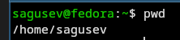{#fig-001 width=70%}

## Работа с командой ls

Перешёл в каталог /tmp с помощью команды cd ([рис. @fig-002]).

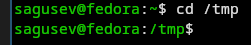{#fig-002 width=70%}

Вывел на экран содержимое каталога командой ls ([рис. @fig-003]).

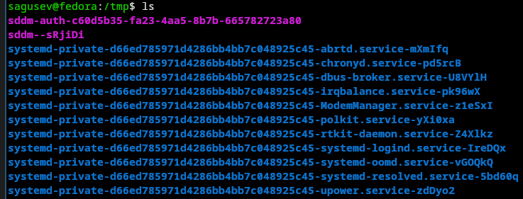{#fig-003 width=70%}

Вывел на экран все файлы, в том числе и скрытые командой ls -a ([рис. @fig-004]).

{#fig-004 width=70%}

Вывел на экран все файлы и их тип командой ls -F ([рис. @fig-005]).

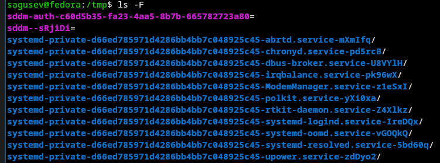{#fig-005 width=70%}

Вывел на экран все файлы и информацию о них командой ls -l ([рис. @fig-006]).

{#fig-006 width=70%}

Определил, что в каталоге /var/spool есть подкаталог с именем cron ([рис. @fig-007]).

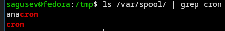{#fig-007 width=70%}

Перешёл в домашний каталог с помощью команды cd и вывел на экран его содержимое командой ls -l, чтобы определить, кто является владельцем файлов и подкаталогов ([рис. @fig-008]).

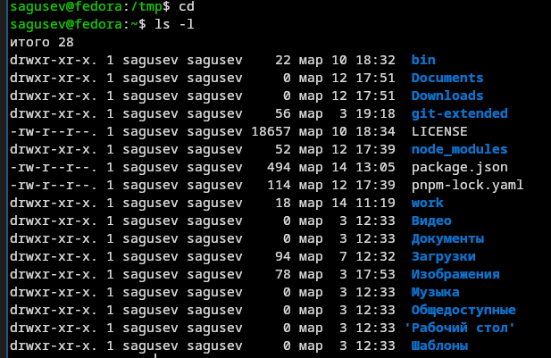{#fig-008 width=70%}

## Работа с каталогами

В домашнем каталоге создал новый каталог с именем newdir командой mkdir ([рис. @fig-009]).

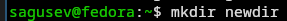{#fig-009 width=70%}

В каталоге ~/newdir создайл новый каталог с именем morefun ([рис. @fig-010]).

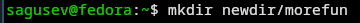{#fig-010 width=70%}

В домашнем каталоге создал одной командой три новых каталога с именами letters, memos, misk, перечислив их через пробел ([рис. @fig-011]).

{#fig-011 width=70%}

Удалил эти каталоги одной командой ([рис. @fig-012]).

{#fig-012 width=70%}

Попробовал удалить ранее созданный каталог ~/newdir командой rm ([рис. @fig-013]), вышла ошибка и каталог не удалился, так как он был непустой.

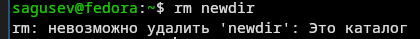{#fig-013 width=70%}

Удалил каталог ~/newdir/morefun из домашнего каталога и проверил, был ли он удалён ([рис. @fig-014]).

{#fig-014 width=70%}

## Работа с командой man

С помощью команды man ([рис. @fig-015]) определил, что опцию '-R' команды ls нужно использовать для просмотра содержимого не только указанного каталога, но и подкаталогов, входящих в него ([рис. @fig-016]).

{#fig-015 width=70%}

{#fig-016 width=70%}

С помощью команды man определите набор опций команды ls ([рис. @fig-017]), позволяющий отсортировать по времени последнего изменения ([рис. @fig-018]) выводимый список содержимого каталога с развёрнутым описанием файлов ([рис. @fig-019]).

{#fig-017 width=70%}

{#fig-018 width=70%}

{#fig-019 width=70%}

Использовал команду man для просмотра описания команд: cd, pwd, mkdir, rmdir, rm ([рис. @fig-020]).

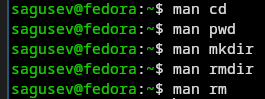{#fig-020 width=70%}

Команда cd имеет следующие опции: -L - переход с учётом символических ссылок, -P - переход по физическому пути, игнорируя символические ссылки ([рис. @fig-021]).

{#fig-021 width=70%}

Команда pwd имеет следующие опции: -L - выводит путь с учётом символических ссылок, если такие использовались для перехода в директорию, -P - выводит физический путь показывая реальное местоположение директории в файловой системе ([рис. @fig-022]).

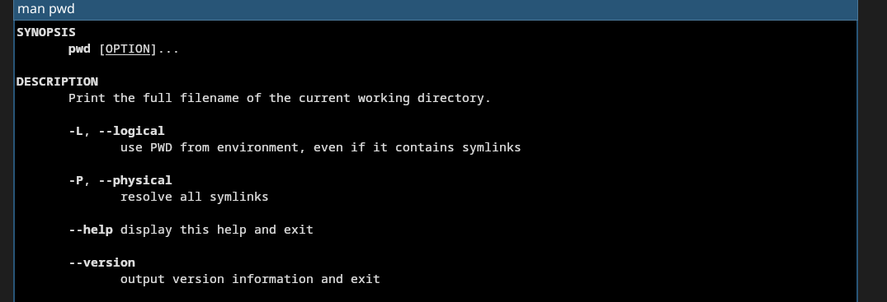{#fig-022 width=70%}

Команда mkdir имеет следующие опции: -v - более подробный вывод для каждой директории, -p - создаёт и родителей, если таковых ещё нет, -m - позволяет задать права доступа, аналогично chmod ([рис. @fig-023]).

{#fig-023 width=70%}

Команда rmdir имеет следующие опции: -p - удаляет каталог и его родителей, -v - более подробный вывод для каждой директории ([рис. @fig-024]).

{#fig-024 width=70%}

Команда rm имеет следующие опции: -r - удаляет каталог и всё его содержимое, -f - удаляет принудительно, -d - удаляет пустые директории, -i - при удалении нескольких файлов запрашивает новый промпт перед удалением следующего файла ([рис. @fig-025]).

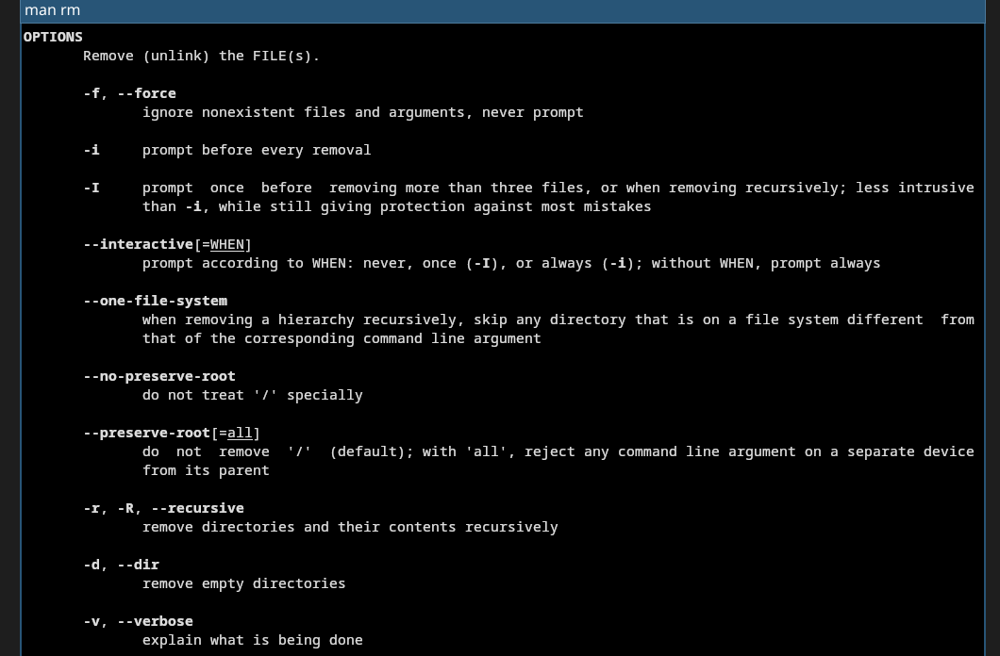{#fig-025 width=70%}

Используя информацию ([рис. @fig-026]), полученную при помощи команды history ([рис. @fig-027]), выполнил модификацию и исполнение нескольких команд из буфера команд.

{#fig-026 width=70%}

{#fig-027 width=70%}

Заменил в команде ls опцию -а на -ltr ([рис. @fig-029]).

{#fig-029 width=70%}

Заменил в команде man команду rm на exit ([рис. @fig-030]), ([рис. @fig-031]).

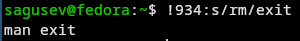{#fig-030 width=70%}

{#fig-031 width=70%}

Заменил в команде mkdir каталог newdir на notnewdir ([рис. @fig-029]).

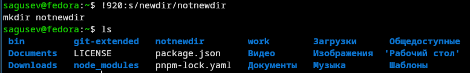{#fig-032 width=70%}

# Ответы на контрольные вопросы

1) Командная строка - это текстовая система, которая передает команды компьютеру и возвращает результаты пользователю. В операционной системе типа Linux взаимодействие пользователя с системой обычно осуществляется с помощью командной строки посредством построчного ввода команд.

2) Для определения абсолютного пути к текущему каталогу используется команда pwd. Например: если я введу pwd в своем домашнем каталоге то получу /home/sagusev

3) С помощью команды ls можно определить имена файлов, при помощи опции -F уже мы сможем определить тип файлов. Пример есть в лабораторной работе.

4) С помощью команды ls можно определить имена файлов, если нам необходимы скрытые файлы, добавим опцию -a. Пример есть в лабораторной работе.

5) rmdir по умолчанию удаляет пустые каталоги, не удаляет файлы. rm удаляет файлы, без дополнительных опций (-d, -r) не будет удалять каталоги. Удалить в одной строчке одной командой можно файл и каталог. Если файл находится в каталоге, используем рекурсивное удаление, если файл и каталог не связаны подобным образом, то добавим опцию -d, введя имена через пробел после утилиты. Пример есть в лабораторной работе.

6) Вывести информацию о последних выполненных пользователем команд можно с помощью history. Пример есть в лабораторной работе.

7) Используем синтаксис !<номер_команды>:s/<что_меняем>/<на_что_меняем>. Примеры есть в лабораторной работе.

8) Предположим, я нахожусь не в домашнем каталоге. Если я введу "cd ; ls", то окажусь в домашнем каталоге и получу вывод файлов внутри него.

9) Символ экранирования - (обратный слеш) добавление перед спецсимволом обратный слеш, чтобы использовать специальный символ как обычный. Также позволяет читать системе название директорий с пробелом. Пример: cd work/Операционные\ системы/

10) Опция -l позволит увидеть дополнительную информацию о файлах в каталоге: время создания, владельца, права доступа

11) Относительный путь к файлу начинается из той директории, где вы находитесь (она сама не прописывается в пути), он прописывается относительно данной директории. Абсолютный путь начинается с корневого каталога. Пример, прописав cd /tmp нас перенесёт в каталог tmp корневого каталога, а прописав cd tmp нас перенесёт в подкаталог tmp текущего каталога.

12) Использовать man <имя команды> или <имя команды> --help

13) Клавиша Tab.

# Выводы

Я приобрел практические навыки взаимодействия пользователя с системой посредством командной строки.

# Список литературы

1. https://esystem.rudn.ru/mod/resource/view.php?id=1358332
