---
## Authors
author:
  name: Гусев Степан Андреевич
  email: 1032242444@rudn.ru
  affiliation:
    - name: Российский университет дружбы народов
      country: Российская Федерация
      postal-code: 117198
      city: Москва
      address: ул. Миклухо-Маклая, д. 6
## Title
title: "Презентация по лабораторной работе №7"
subtitle: "Дисциплина: Архитектура компьютеров и операционные системы"
license: CC BY
date: today
date-format: "YYYY-MM-DD" # Example: 2025-09-06
---

# Информация

##

:::::::::::::: {.columns align=center}
::: {.column width="100%"}

**Презентация по лабораторной работе №7**

---

**Автор:**
Гусев Степан Андреевич

**Преподаватель:**
Кулябов Дмитрий Сергеевич, д.ф.-м.н., профессор кафедры теории вероятностей и кибербезопасности

Российский университет дружбы народов

:::
::::::::::::::

## Докладчик

:::::::::::::: {.columns align=center}
::: {.column width="70%"}

  * Гусев Степан Андреевич
  * Студент программы "Бизнес-информатика"
  * Российский университет дружбы народов им. П. Лумумбы
  * [1032242444@rudn.ru](mailto:1032242444@rudn.ru)
  * <https://github.com/stepagusev>

:::
::: {.column width="30%"}

:::
::::::::::::::

## Цель

Ознакомление с файловой системой Linux, её структурой, именами и содержанием каталогов. Приобретение практических навыков по применению команд для работы с файлами и каталогами, по управлению процессами (и работами), по проверке использования диска и обслуживанию файловой системы.

## Задание

1) Выполнить все примеры, приведённые в первой части описания лабораторной работы
2) Выполнить команды по копированию, созданию и перемещению файлов и каталогов
3) Определить опции команды chmod
4) Изменить права доступа к файлам
5) Прочитать документацию по командам mount, fsck, mkfs, kill и кратко их охарактеризовать с примерами

# Выполнение лабораторной работы

## Выполнение примеров из первой части работы

Создал файл abc1 и скопировал его в файлы april и may.

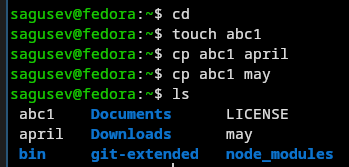{#fig-001 width=70%}

## Выполнение примеров из первой части работы

Создал каталог monthly и скопировал в него файлы april и may.

{#fig-002 width=70%}

## Выполнение примеров из первой части работы

Скопировал файл monthly/may в monthly/june.

{#fig-003 width=70%}

## Выполнение примеров из первой части работы

Создал каталог monthly.00 и скопировал в него каталог monthly.

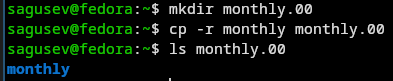{#fig-004 width=70%}

## Выполнение примеров из первой части работы

Скопировал каталог monthly.00 в /tmp.

{#fig-005 width=70%}

## Выполнение примеров из первой части работы

Переименовал файл april в july с помощью команды mv.

{#fig-006 width=70%}

## Выполнение примеров из первой части работы

Переместил файл july в каталог monthly.00 с помощью команды mv.

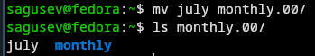{#fig-007 width=70%}

## Выполнение примеров из первой части работы

Переименовал каталог monthly.00 в monthly.01.

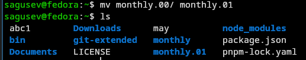{#fig-008 width=70%}

## Выполнение примеров из первой части работы

Создал каталог reports и переместил в него каталог monthly.01.

{#fig-009 width=70%}

## Выполнение примеров из первой части работы

Переименовал каталог reports/monthly.01 в reports/monthly.

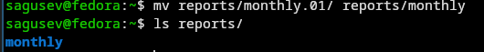{#fig-010 width=70%}

## Выполнение примеров из первой части работы

Создал файл may и задал право выполнения для владельца с помощью команды chmod.

{#fig-011 width=70%}

## Выполнение примеров из первой части работы

Лишил владельца права выполнения файла may с помощью команды chmod.

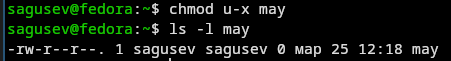{#fig-012 width=70%}

## Выполнение примеров из первой части работы

Создал каталог monthly с запретом на чтение для членов группы и всех остальных пользователей.

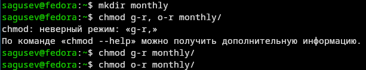{#fig-013 width=70%}

## Выполнение примеров из первой части работы

Создал файл abc1 с правом записи для членов группы.

{#fig-014 width=70%}

## Выполнение примеров из первой части работы

С помощью команды fsck проверил целостность файловой системы.

{#fig-015 width=70%}

## Выполнение команд по работе с файлами и каталогами

Скопировал файл /usr/include/sys/io.h в ~/equipment.

{#fig-016 width=70%}

## Выполнение команд по работе с файлами и каталогами

Создал директорию ~/ski.plases.

{#fig-017 width=70%}

## Выполнение команд по работе с файлами и каталогами

Переместил equipment в ski.plases.

{#fig-018 width=70%}

## Выполнение команд по работе с файлами и каталогами

Переименовал equipment в equiplist.

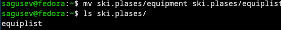{#fig-019 width=70%}

## Выполнение команд по работе с файлами и каталогами

Создал файл abc1 и переместил его в ski.plases под названием equiplist2.

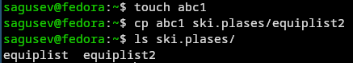{#fig-020 width=70%}

## Выполнение команд по работе с файлами и каталогами

В каталоге ski.plases создал подкаталог equipment.

{#fig-021 width=70%}

## Выполнение команд по работе с файлами и каталогами

Переместил файлы equiplist и equiplist2 в equipment.

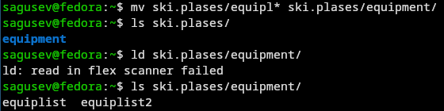{#fig-022 width=70%}

## Выполнение команд по работе с файлами и каталогами

Создал каталог newdir и переместил его в ski.plases с названием plans.

{#fig-023 width=70%}

## Определение опций команды chmod

С помощью команды chmod и опций g-x, o-x запретил выполнение каталога australia членам группы и всем пользователям.

{#fig-024 width=70%}

## Определение опций команды chmod

С помощью команды chmod и опций g-r, o-r запретил чтение каталога play членам группы и всем пользователям.

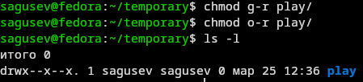{#fig-025 width=70%}

## Определение опций команды chmod

С помощью команды chmod и опций u-w, u+x запретил запись и разрешил выполнение файла my_os владельцу.

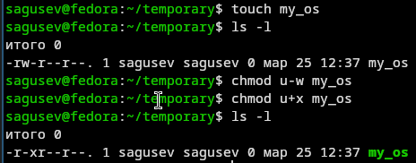{#fig-026 width=70%}

## Определение опций команды chmod

С помощью команды chmod и опций g+w разрешил запись в файл feathers членам группы.

{#fig-027 width=70%}

## Изменение прав доступа к файлам

Просмотрел содержимое файла /etc/passwd.

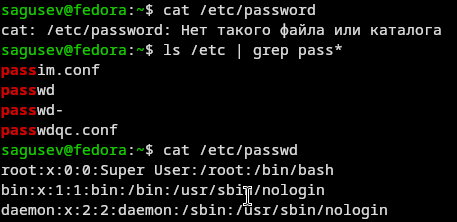{#fig-028 width=70%}

## Изменение прав доступа к файлам

Скопировал файл ~/feathers в ~/file.old, переместил ~/file.old в ~/play, скопировал ~/play в ~/fun, переместил ~/fun в ~/play под названием games.

{#fig-029 width=70%}

## Изменение прав доступа к файлам

Лишил владельца файла ~/feathers права на чтение, попытался просмотреть содержимое ~/feathers с помощью cat и получил ошибку.

{#fig-030 width=70%}

## Изменение прав доступа к файлам

Попытался скопировать файл ~/feathers и также получил ошибку.

{#fig-031 width=70%}

## Изменение прав доступа к файлам

Дал владельцу файла ~/feathers право на чтение.

{#fig-032 width=70%}

## Изменение прав доступа к файлам

Лишил владельца каталога ~/play права на выполнение, попытался перейти в ~/play и получил ошибку.

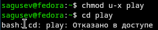{#fig-033 width=70%}

## Изменение прав доступа к файлам

Вернул владельцу каталога ~/play право на выполнение.

{#fig-034 width=70%}

## Краткое описание команд mount, fsck, mkfs, kill 

С помощью команды man прочитал описание команд mount, fsck, mkfs, kill: 
- mount — утилита командной строки в UNIX-подобных операционных системах. Применяется для монтирования файловых систем.
- fsck (проверка файловой системы) - это утилита командной строки, которая позволяет выполнять проверки согласованности и интерактивное исправление в одной или нескольких файловых системах Linux. Он использует программы, специфичные для типа файловой системы, которую он проверяет.
- mkfs используется для создания файловой системы Linux на некотором устройстве, обычно в разделе жёсткого диска. В качестве аргумента filesys для файловой системы может выступать или название устройства
- Команда Kill посылает указанный сигнал указанному процессу. Если не указано ни одного сигнала, посылается сигнал SIGTERM. Сигнал SIGTERM завершает лишь те процессы, которые не обрабатывают его приход. Для других процессов может быть необходимым послать сигнал SIGKILL, поскольку этот сигнал перехватить невозможно.

{#fig-035 width=70%}

# Выводы

## Выводы

Я ознакомился с файловой системой Linux, её структурой, именами и содержанием каталогов, приобрёл практические навыки по применению команд для работы с файлами и каталогами, по управлению процессами (и работами), по проверке использования диска и обслуживанию файловой системы.
