---
## Author
author:
  name: Степан Андреевич Гусев
  email: 1032242444@rudn.ru
  affiliation:
    - name: Российский университет дружбы народов
      country: Российская Федерация
      postal-code: 117198
      city: Москва
      address: ул. Миклухо-Маклая, д. 6

## Title
title: "Отчёт по лабораторной работе №7"
subtitle: "Архитектура компьютеров и операционные системы"
license: "CC BY"
---

# Цель работы

Ознакомление с файловой системой Linux, её структурой, именами и содержанием каталогов. Приобретение практических навыков по применению команд для работы с файлами и каталогами, по управлению процессами (и работами), по проверке использования диска и обслуживанию файловой системы.

# Задание

1) Выполнить все примеры, приведённые в первой части описания лабораторной работы
2) Выполнить команды по копированию, созданию и перемещению файлов и каталогов
3) Определить опции команды chmod
4) Изменить права доступа к файлам
5) Прочитать документацию по командам mount, fsck, mkfs, kill и кратко их охарактеризовать с примерами

# Теоретическое введение

Для создания текстового файла можно использовать команду touch. Для просмотра файлов небольшого размера можно использовать команду cat. Для просмотра файлов постранично удобнее использовать команду less. Команда cp используется для копирования файлов и каталогов. Команды mv и mvdir предназначены для перемещения и переименования файлов и каталогов.

Каждый файл или каталог имеет права доступа. В сведениях о файле или каталоге указываются:

– тип файла (символ (-) обозначает файл, а символ (d) — каталог);

– права для владельца файла (r — разрешено чтение, w — разрешена запись, x — разрешено выполнение, - — право доступа отсутствует);

– права для членов группы (r — разрешено чтение, w — разрешена запись, x — разрешено выполнение, - — право доступа отсутствует);

– права для всех остальных (r — разрешено чтение, w — разрешена запись, x — разрешено выполнение, - — право доступа отсутствует).

Права доступа к файлу или каталогу можно изменить, воспользовавшись командой chmod. Сделать это может владелец файла (или каталога) или пользователь с правами администратора.

Файловая система в Linux состоит из фалов и каталогов. Каждому физическому носителю соответствует своя файловая система. Существует несколько типов файловых систем. Перечислим наиболее часто встречающиеся типы:

– ext2fs (second extended filesystem);

– ext2fs (third extended file system);

– ext4 (fourth extended file system);

– ReiserFS;

– xfs;

– fat (file allocation table);

– ntfs (new technology file system).

Для просмотра используемых в операционной системе файловых систем можно воспользоваться командой mount без параметров.

# Выполнение лабораторной работы

## Выполнение примеров из первой части работы

Создал файл abc1 и скопировал его в файлы april и may ([рис. @fig-001]).

{#fig-001 width=70%}

Создал каталог monthly и скопировал в него файлы april и may ([рис. @fig-002]).

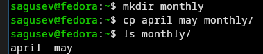{#fig-002 width=70%}

Скопировал файл monthly/may в monthly/june ([рис. @fig-003]).

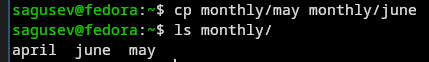{#fig-003 width=70%}

Создал каталог monthly.00 и скопировал в него каталог monthly ([рис. @fig-004]).

{#fig-004 width=70%}

Скопировал каталог monthly.00 в /tmp ([рис. @fig-005]).

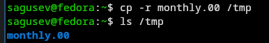{#fig-005 width=70%}

Переименовал файл april в july с помощью команды mv ([рис. @fig-006]).

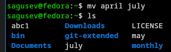{#fig-006 width=70%}

Переместил файл july в каталог monthly.00 с помощью команды mv ([рис. @fig-007]).

{#fig-007 width=70%}

Переименовал каталог monthly.00 в monthly.01 ([рис. @fig-008]).

{#fig-008 width=70%}

Создал каталог reports и переместил в него каталог monthly.01 ([рис. @fig-009]).

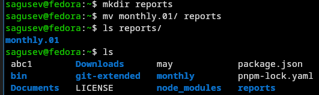{#fig-009 width=70%}

Переименовал каталог reports/monthly.01 в reports/monthly ([рис. @fig-010]).

{#fig-010 width=70%}

Создал файл may и задал право выполнения для владельца с помощью команды chmod ([рис. @fig-011]).

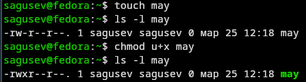{#fig-011 width=70%}

Лишил владельца права выполнения файла may с помощью команды chmod ([рис. @fig-012]).

{#fig-012 width=70%}

Создал каталог monthly с запретом на чтение для членов группы и всех остальных пользователей ([рис. @fig-013]).

{#fig-013 width=70%}

Создал файл abc1 с правом записи для членов группы ([рис. @fig-014]).

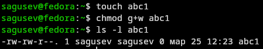{#fig-014 width=70%}

С помощью команды fsck проверил целостность файловой системы ([рис. @fig-015]).

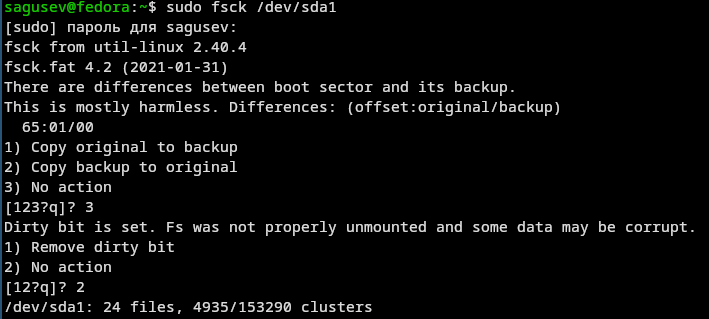{#fig-015 width=70%}

## Выполнение команд по копированию, созданию и перемещению файлов и каталогов

Скопировал файл /usr/include/sys/io.h в ~/equipment ([рис. @fig-016]).

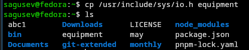{#fig-016 width=70%}

Создал директорию ~/ski.plases ([рис. @fig-017]).

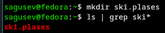{#fig-017 width=70%}

Переместил equipment в ski.plases ([рис. @fig-018]).

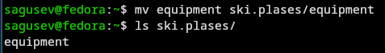{#fig-018 width=70%}

Переименовал equipment в equiplist ([рис. @fig-019]).

{#fig-019 width=70%}

Создал файл abc1 и переместил его в ski.plases под названием equiplist2 ([рис. @fig-020]).

{#fig-020 width=70%}

В каталоге ski.plases создал подкаталог equipment ([рис. @fig-021]).

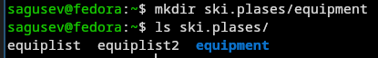{#fig-021 width=70%}

Переместил файлы equiplist и equiplist2 в equipment ([рис. @fig-022]).

{#fig-022 width=70%}

Создал каталог newdir и переместил его в ski.plases с названием plans ([рис. @fig-023]).

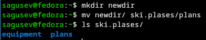{#fig-023 width=70%}

## Определение опций команды chmod

С помощью команды chmod и опций g-x, o-x запретил выполнение каталога australia членам группы и всем пользователям ([рис. @fig-024]).

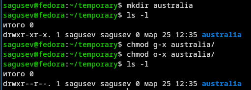{#fig-024 width=70%}

С помощью команды chmod и опций g-r, o-r запретил чтение каталога play членам группы и всем пользователям ([рис. @fig-025]).

{#fig-025 width=70%}

С помощью команды chmod и опций u-w, u+x запретил запись и разрешил выполнение файла my_os владельцу ([рис. @fig-026]).

{#fig-026 width=70%}

С помощью команды chmod и опций g+w разрешил запись в файл feathers членам группы ([рис. @fig-027]).

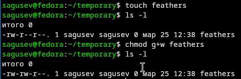{#fig-027 width=70%}

## Изменение прав доступа к файлам

Просмотрел содержимое файла /etc/passwd ([рис. @fig-028]).

{#fig-028 width=70%}

Скопировал файл ~/feathers в ~/file.old, переместил ~/file.old в ~/play, скопировал ~/play в ~/fun, переместил ~/fun в ~/play под названием games ([рис. @fig-029]).

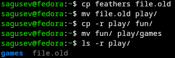{#fig-029 width=70%}

Лишил владельца файла ~/feathers права на чтение, попытался просмотреть содержимое ~/feathers с помощью cat и получил ошибку ([рис. @fig-030]).

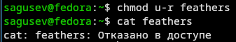{#fig-030 width=70%}

Попытался скопировать файл ~/feathers и также получил ошибку ([рис. @fig-031]).

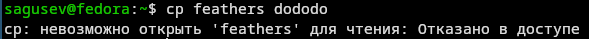{#fig-031 width=70%}

Дал владельцу файла ~/feathers право на чтение ([рис. @fig-032]).

{#fig-032 width=70%}

Лишил владельца каталога ~/play права на выполнение, попытался перейти в ~/play и получил ошибку ([рис. @fig-033]).

{#fig-033 width=70%}

Вернул владельцу каталога ~/play право на выполнение ([рис. @fig-034]).

{#fig-034 width=70%}

## Краткое описание команд mount, fsck, mkfs, kill 

С помощью команды man прочитал описание команд mount, fsck, mkfs, kill: 
- mount — утилита командной строки в UNIX-подобных операционных системах. Применяется для монтирования файловых систем.
- fsck (проверка файловой системы) - это утилита командной строки, которая позволяет выполнять проверки согласованности и интерактивное исправление в одной или нескольких файловых системах Linux. Он использует программы, специфичные для типа файловой системы, которую он проверяет.
- mkfs используется для создания файловой системы Linux на некотором устройстве, обычно в разделе жёсткого диска. В качестве аргумента filesys для файловой системы может выступать или название устройства
- Команда Kill посылает указанный сигнал указанному процессу. Если не указано ни одного сигнала, посылается сигнал SIGTERM. Сигнал SIGTERM завершает лишь те процессы, которые не обрабатывают его приход. Для других процессов может быть необходимым послать сигнал SIGKILL, поскольку этот сигнал перехватить невозможно ([рис. @fig-035]).

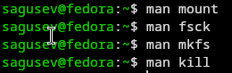{#fig-035 width=70%}

# Выводы

Я ознакомился с файловой системой Linux, её структурой, именами и содержанием каталогов, приобрёл практические навыки по применению команд для работы с файлами и каталогами, по управлению процессами (и работами), по проверке использования диска и обслуживанию файловой системы.

# Ответы на контрольные вопросы

1) Ext2, Ext3, Ext4 или Extended Filesystem - это стандартная файловая система для Linux. Она была разработана еще для Minix. Она самая стабильная из всех существующих, кодовая база изменяется очень редко и эта файловая система содержит больше всего функций. Версия ext2 была разработана уже именно для Linux и получила много улучшений. В 2001 году вышла ext3, которая добавила еще больше стабильности благодаря использованию журналирования. В 2006 была выпущена версия ext4, которая используется во всех дистрибутивах Linux до сегодняшнего дня. В ней было внесено много улучшений, в том числе увеличен максимальный размер раздела до одного экзабайта.
Btrfs или B-Tree File System - это совершенно новая файловая система, которая сосредоточена на отказоустойчивости, легкости администрирования и восстановления данных. Файловая система объединяет в себе очень много новых интересных возможностей, таких как размещение на нескольких разделах, поддержка подтомов, изменение размера не лету, создание мгновенных снимков, а также высокая производительность. Но многими пользователями файловая система Btrfs считается нестабильной. Тем не менее, она уже используется как файловая система по умолчанию в OpenSUSE и SUSE Linux.
VFAT (Virtual File Allocation Table) — это расширение файловой системы FAT (обычно FAT16 или FAT32), появившееся в Windows 95, которое обеспечивает поддержку длинных имён файлов (до 255 символов, включая пробелы и точки). Оно сохраняет совместимость со старым форматом имён 8.3 (Short File Name), добавляя к нему информацию о длинном имени (Long File Name - LFN) в кодировке UTF-16LE ([рис. @fig-036]).

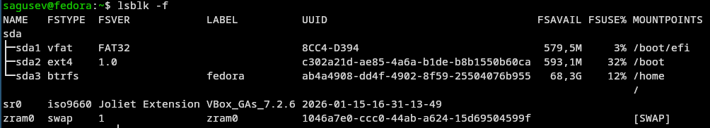{#fig-036 width=70%}

2)
/ — root каталог. Содержит в себе всю иерархию системы;

/bin — здесь находятся двоичные исполняемые файлы. Основные общие команды, хранящиеся отдельно от других программ в системе (прим.: pwd, ls, cat, ps);

/boot — тут расположены файлы, используемые для загрузки системы (образ initrd, ядро vmlinuz);

/dev — в данной директории располагаются файлы устройств (драйверов). С помощью этих файлов можно взаимодействовать с устройствами. К примеру, если это жесткий диск, можно подключить его к файловой системе. В файл принтера же можно написать напрямую и отправить задание на печать;

/etc — в этой директории находятся файлы конфигураций программ. Эти файлы позволяют настраивать системы, сервисы, скрипты системных демонов;

/home — каталог, аналогичный каталогу Users в Windows. Содержит домашние каталоги учетных записей пользователей (кроме root). При создании нового пользователя здесь создается одноименный каталог с аналогичным именем и хранит личные файлы этого пользователя;

/lib — содержит системные библиотеки, с которыми работают программы и модули ядра;

/lost+found — содержит файлы, восстановленные после сбоя работы системы. Система проведет проверку после сбоя и найденные файлы можно будет посмотреть в данном каталоге;

/media — точка монтирования внешних носителей. Например, когда вы вставляете диск в дисковод, он будет автоматически смонтирован в директорию /media/cdrom;

/mnt — точка временного монтирования. Файловые системы подключаемых устройств обычно монтируются в этот каталог для временного использования;

/opt — тут расположены дополнительные (необязательные) приложения. Такие программы обычно не подчиняются принятой иерархии и хранят свои файлы в одном подкаталоге (бинарные, библиотеки, конфигурации);

/proc — содержит файлы, хранящие информацию о запущенных процессах и о состоянии ядра ОС;

/root — директория, которая содержит файлы и личные настройки суперпользователя;

/run — содержит файлы состояния приложений. Например, PID-файлы или UNIX-сокеты;

/sbin — аналогично /bin содержит бинарные файлы. Утилиты нужны для настройки и администрирования системы суперпользователем;

/srv — содержит файлы сервисов, предоставляемых сервером (прим. FTP или Apache HTTP);

/sys — содержит данные непосредственно о системе. Тут можно узнать информацию о ядре, драйверах и устройствах;

/tmp — содержит временные файлы. Данные файлы доступны всем пользователям на чтение и запись. Стоит отметить, что данный каталог очищается при перезагрузке;

/usr — содержит пользовательские приложения и утилиты второго уровня, используемые пользователями, а

не системой. Содержимое доступно только для чтения (кроме root). Каталог имеет вторичную иерархию и похож на корневой;

/var — содержит переменные файлы. Имеет подкаталоги, отвечающие за отдельные переменные. Например, логи будут храниться в /var/log, кэш в /var/cache, очереди заданий в /var/spool/ и так далее.
([рис. @fig-037]), ([рис. @fig-038]).

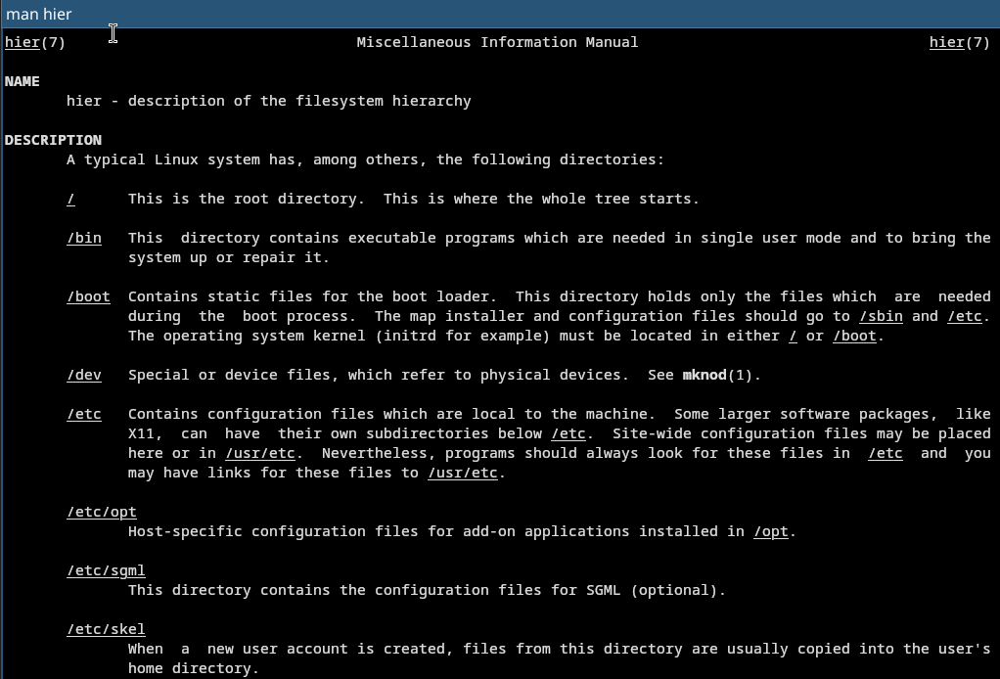{#fig-037 width=70%}

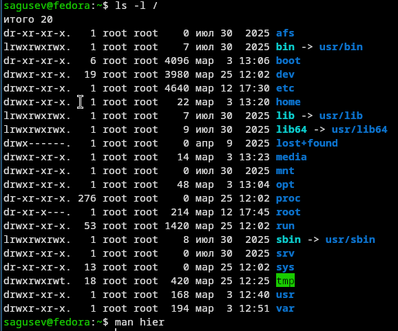{#fig-038 width=70%}

3) Монтирование тома.

4) Отсутствие синхронизации между образом файловой системы в памяти и ее данными на диске в случае аварийного останова может привести к появлению следующих ошибок:

Один блок адресуется несколькими mode (принадлежит нескольким файлам). Блок помечен как свободный, но в то же время занят (на него ссылается onode). Блок помечен как занятый, но в то же время свободен (ни один inode на него не ссылается). Неправильное число ссылок в inode (недостаток или избыток ссылающихся записей в каталогах). Несовпадение между размером файла и суммарным размером адресуемых inode блоков. Недопустимые адресуемые блоки (например, расположенные за пределами файловой системы). "Потерянные" файлы (правильные inode, на которые не ссылаются записи каталогов). Недопустимые или неразмещенные номера inode в записях каталогов.

5) mkfs - позволяет создать файловую систему Linux.

6) Cat - выводит содержимое файла на стандартное устройство вывода. Выполнение команды head выведет первые 10 строк текстового файла. Выполнение команды tail выведет последние 10 строк текстового файла. Команда tac - это тоже самое, что и cat, только отображает строки в обратном порядке. Для того, чтобы просмотреть огромный текстовый файл применяются команды для постраничного просмотра. Такие как more и less.

7) Cp – копирует или перемещает директорию, файлы.

8) Mv - переименовать или переместить файл или директорию

9) Права доступа к файлу или каталогу можно изменить, воспользовавшись командой chmod. Сделать это может владелец файла (или каталога) или пользователь с правами администратора.

# Список литературы

1. https://esystem.rudn.ru/pluginfile.php/3097171/mod_resource/content/4/005-lab_files.pdf
