---
## Authors
author:
  name: Гусев Степан Андреевич
  email: 1032242444@rudn.ru
  affiliation:
    - name: Российский университет дружбы народов
      country: Российская Федерация
      postal-code: 117198
      city: Москва
      address: ул. Миклухо-Маклая, д. 6
## Title
title: "Презентация по лабораторной работе №8"
subtitle: "Дисциплина: Архитектура компьютеров и операционные системы"
license: CC BY
date: today
date-format: "YYYY-MM-DD" # Example: 2025-09-06
---

# Информация

##

:::::::::::::: {.columns align=center}
::: {.column width="100%"}

**Презентация по лабораторной работе №8**

---

**Автор:**
Гусев Степан Андреевич

**Преподаватель:**
Кулябов Дмитрий Сергеевич, д.ф.-м.н., профессор кафедры теории вероятностей и кибербезопасности

Российский университет дружбы народов

:::
::::::::::::::

## Докладчик

:::::::::::::: {.columns align=center}
::: {.column width="70%"}

  * Гусев Степан Андреевич
  * Студент программы "Бизнес-информатика"
  * Российский университет дружбы народов им. П. Лумумбы
  * [1032242444@rudn.ru](mailto:1032242444@rudn.ru)
  * <https://github.com/stepagusev>

:::
::: {.column width="30%"}

:::
::::::::::::::

## Цель

Ознакомление с инструментами поиска файлов и фильтрации текстовых данных. Приобретение практических навыков: по управлению процессами (и заданиями), по проверке использования диска и обслуживанию файловых систем.

## Задание

1) Осуществите вход в систему, используя соответствующее имя пользователя.
2) Запишите в файл file.txt названия файлов, содержащихся в каталоге /etc. Допишите в этот же файл названия файлов, содержащихся в вашем домашнем каталоге.
3) Выведите имена всех файлов из file.txt, имеющих расширение .conf, после чего запишите их в новый текстовой файл conf.txt.
4) Определите, какие файлы в вашем домашнем каталоге имеют имена, начинавшиеся с символа c? Предложите несколько вариантов, как это сделать.
5) Выведите на экран (постранично) имена файлов из каталога /etc, начинающиеся с символа h.

## Задание

6) Запустите в фоновом режиме процесс, который будет записывать в файл ~/logfile файлы, имена которых начинаются с log.
7) Удалите файл ~/logfile.
8) Запустите из консоли в фоновом режиме редактор gedit.
9) Определите идентификатор процесса gedit, используя команду ps, конвейер и фильтр grep. Как ещё можно определить идентификатор процесса?
10) Прочтите справку (man) команды kill, после чего используйте её для завершения процесса gedit.
11) Выполните команды df и du, предварительно получив более подробную информацию
об этих командах, с помощью команды man.
12) Воспользовавшись справкой команды find, выведите имена всех директорий, имеющихся в вашем домашнем каталоге.

# Выполнение лабораторной работы

## Выполнение лабораторной работы

Вошёл в систему.

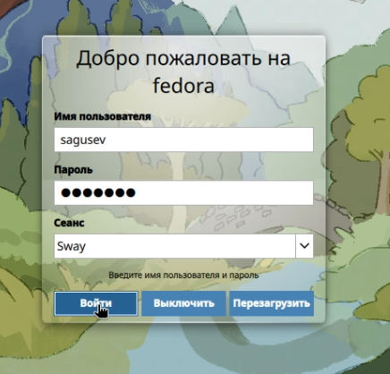{#fig-001 width=70%}

## Выполнение лабораторной работы

Записал в файл file.txt названия файлов, содержащихся в каталоге /etc.

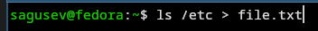{#fig-002 width=70%}

## Выполнение лабораторной работы

Дописал в этот же файл названия файлов, содержащихся в домашнем каталоге.

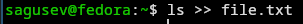{#fig-003 width=70%}

## Выполнение лабораторной работы

Вывел имена всех файлов из file.txt, имеющих расширение .conf, после чего записал их в новый текстовой файл conf.txt.

{#fig-004 width=70%}

## Выполнение лабораторной работы

Определил, какие файлы в домашнем каталоге имеют имена, начинавшиеся с символа 'c' двумя способами.

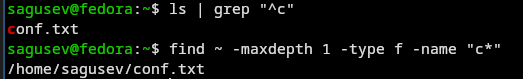{#fig-005 width=70%}

## Выполнение лабораторной работы

Вывел на экран постранично имена файлов из каталога /etc, начинающиеся с символа 'h'.

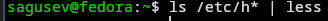{#fig-006 width=70%}

## Выполнение лабораторной работы

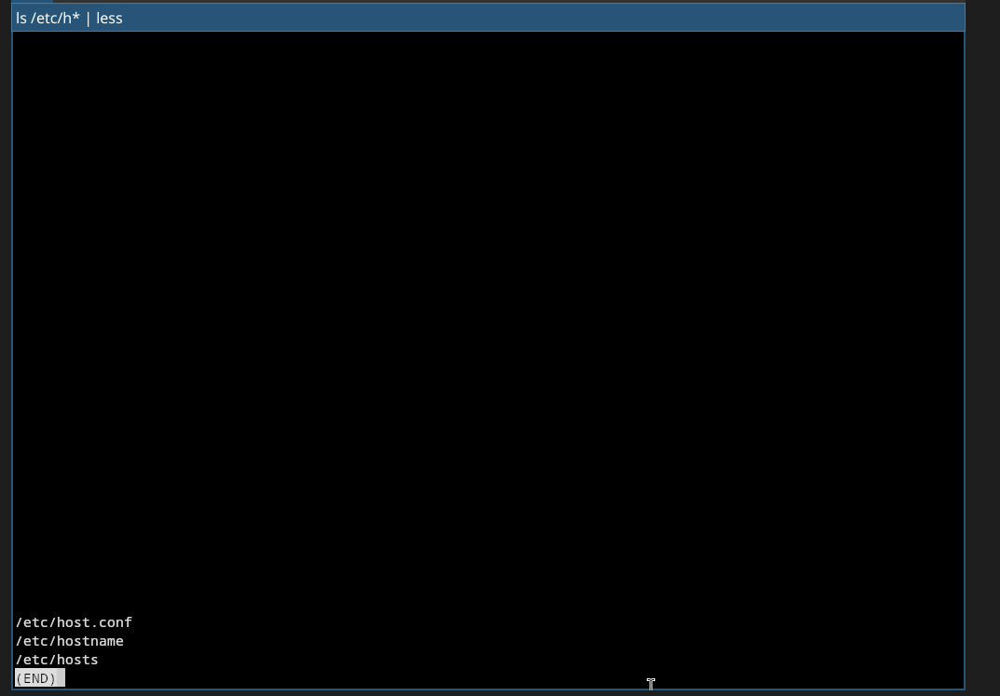{#fig-007 width=70%}

## Выполнение лабораторной работы

Запустил в фоновом режиме процесс, который записывает в файл ~/logfile файлы, имена которых начинаются с 'log'.

{#fig-008 width=70%}

## Выполнение лабораторной работы

Удалил файл ~/logfile.

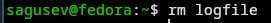{#fig-009 width=70%}

## Выполнение лабораторной работы

Запустил из консоли в фоновом режиме редактор nano вместо gedit, т.к. он не установлен.

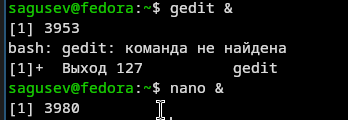{#fig-010 width=70%}

## Выполнение лабораторной работы

Определил идентификатор процесса nano, используя команду ps, конвейер и фильтр grep.

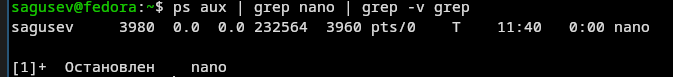{#fig-011 width=70%}

## Выполнение лабораторной работы

Ещё можно определить идентификатор процесса с помощью команды pgrep.

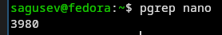{#fig-012 width=70%}

## Выполнение лабораторной работы

Прочёл справку команды kill.

{#fig-013 width=70%}

## Выполнение лабораторной работы

Использовал kill для завершения процесса nano.

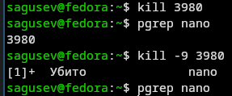{#fig-014 width=70%}

## Выполнение лабораторной работы

Получил информацию о df и du, с помощью команды man.

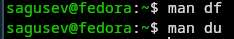{#fig-015 width=70%}

## Выполнение лабораторной работы

Выполнил команду df -h, определив объем свободной памяти на жёстком диске.

{#fig-016 width=70%}

## Выполнение лабораторной работы

Выполнил команду du -sh ~, определив объем домашнего каталога.

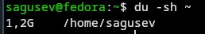{#fig-017 width=70%}

## Выполнение лабораторной работы

Прочёл справку команды find.

{#fig-018 width=70%}

## Выполнение лабораторной работы

Вывел имена всех директорий, имеющихся в домашнем каталоге с помощью find.

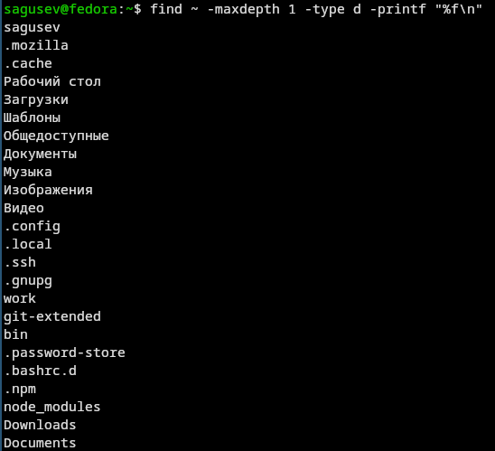{#fig-019 width=70%}

# Выводы

## Выводы

Я ознакомился с инструментами поиска файлов и фильтрации текстовых данных. Я приобрёл практические навыки по управлению процессами (и заданиями), по проверке использования диска и обслуживанию файловых систем.
