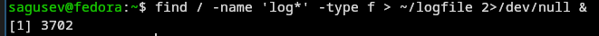
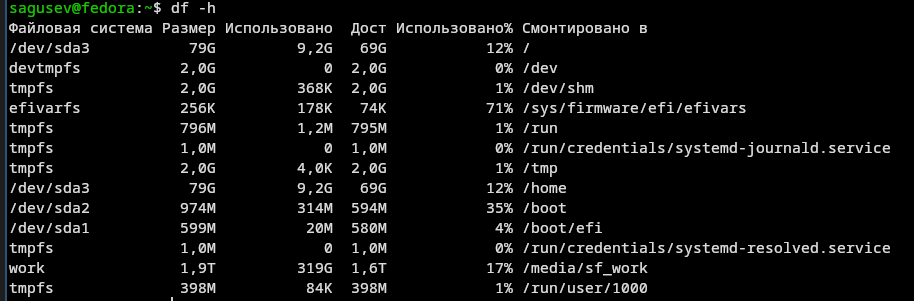

---
## Author
author:
  name: Степан Андреевич Гусев
  email: 1032242444@rudn.ru
  affiliation:
    - name: Российский университет дружбы народов
      country: Российская Федерация
      postal-code: 117198
      city: Москва
      address: ул. Миклухо-Маклая, д. 6

## Title
title: "Отчёт по лабораторной работе №8"
subtitle: "Архитектура компьютеров и операционные системы"
license: "CC BY"
---

# Цель работы

Ознакомление с инструментами поиска файлов и фильтрации текстовых данных. Приобретение практических навыков: по управлению процессами (и заданиями), по проверке использования диска и обслуживанию файловых систем.

# Задание

1) Осуществите вход в систему, используя соответствующее имя пользователя.
2) Запишите в файл file.txt названия файлов, содержащихся в каталоге /etc. Допишите в этот же файл названия файлов, содержащихся в вашем домашнем каталоге.
3) Выведите имена всех файлов из file.txt, имеющих расширение .conf, после чего запишите их в новый текстовой файл conf.txt.
4) Определите, какие файлы в вашем домашнем каталоге имеют имена, начинавшиеся с символа c? Предложите несколько вариантов, как это сделать.
5) Выведите на экран (постранично) имена файлов из каталога /etc, начинающиеся с символа h.
6) Запустите в фоновом режиме процесс, который будет записывать в файл ~/logfile файлы, имена которых начинаются с log.
7) Удалите файл ~/logfile.
8) Запустите из консоли в фоновом режиме редактор gedit.
9) Определите идентификатор процесса gedit, используя команду ps, конвейер и фильтр grep. Как ещё можно определить идентификатор процесса?
10) Прочтите справку (man) команды kill, после чего используйте её для завершения процесса gedit.
11) Выполните команды df и du, предварительно получив более подробную информацию
об этих командах, с помощью команды man.
12) Воспользовавшись справкой команды find, выведите имена всех директорий, имеющихся в вашем домашнем каталоге.

# Теоретическое введение

В интерфейсе командной строки есть очень полезная возможность перенаправления (переадресации) ввода и вывода (англ. термин I/O Redirection). Как мы уже заметили, многие программы выводят данные на экран. А ввод данных в терминале осуществляется с клавиатуры. С помощью специальных обозначений можно перенаправить вывод многих команд в файлы или иные устройства вывода (например, распечатать на принтере). Тоже самое и со вводом информации, вместо ввода данных с клавиатуры, для многих программ можно задать считывание символов их файла. Кроме того, можно даже вывод одной программы передать на ввод другой программе.

К каждой программе, запускаемой в командной строке, по умолчанию подключено три потока данных:

STDIN (0) — стандартный поток ввода (данные, загружаемые в программу). STDOUT (1) — стандартный поток вывода (данные, которые выводит программа). По умолчанию — терминал. STDERR (2) — стандартный поток вывода диагностических и отладочных сообщений (например, сообщениях об ошибках). По умолчанию — терминал.

Pipe (конвеер) – это однонаправленный канал межпроцессного взаимодействия. Термин был придуман Дугласом Макилроем для командной оболочки Unix и назван по аналогии с трубопроводом. Конвейеры чаще всего используются в shell-скриптах для связи нескольких команд путем перенаправления вывода одной команды (stdout) на вход (stdin) последующей, используя символ конвеера ‘|’.

# Выполнение лабораторной работы

Вошёл в систему ([рис. @fig-001]).

{#fig-001 width=70%}

Записал в файл file.txt названия файлов, содержащихся в каталоге /etc ([рис. @fig-002]).

{#fig-002 width=70%}

Дописал в этот же файл названия файлов, содержащихся в домашнем каталоге ([рис. @fig-003]).

{#fig-003 width=70%}

Вывел имена всех файлов из file.txt, имеющих расширение .conf, после чего записал их в новый текстовой файл conf.txt ([рис. @fig-004]).

{#fig-004 width=70%}

Определил, какие файлы в домашнем каталоге имеют имена, начинавшиеся с символа 'c' двумя способами ([рис. @fig-005]).

{#fig-005 width=70%}

Вывел на экран постранично имена файлов из каталога /etc, начинающиеся с символа 'h' ([рис. @fig-006]), ([рис. @fig-007]).

{#fig-006 width=70%}

{#fig-007 width=70%}

Запустил в фоновом режиме процесс, который записывает в файл ~/logfile файлы, имена которых начинаются с 'log' ([рис. @fig-008]).

{#fig-008 width=70%}

Удалил файл ~/logfile. ([рис. @fig-009]).

{#fig-009 width=70%}

Запустил из консоли в фоновом режиме редактор nano вместо gedit, т.к. он не установлен ([рис. @fig-010]).

{#fig-010 width=70%}

Определил идентификатор процесса nano, используя команду ps, конвейер и фильтр grep ([рис. @fig-011]).

{#fig-011 width=70%}

Ещё можно определить идентификатор процесса с помощью команды pgrep ([рис. @fig-012]).

{#fig-012 width=70%}

Прочёл справку команды kill ([рис. @fig-013]).

{#fig-013 width=70%}

Использовал kill для завершения процесса nano ([рис. @fig-014]).

{#fig-014 width=70%}

Получил информацию о df и du, с помощью команды man ([рис. @fig-015]).

{#fig-015 width=70%}

Выполнил команду df -h, определив объем свободной памяти на жёстком диске ([рис. @fig-016]).

{#fig-016 width=70%}

Выполнил команду du -sh ~, определив объем домашнего каталога ([рис. @fig-017]).

{#fig-017 width=70%}

Прочёл справку команды find ([рис. @fig-018]).

{#fig-018 width=70%}

Вывел имена всех директорий, имеющихся в домашнем каталоге с помощью find ([рис. @fig-019]).

{#fig-019 width=70%}

# Выводы

Я ознакомился с инструментами поиска файлов и фильтрации текстовых данных. Я приобрёл практические навыки по управлению процессами (и заданиями), по проверке использования диска и обслуживанию файловых систем.

# Ответы на контрольные вопросы

1) В системе по умолчанию открыто три специальных потока: – stdin — стандартный поток ввода (по умолчанию: клавиатура), файловый дескриптор 0; – stdout — стандартный поток вывода (по умолчанию: консоль), файловый дескриптор 1; – stderr — стандартный поток вывод сообщений об ошибках (по умолчанию: консоль), файловый дескриптор 2.

2) Этот знак > - перенаправление ввода/вывода, а » - перенаправление в режиме добавления.

3) Конвейер (pipe) служит для объединения простых команд или утилит в цепочки, в которых результат работы предыдущей команды передаётся последующей.

4) Чем это понятие отличается от программы? Главное отличие между программой и процессом заключается в том, что программа - это набор инструкций, который позволяет ЦПУ выполнять определенную задачу, в то время как процесс - это исполняемая программа.

5) PPID - (parent process ID) идентификатор родительского процесса. Процесс может порождать и другие процессы. UID, GID - реальные идентификаторы пользователя и его группы, запустившего данный процесс.

6) Запущенные фоном программы называются задачами (jobs). Ими можно управлять с помощью команды jobs, которая выводит список запущенных в данный момент задач.

7) Команда htop похожа на команду top по выполняемой функции: они обе показывают информацию о процессах в реальном времени, выводят данные о потреблении системных ресурсов и позволяют искать, останавливать и управлять процессами.

У обеих команд есть свои преимущества. Например, в программе htop реализован очень удобный поиск по процессам, а также их фильтрация. В команде top это не так удобно — нужно знать кнопку для вывода функции поиска.

Зато в top можно разделять область окна и выводить информацию о процессах в соответствии с разными настройками. В целом top намного более гибкая в настройке отображения процессов.

8) Команда find - это одна из наиболее важных и часто используемых утилит системы Linux. Это команда для поиска файлов и каталогов на основе специальных условий. Ее можно использовать в различных обстоятельствах, например, для поиска файлов по разрешениям, владельцам, группам, типу, размеру и другим подобным критериям.

Утилита find предустановлена по умолчанию во всех Linux дистрибутивах, поэтому вам не нужно будет устанавливать никаких дополнительных пакетов. Это очень важная находка для тех, кто хочет использовать командную строку наиболее эффективно.

Команда find имеет такой синтаксис: find [папка] [параметры] критерий шаблон [действие] Пример: find /etc -name "p*" -print

9) find / -type f -exec grep -H 'текстДляПоиска' {} ;

10) С помощью команды df -h.

11) С помощью команды du -s.

12) С помощью команды kill% номер задачи.

# Список литературы

1. https://esystem.rudn.ru/pluginfile.php/3097173/mod_resource/content/4/006-lab_proc.pdf
