---
## Authors
author:
  name: Гусев Степан Андреевич
  email: 1032242444@rudn.ru
  affiliation:
    - name: Российский университет дружбы народов
      country: Российская Федерация
      postal-code: 117198
      city: Москва
      address: ул. Миклухо-Маклая, д. 6
## Title
title: "Презентация по лабораторной работе №9"
subtitle: "Дисциплина: Архитектура компьютеров и операционные системы"
license: CC BY
date: today
date-format: "YYYY-MM-DD" # Example: 2025-09-06
---

# Информация

##

:::::::::::::: {.columns align=center}
::: {.column width="100%"}

**Презентация по лабораторной работе №9**

---

**Автор:**
Гусев Степан Андреевич

**Преподаватель:**
Кулябов Дмитрий Сергеевич, д.ф.-м.н., профессор кафедры теории вероятностей и кибербезопасности

Российский университет дружбы народов

:::
::::::::::::::

## Докладчик

:::::::::::::: {.columns align=center}
::: {.column width="70%"}

  * Гусев Степан Андреевич
  * Студент программы "Бизнес-информатика"
  * Российский университет дружбы народов им. П. Лумумбы
  * [1032242444@rudn.ru](mailto:1032242444@rudn.ru)
  * <https://github.com/stepagusev>

:::
::: {.column width="30%"}

:::
::::::::::::::

## Цель

Освоение основных возможностей командной оболочки Midnight Commander. Приобретение навыков практической работы по просмотру каталогов и файлов; манипуляций с ними.

## Задание по mc

1) Изучите информацию о mc, вызвав в командной строке man mc.
2) Запустите из командной строки mc, изучите его структуру и меню.
3) Выполните несколько операций в mc, используя управляющие клавиши (операции с панелями; выделение/отмена выделения файлов, копирование/перемещение файлов, получение информации о размере и правах доступа на файлы и/или каталоги и т.п.)
4) Выполните основные команды меню левой (или правой) панели. Оцените степень подробности вывода информации о файлах.
5) Используя возможности подменю Файл, выполните:
– просмотр содержимого текстового файла;
– редактирование содержимого текстового файла (без сохранения результатов
редактирования);
– создание каталога;
– копирование в файлов в созданный каталог.
6) С помощью соответствующих средств подменю Команда осуществите:
– поиск в файловой системе файла с заданными условиями (например, файла с расширением .c или .cpp, содержащего строку main);
– выбор и повторение одной из предыдущих команд;
– переход в домашний каталог;
– анализ файла меню и файла расширений.
7) Вызовите подменю Настройки . Освойте операции, определяющие структуру экрана mc (Full screen, Double Width, Show Hidden Files и т.д.).

## Задание по встроенному редактору mc
1) Создайте текстовой файл text.txt.
2) Откройте этот файл с помощью встроенного в mc редактора.
3) Вставьте в открытый файл небольшой фрагмент текста, скопированный из любого другого файла или Интернета.
4) Проделайте с текстом следующие манипуляции, используя горячие клавиши:
- Удалите строку текста.
- Выделите фрагмент текста и скопируйте его на новую строку;
- Выделите фрагмент текста и перенесите его на новую строку;
- Сохраните файл;
- Отмените последнее действие;
- Перейдите в конец файла (нажав комбинацию клавиш) и напишите некоторый текст;
- Перейдите в начало файла (нажав комбинацию клавиш) и напишите некоторый текст;
- Сохраните и закройте файл.
5) Откройте файл с исходным текстом на некотором языке программирования (например C или Java).
6) Используя меню редактора, включите подсветку синтаксиса, если она не включена, или выключите, если она включена.

# Выполнение лабораторной работы

## Задание по mc

Выполнил man mc, чтобы изучить информацию о mc.

{#fig-001 width=70%}

## Задание по mc

Запустил mc.

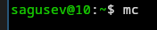{#fig-002 width=70%}

## Задание по mc

Изучил его структуру и меню: перемещаться между панелями через Tab, внутри панеля с помощью стрелочек.

{#fig-003 width=70%}

## Задание по mc

Скопировал файл с помощью F5.

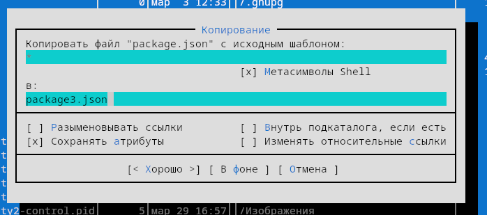{#fig-004 width=70%}

## Задание по mc

В левой панели открыл информацию о файле, вывод более подробный чем при ls -l.

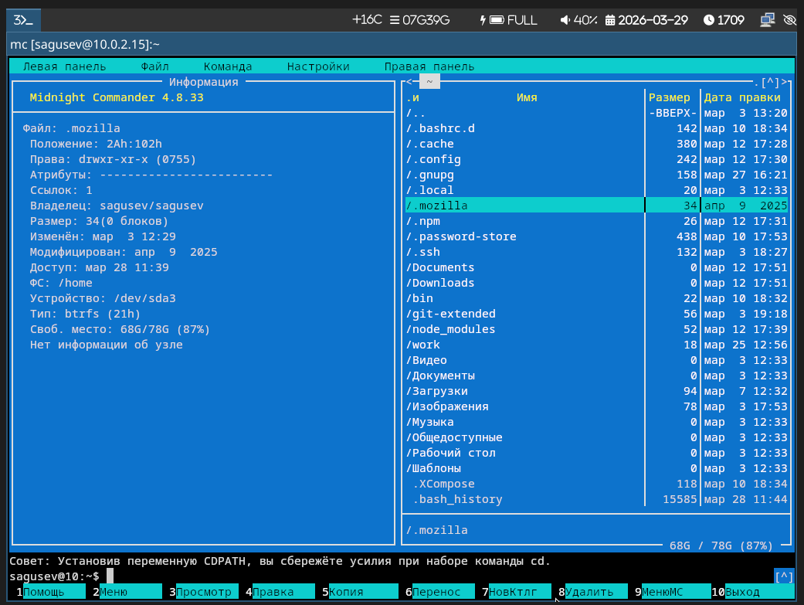{#fig-005 width=70%}

## Задание по mc

С помощью подменю Файл просмотрел содержимое текстового файла.

{#fig-006 width=70%}

## Задание по mc

С помощью подменю Файл редактировал содержимое текстового файла без сохранения.

{#fig-007 width=70%}

## Задание по mc

С помощью подменю Файл создал каталог.

{#fig-008 width=70%}

## Задание по mc

С помощью подменю Файл скопировал файл в созданный каталог.

{#fig-009 width=70%}

## Задание по mc

С помощью подменю Команда осуществил поиск в системе файлов с заданными условиями.

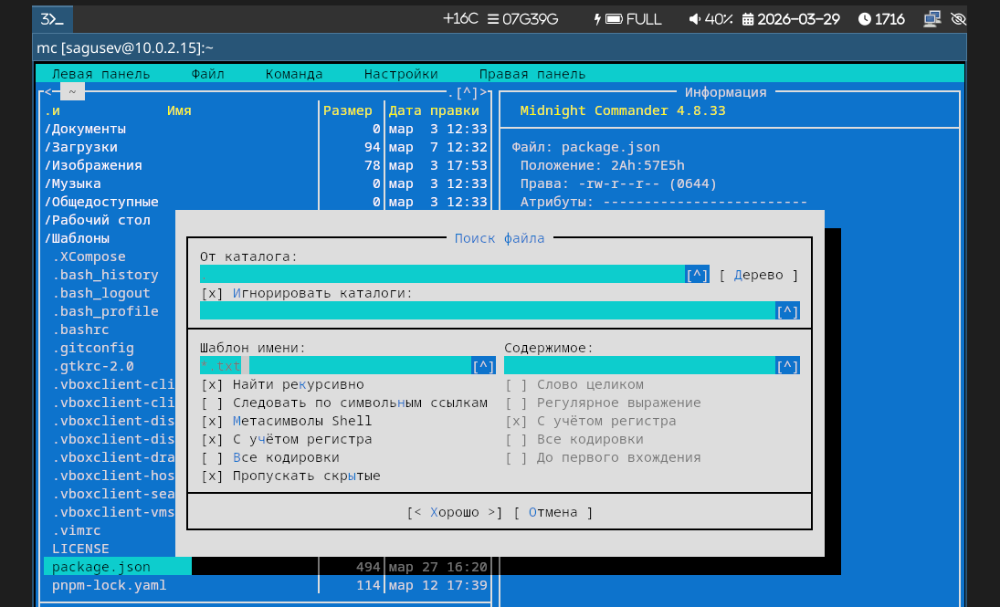{#fig-010 width=70%}

## Задание по mc

Вывод найденных файлов.

{#fig-011 width=70%}

## Задание по mc

С помощью подменю Команда перешёл в домашний каталог.

{#fig-012 width=70%}

## Задание по mc

С помощью подменю Команда выбрал и повторил одну из предыдущих команд.

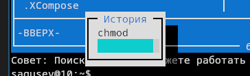{#fig-013 width=70%}

## Задание по mc

С помощью подменю Настройки открыл mc.ext.ini.

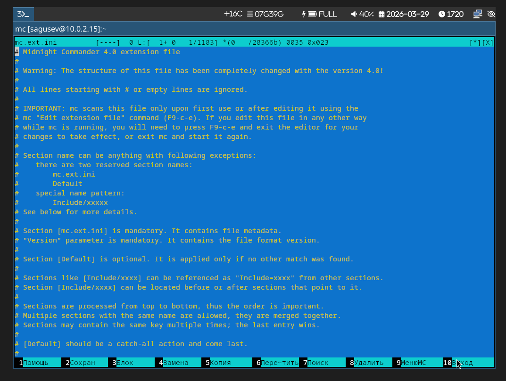{#fig-014 width=70%}

## Задание по mc

С помощью подменю Настройки открыл .mc.menu.

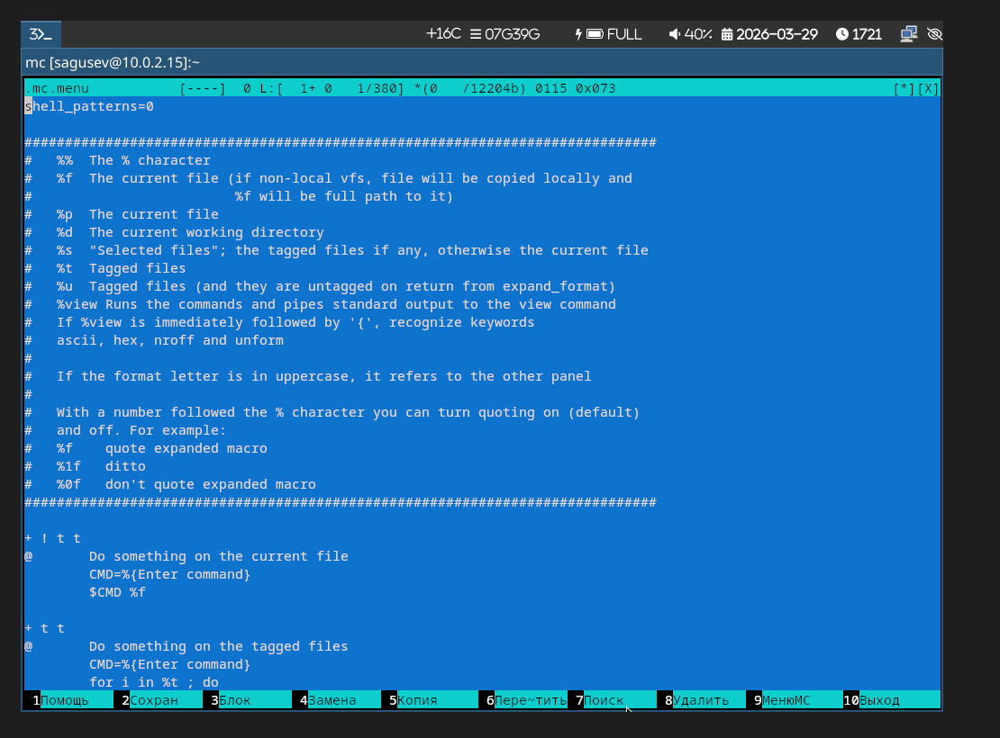{#fig-015 width=70%}

## Задание по mc

С помощью подменю Настройки открыл настройки панели.

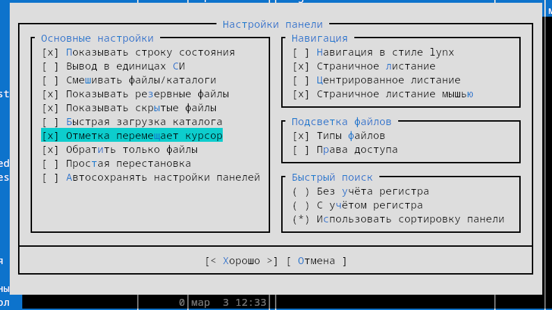{#fig-016 width=70%}

## Задание по mc

С помощью подменю Настройки открыл настройки внешнего вида.

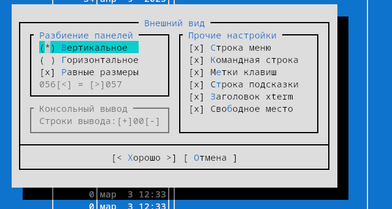{#fig-017 width=70%}

## Задание по mc

С помощью подменю Настройки открыл определение клавиш.

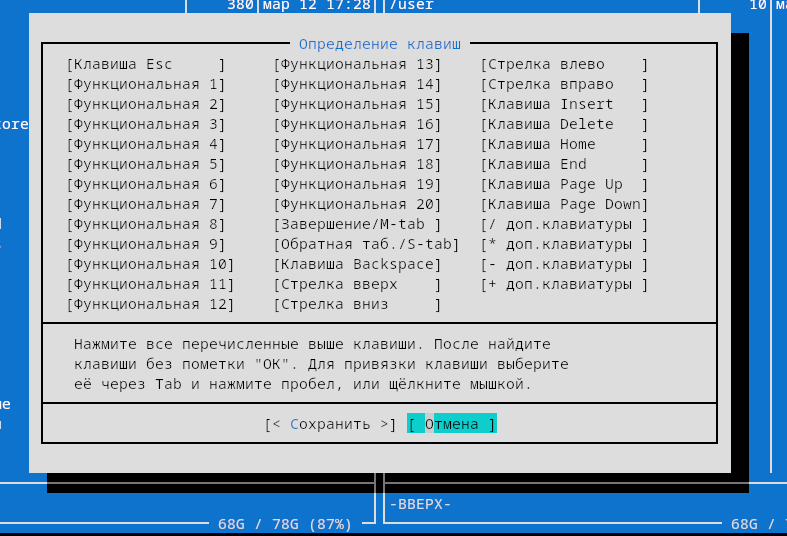{#fig-018 width=70%}

## Задание по mc

С помощью подменю Настройки открыл параметры конфигурации.

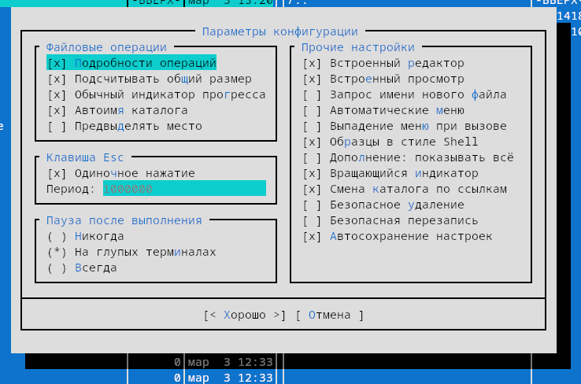{#fig-019 width=70%}

## Задание по встроенному редактору mc

Создал файл text.txt.

{#fig-020 width=70%}

## Задание по встроенному редактору mc

Открыл файл text.txt во встроенном в mc редакторе.

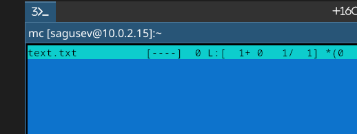{#fig-021 width=70%}

## Задание по встроенному редактору mc

Вставил небольшой фрагмент текста.

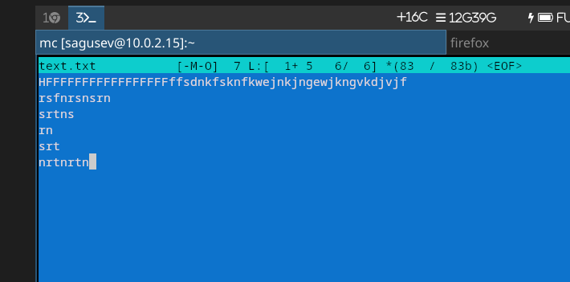{#fig-022 width=70%}

## Задание по встроенному редактору mc

Удалил строку текста.

{#fig-023 width=70%}

## Задание по встроенному редактору mc

Выделил фрагмент текста, скопировал его и перенёс на новую строку.

{#fig-024 width=70%}

## Задание по встроенному редактору mc

Сохранил файл.

{#fig-025 width=70%}

## Задание по встроенному редактору mc

Отменил последнее действие.

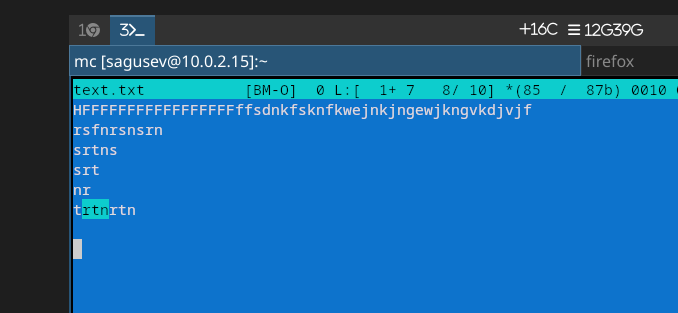{#fig-026 width=70%}

## Задание по встроенному редактору mc

Перешёл в начало файла с помощью кнопки PgUp.

{#fig-027 width=70%}

## Задание по встроенному редактору mc

Перешёл в конец файла с помощью кнопки PgDn.

{#fig-028 width=70%}

## Задание по встроенному редактору mc

Сохранил и закрыл файл.

{#fig-029 width=70%}

## Задание по встроенному редактору mc

Открыл файл с текстом на языке Python.

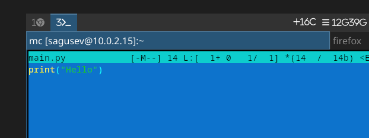{#fig-030 width=70%}

## Задание по встроенному редактору mc

Используя меню редактора, выключил подсветку синтаксиса.

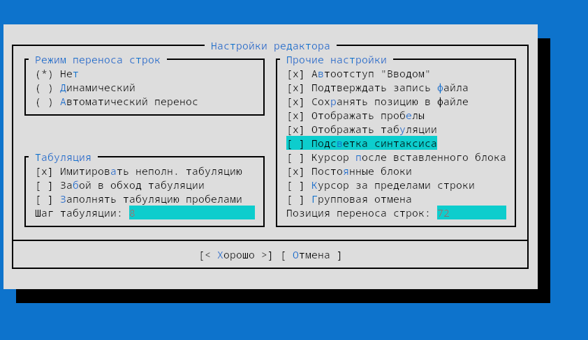{#fig-031 width=70%}

## Задание по встроенному редактору mc

Проверил, что подсветка выключена

{#fig-032 width=70%}

# Выводы

## Выводы

Я освоил основные возможности командной оболочки Midnight Commander, а также приобретёл навыки практической работы по просмотру каталогов и файлов; манипуляций с ними.
