---
## Author
author:
  name: Степан Андреевич Гусев
  email: 1032242444@rudn.ru
  affiliation:
    - name: Российский университет дружбы народов
      country: Российская Федерация
      postal-code: 117198
      city: Москва
      address: ул. Миклухо-Маклая, д. 6

## Title
title: "Отчёт по лабораторной работе №9"
subtitle: "Архитектура компьютеров и операционные системы"
license: "CC BY"
---

# Цель работы

Освоение основных возможностей командной оболочки Midnight Commander. Приобретение навыков практической работы по просмотру каталогов и файлов; манипуляций с ними.

# Задание

## Задание по mc

1) Изучите информацию о mc, вызвав в командной строке man mc.
2) Запустите из командной строки mc, изучите его структуру и меню.
3) Выполните несколько операций в mc, используя управляющие клавиши (операции с панелями; выделение/отмена выделения файлов, копирование/перемещение файлов, получение информации о размере и правах доступа на файлы и/или каталоги и т.п.)
4) Выполните основные команды меню левой (или правой) панели. Оцените степень подробности вывода информации о файлах.
5) Используя возможности подменю Файл, выполните:
– просмотр содержимого текстового файла;
– редактирование содержимого текстового файла (без сохранения результатов
редактирования);
– создание каталога;
– копирование в файлов в созданный каталог.
6) С помощью соответствующих средств подменю Команда осуществите:
– поиск в файловой системе файла с заданными условиями (например, файла с расширением .c или .cpp, содержащего строку main);
– выбор и повторение одной из предыдущих команд;
– переход в домашний каталог;
– анализ файла меню и файла расширений.
7) Вызовите подменю Настройки . Освойте операции, определяющие структуру экрана mc (Full screen, Double Width, Show Hidden Files и т.д.).

## Задание по встроенному редактору mc
1) Создайте текстовой файл text.txt.
2) Откройте этот файл с помощью встроенного в mc редактора.
3) Вставьте в открытый файл небольшой фрагмент текста, скопированный из любого другого файла или Интернета.
4) Проделайте с текстом следующие манипуляции, используя горячие клавиши:
- Удалите строку текста.
- Выделите фрагмент текста и скопируйте его на новую строку;
- Выделите фрагмент текста и перенесите его на новую строку;
- Сохраните файл;
- Отмените последнее действие;
- Перейдите в конец файла (нажав комбинацию клавиш) и напишите некоторый текст;
- Перейдите в начало файла (нажав комбинацию клавиш) и напишите некоторый текст;
- Сохраните и закройте файл.
5) Откройте файл с исходным текстом на некотором языке программирования (например C или Java).
6) Используя меню редактора, включите подсветку синтаксиса, если она не включена, или выключите, если она включена.

# Теоретическое введение

Командная оболочка — интерфейс взаимодействия пользователя с операционной системой и программным обеспечением посредством команд. Midnight Commander (или mc) — псевдографическая командная оболочка для UNIX/Linux систем. Для запуска mc необходимо в командной строке набрать mc и нажать Enter .

MC имеет много полезных как для пользователей, так и для администраторов, функций (копирование, удаление, переименование/перемещение, создание директорий).

Главное окно программы Midnight Commander состоит из трех полей. Два поля, называемые "панелями", идентичны по структуре и обычно отображают перечни файлов и подкаталогов каких-то двух каталогов файловой структуры. Эти каталоги в общем случае различны, хотя, в частности, могут и совпасть. Каждая панель состоит из заголовка, списка файлов и информационной строки.

Третье поле экрана, расположенное в нижней части экрана, содержит командную строку текущей оболочки. В этом же поле (самая нижняя строка экрана) содержится подсказка по использованию функциональных клавиш F1 - F10. Самая верхняя строка экрана содержит строку горизонтального меню. Эта строка может не отображаться на экране; в этом случае доступ к ней можно получить, щёлкнув мышью по верхней рамке или нажав клавишу F9.

# Выполнение лабораторной работы

## Задание по mc

Выполнил man mc, чтобы изучить информацию о mc ([рис. @fig-001]).

{#fig-001 width=70%}

Запустил mc ([рис. @fig-002]).

{#fig-002 width=70%}

Изучил его структуру и меню: перемещаться между панелями через Tab, внутри панеля с помощью стрелочек ([рис. @fig-003]).

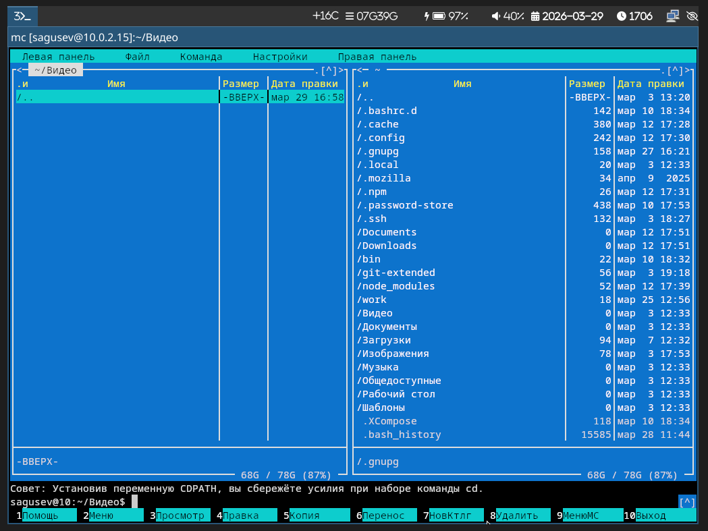{#fig-003 width=70%}

Скопировал файл с помощью F5 ([рис. @fig-004]).

{#fig-004 width=70%}

В левой панели открыл информацию о файле, вывод более подробный чем при ls -l ([рис. @fig-005]).

{#fig-005 width=70%}

С помощью подменю Файл просмотрел содержимое текстового файла ([рис. @fig-006]).

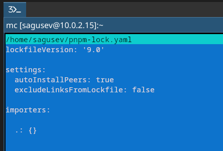{#fig-006 width=70%}

С помощью подменю Файл редактировал содержимое текстового файла без сохранения ([рис. @fig-007]).

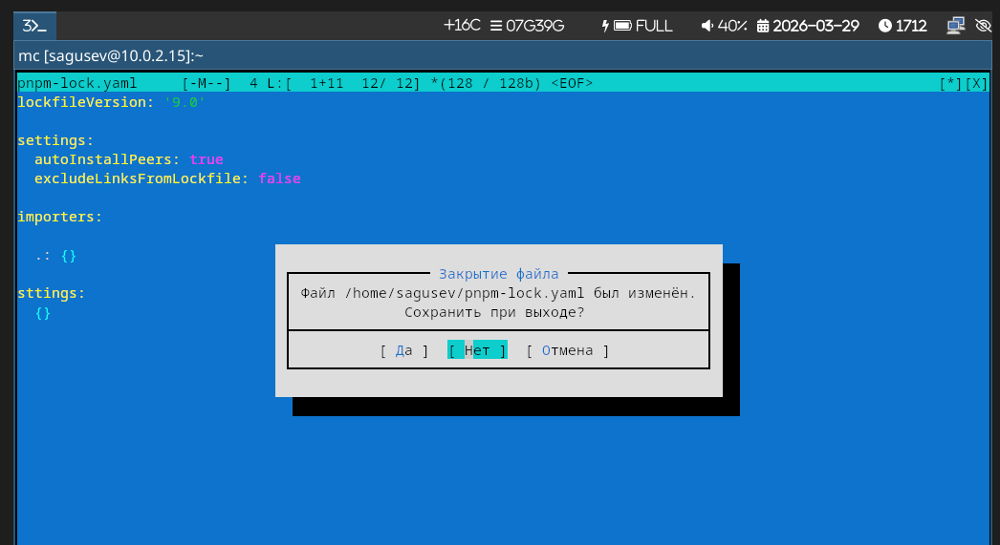{#fig-007 width=70%}

С помощью подменю Файл создал каталог ([рис. @fig-008]).

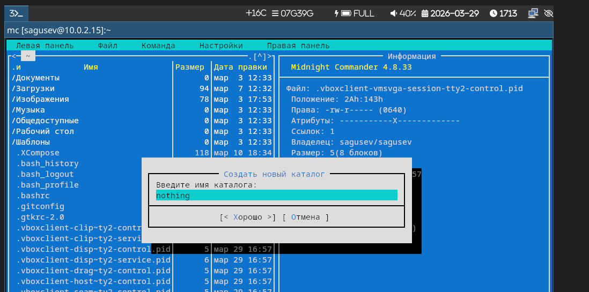{#fig-008 width=70%}

С помощью подменю Файл скопировал файл в созданный каталог ([рис. @fig-009]).

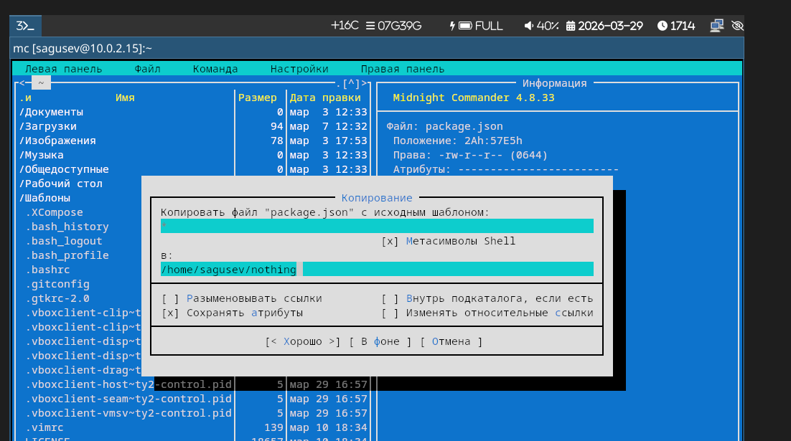{#fig-009 width=70%}

С помощью подменю Команда осуществил поиск в системе файлов с заданными условиями ([рис. @fig-010]).

{#fig-010 width=70%}

Вывод найденных файлов ([рис. @fig-011]).

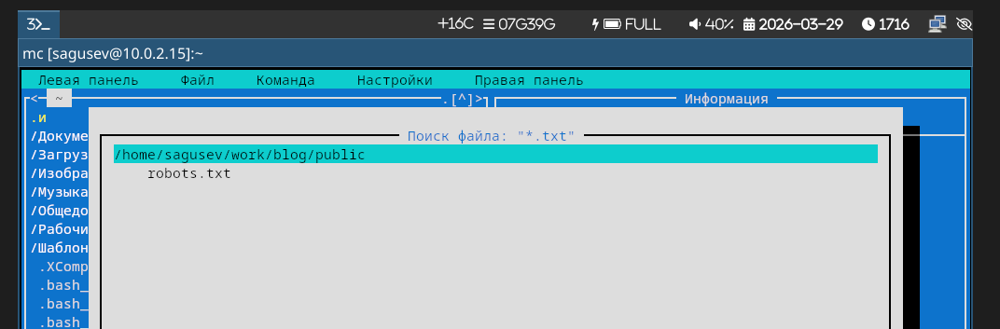{#fig-011 width=70%}

С помощью подменю Команда перешёл в домашний каталог ([рис. @fig-012]).

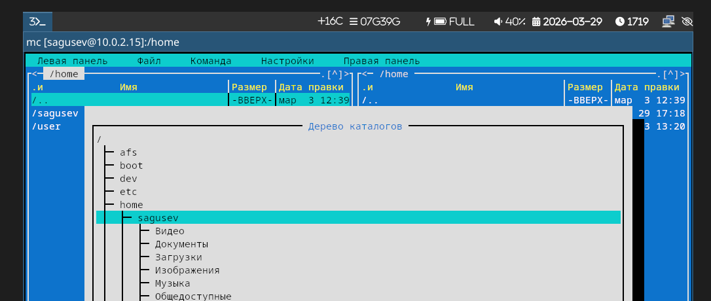{#fig-012 width=70%}

С помощью подменю Команда выбрал и повторил одну из предыдущих команд ([рис. @fig-013]).

{#fig-013 width=70%}

С помощью подменю Настройки открыл mc.ext.ini ([рис. @fig-014]).

{#fig-014 width=70%}

С помощью подменю Настройки открыл .mc.menu ([рис. @fig-015]).

{#fig-015 width=70%}

С помощью подменю Настройки открыл настройки панели ([рис. @fig-016]).

{#fig-016 width=70%}

С помощью подменю Настройки открыл настройки внешнего вида ([рис. @fig-017]).

{#fig-017 width=70%}

С помощью подменю Настройки открыл определение клавиш ([рис. @fig-018]).

{#fig-018 width=70%}

С помощью подменю Настройки открыл параметры конфигурации ([рис. @fig-019]).

{#fig-019 width=70%}

## Задание по встроенному редактору mc

Создал файл text.txt ([рис. @fig-020]).

{#fig-020 width=70%}

Открыл файл text.txt во встроенном в mc редакторе ([рис. @fig-021]).

{#fig-021 width=70%}

Вставил небольшой фрагмент текста ([рис. @fig-022]).

{#fig-022 width=70%}

Удалил строку текста ([рис. @fig-023]).

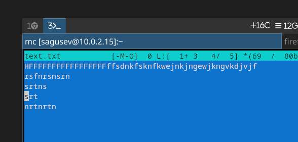{#fig-023 width=70%}

Выделил фрагмент текста, скопировал его и перенёс на новую строку ([рис. @fig-024]).

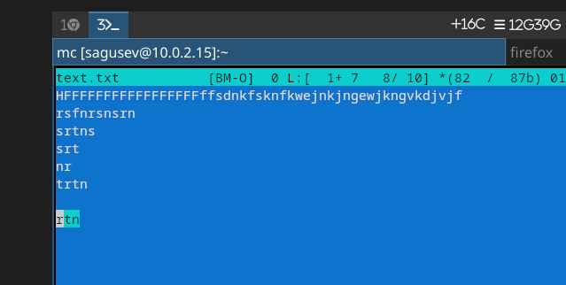{#fig-024 width=70%}

Сохранил файл ([рис. @fig-025]).

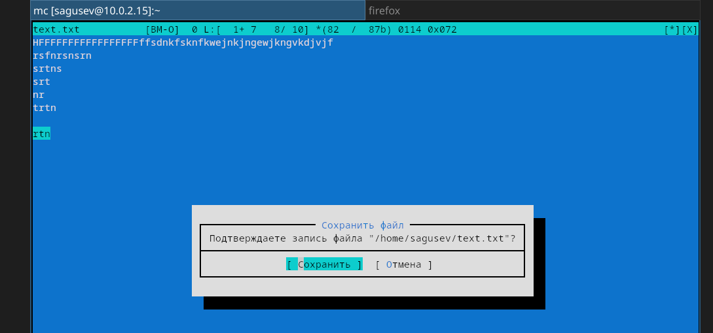{#fig-025 width=70%}

Отменил последнее действие ([рис. @fig-026]).

{#fig-026 width=70%}

Перешёл в начало файла с помощью кнопки PgUp ([рис. @fig-027]).

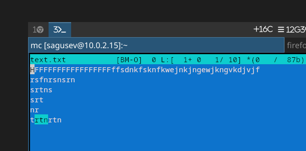{#fig-027 width=70%}

Перешёл в конец файла с помощью кнопки PgDn ([рис. @fig-028]).

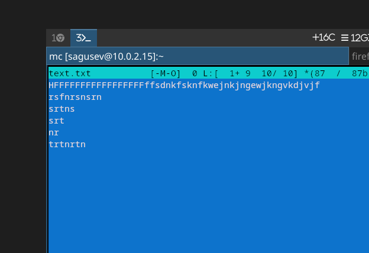{#fig-028 width=70%}

Сохранил и закрыл файл ([рис. @fig-029]).

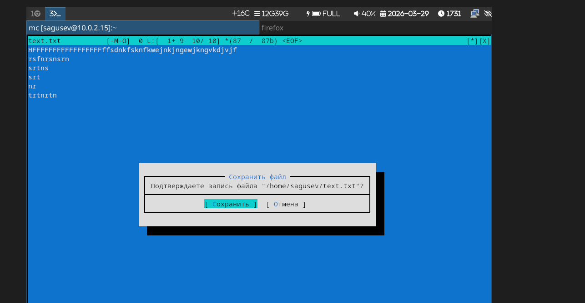{#fig-029 width=70%}

Открыл файл с текстом на языке Python ([рис. @fig-030]).

{#fig-030 width=70%}

Используя меню редактора, выключил подсветку синтаксиса ([рис. @fig-031]), ([рис. @fig-032]).

{#fig-031 width=70%}

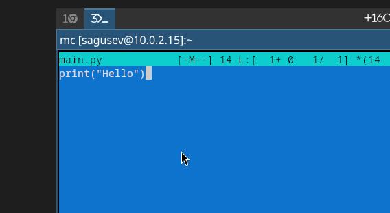{#fig-032 width=70%}

# Выводы

Я освоил основные возможности командной оболочки Midnight Commander, а также приобретёл навыки практической работы по просмотру каталогов и файлов; манипуляций с ними.

# Ответы на контрольные вопросы

1) Панели могут дополнительно быть переведены в один из двух режимов: Информация или Дерево. В режиме Информация на панель выводятся сведения о файле и текущей файловой системе, расположенных на активной панели. В режиме Дерево (рис. 7.3) на одной из панелей выводится структура дерева каталогов.

2) В разделе Командная строка оболочки (Shell) перечисляются команды и комбинации клавиш, которые используются для ввода и редактирования команд в командной строке оболочки. Большая часть этих команд служит для переноса имен файлов и/или имен каталогов в командную строку (чтобы уменьшить трудоемкость ввода) или для доступа к истории команд. Клавиши редактирования строк ввода используются как при редактировании командной строки, так и других строк ввода, появляющихся в различных запросах программы.

Как с помощью меню так и с помощью команд shell можно переносить, копировать и получать информацию о файоах и каталогах.

3) В меню каждой (левой или правой) панели можно выбрать Формат списка:
стандартный — выводит список файлов и каталогов с указанием размера и времени правки;
ускоренный — позволяет задать число столбцов, на которые разбивается панель при выводе списка имён файлов или каталогов без дополнительной информации;
расширенный — помимо названия файла или каталога выводит сведения о правах доступа, владельце, группе, размере, времени правки;
определённый пользователем — позволяет вывести те сведения о файле или каталоге, которые задаст сам пользователь.

4) В меню Файл содержит перечень команд, которые могут быть применены к одному или нескольким файлам или каталогам. Команды меню Файл:
Просмотр ( F3 ) — позволяет посмотреть содержимое текущего (или выделенного) файла без возможности редактирования.
Просмотр вывода команды ( М + ! ) — функция запроса команды с параметрами (аргумент к текущему выбранному файлу).
Правка ( F4 ) — открывает текущий (или выделенный) файл для его редактирования.
Копирование ( F5 ) — осуществляет копирование одного или нескольких файлов или каталогов в указанное пользователем во всплывающем окне место.
Права доступа ( Ctrl-x c ) — позволяет указать (изменить) права доступа к одному или нескольким файлам или каталогам .
Жёсткая ссылка ( Ctrl-x l ) — позволяет создать жёсткую ссылку к текущему (или выделенному) файлу.
Символическая ссылка ( Ctrl-x s ) — позволяет создать символическую ссылку к текущему (или выделенному) файлу.
Владелец/группа ( Ctrl-x o ) — позволяет задать (изменить) владельца и имя группы для одного или нескольких файлов или каталогов.
Права (расширенные) — позволяет изменить права доступа и владения для одного или нескольких файлов или каталогов.
Переименование ( F6 ) — позволяет переименовать (или переместить) один или несколько файлов или каталогов.
Создание каталога ( F7 ) — позволяет создать каталог.
Удалить ( F8 ) — позволяет удалить один или несколько файлов или каталогов.
Выход ( F10 ) — завершает работу mc.

5) В меню Команда содержатся более общие команды для работы с mc. Команды меню Команда:
Дерево каталогов — отображает структуру каталогов системы.
Поиск файла — выполняет поиск файлов по заданным параметрам.
Переставить панели — меняет местами левую и правую панели.
Сравнить каталоги ( Ctrl-x d ) — сравнивает содержимое двух каталогов.
Размеры каталогов — отображает размер и время изменения каталога (по умолчанию в mc размер - каталога корректно не отображается).
История командной строки — выводит на экран список ранее выполненных в оболочке команд.
Каталоги быстрого доступа ( Ctrl-\ ) — пр вызове выполняется быстрая смена текущего каталога на один из заданного списка.
Восстановление файлов — позволяет восстановить файлы на файловых системах ext2 и ext3.
Редактировать файл расширений — позволяет задать с помощью определённого синтаксиса действия при запуске файлов с определённым расширением (например, какое программного обеспечение запускать для открытия или редактирования файлов с расширением doc или docx).
Редактировать файл меню — позволяет отредактировать контекстное меню пользователя, вызываемое по клавише F2 .
Редактировать файл расцветки имён — позволяет подобрать оптимальную для пользователя расцветку имён файлов в зависимости от их типа.

6) Меню Настройки содержит ряд дополнительных опций по внешнему виду и функциональности mc. Меню Настройки содержит:
Конфигурация — позволяет скорректировать настройки работы с панелями.
Внешний вид и Настройки панелей — определяет элементы (строка меню, командная строка, подсказки и прочее), отображаемые при вызове mc, а также геометрию расположения панелей и цветовыделение.
Биты символов — задаёт формат обработки информации локальным терминалом.
Подтверждение — позволяет установить или убрать вывод окна с запросом подтверждения действий при операциях удаления и перезаписи файлов, а также при выходе из программы.
Распознание клавиш — диалоговое окно используется для тестирования функциональных клавиш, клавиш управления курсором и прочее.
Виртуальные ФС –– настройки виртуальной файловой системы: тайм-аут, пароль и прочее.

7) F1 Вызов контекстно-зависимой подсказки;
F2 Вызов пользовательского меню с возможностью создания и/или дополнения дополнительных функций;
F3 Просмотр содержимого файла, на который указывает подсветка в активной панели (без возможности редактирования);
F4 Вызов встроенного в mc редактора для изменения содержания файла, на который указывает подсветка в активной панели;
F5 Копирование одного или нескольких файлов, отмеченных в первой (активной) панели, в каталог, отображаемый на второй панели;
F6 Перенос одного или нескольких файлов, отмеченных в первой (активной) панели, в каталог, отображаемый на второй панели;
F7 Создание подкаталога в каталоге, отображаемом в активной панели;
F8 Удаление одного или нескольких файлов (каталогов), отмеченных в первой (активной) панели файлов;
F9 Вызов меню mc;
F10 Выход из mc;

8) Ctrl-y удалить строку;
Ctrl-u отмена последней операции; Ins вставка/замена;
F7 поиск (можно использовать регулярные выражения);
(стрелочка вверх)-F7 повтор последней операции поиска;
F4 замена;
F3 первое нажатие — начало выделения,
второе — окончание выделения;
F5 копировать выделенный фрагмент;
F6 переместить выделенный фрагмент;
F8 удалить выделенный фрагмент;
F2 записать изменения в файл;
F10 выйти из редактора.

9) Можно сохранить часто используемые команды панелизации под отдельными информативными именами, чтобы иметь возможность их быстро вызвать по этим именам. Для этого нужно набрать команду в строке ввода (строка "Команда") и нажать кнопку Добавить. После этого потребуется ввести имя, по которому мы будем вызывать команду. В следующий раз вам достаточно будет выбрать нужное имя из списка, а не вводить всю команду заново.

10) Панель в mc отображает список файлов текущего каталога. Абсолютный путь к этому каталогу отображается в заголовке панели. У активной панели заголовок и одна из её строк подсвечиваются. Управление панелями осуществляется с помощью определённых комбинаций клавиш или пунктов меню mc.

# Список литературы

1. https://esystem.rudn.ru/pluginfile.php/3097175/mod_resource/content/5/007-lab_mc.pdf
