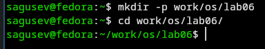
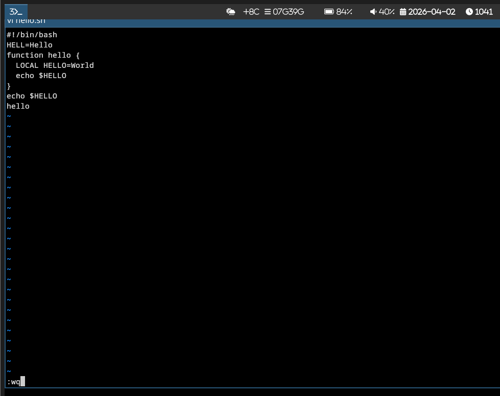
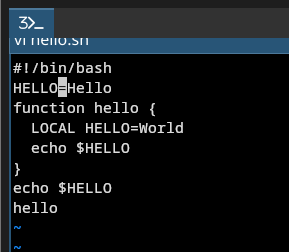
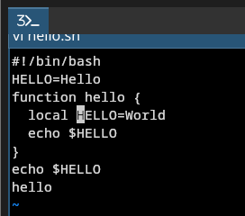
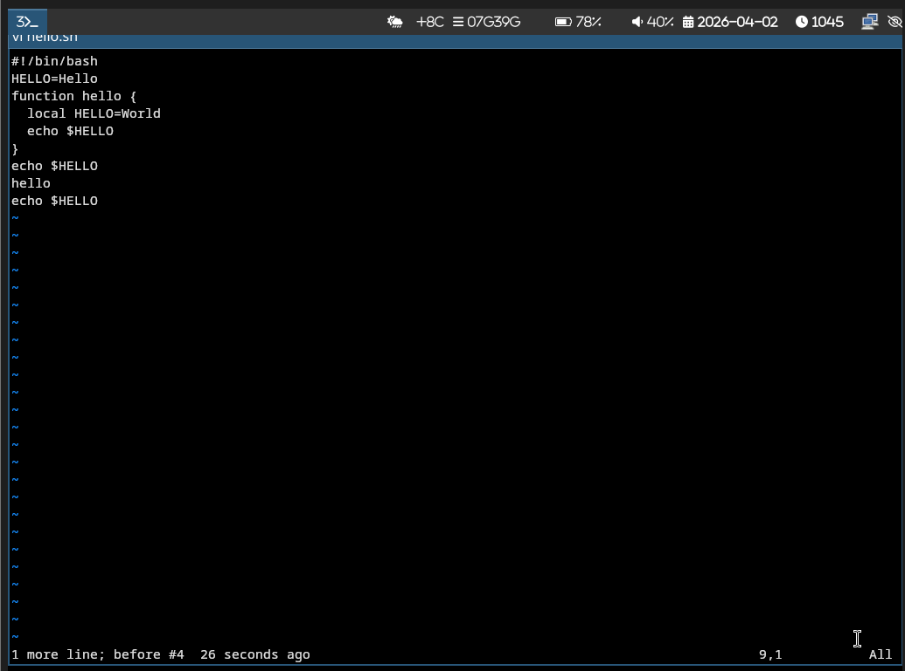
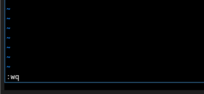

---
## Authors
author:
  name: Гусев Степан Андреевич
  email: 1032242444@rudn.ru
  affiliation:
    - name: Российский университет дружбы народов
      country: Российская Федерация
      postal-code: 117198
      city: Москва
      address: ул. Миклухо-Маклая, д. 6
## Title
title: "Презентация по лабораторной работе №10"
subtitle: "Дисциплина: Архитектура компьютеров и операционные системы"
license: CC BY
date: today
date-format: "YYYY-MM-DD" # Example: 2025-09-06
---

# Информация

##

:::::::::::::: {.columns align=center}
::: {.column width="100%"}

**Презентация по лабораторной работе №10**

---

**Автор:**
Гусев Степан Андреевич

**Преподаватель:**
Кулябов Дмитрий Сергеевич, д.ф.-м.н., профессор кафедры теории вероятностей и кибербезопасности

Российский университет дружбы народов

:::
::::::::::::::

## Докладчик

:::::::::::::: {.columns align=center}
::: {.column width="70%"}

  * Гусев Степан Андреевич
  * Студент программы "Бизнес-информатика"
  * Российский университет дружбы народов им. П. Лумумбы
  * [1032242444@rudn.ru](mailto:1032242444@rudn.ru)
  * <https://github.com/stepagusev>

:::
::: {.column width="30%"}

:::
::::::::::::::

## Цель

Познакомиться с операционной системой Linux. Получить практические навыки работы с редактором vi, установленным по умолчанию практически во всех дистрибутивах.

## Задание

1) Ознакомиться с теоретическим материалом.
2) Ознакомиться с редактором vi.
3) Выполнить упражнения, используя команды vi.

# Выполнение лабораторной работы

## Создание нового файла с использованием vi

Создал новую директорию и перешёл.

{#fig-001 width=70%}

## Создание нового файла с использованием vi

Вызвал vi и создал файл hello.sh.

{#fig-002 width=70%}

## Создание нового файла с использованием vi

Нажал клавишу i и ввёл нужный текст.

{#fig-003 width=70%}

## Создание нового файла с использованием vi

Нажал Ecs, :, ввёл wq, вышел из vi, сохранив изменения.

{#fig-004 width=70%}

## Создание нового файла с использованием vi

Сделал файл исполняемым с помощью chmod.

{#fig-005 width=70%}

## Редактирование существующего файла

Открыл в vi файл hello.sh.

{#fig-006 width=70%}

## Редактирование существующего файла

Перешёл в режим вставки и заменил HELL на HELLO.

{#fig-007 width=70%}

## Редактирование существующего файла

Стёр слово LOCAL в 4 строке.

{#fig-008 width=70%}

## Редактирование существующего файла

Написал в 4 строке local.

{#fig-009 width=70%}

## Редактирование существующего файла

Добавил echo $HELLO в конец файла.

{#fig-010 width=70%}

## Редактирование существующего файла

Удалил последнюю строку.

{#fig-011 width=70%}

## Редактирование существующего файла

Отменил последнее действие нажав u.

{#fig-012 width=70%}

## Редактирование существующего файла

Нажал :, ввёл wq, вышел из vi, сохранив изменения.

{#fig-013 width=70%}

# Выводы

## Выводы

Я получил практические навыки работы с редактором vi.
