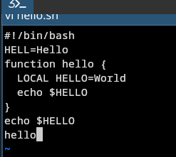
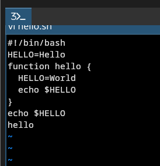
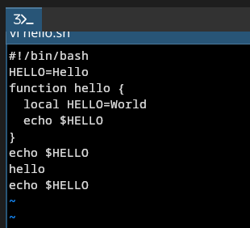
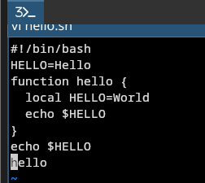
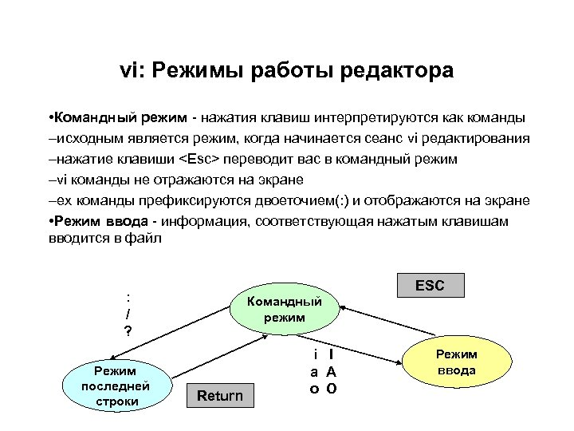

---
## Author
author:
  name: Степан Андреевич Гусев
  email: 1032242444@rudn.ru
  affiliation:
    - name: Российский университет дружбы народов
      country: Российская Федерация
      postal-code: 117198
      city: Москва
      address: ул. Миклухо-Маклая, д. 6

## Title
title: "Отчёт по лабораторной работе №10"
subtitle: "Архитектура компьютеров и операционные системы"
license: "CC BY"
---

# Цель работы

Познакомиться с операционной системой Linux. Получить практические навыки работы с редактором vi, установленным по умолчанию практически во всех дистрибутивах.

# Задание

1) Ознакомиться с теоретическим материалом.
2) Ознакомиться с редактором vi.
3) Выполнить упражнения, используя команды vi.

# Теоретическое введение

В большинстве дистрибутивов Linux в качестве текстового редактора по умолчанию устанавливается интерактивный экранный редактор vi (Visual display editor). Редактор vi имеет три режима работы:
командный режим — предназначен для ввода команд редактирования и навигации по редактируемому файлу;
режим вставки — предназначен для ввода содержания редактируемого файла;
режим последней (или командной) строки — используется для записи изменений в файл и выхода из редактора.
Для вызова редактора vi необходимо указать команду vi и имя редактируемого файла: vi <имя_файла> При этом в случае отсутствия файла с указанным именем будет создан такой файл.
Переход в командный режим осуществляется нажатием клавиши Esc.
Для выхода из редактора vi необходимо перейти в -режим последней строки: находясь в командном режиме, нажать Shift-; (по сути символ : — двоеточие), затем:
набрать символы wq, если перед выходом из редактора требуется записать изменения в файл;
набрать символ q (или q!), если требуется выйти из редактора без сохранения.

# Выполнение лабораторной работы

## Создание нового файла с использованием vi

Создал новую директорию и перешёл ([рис. @fig-001]).

{#fig-001 width=70%}

Вызвал vi и создал файл hello.sh ([рис. @fig-002]).

{#fig-002 width=70%}

Нажал клавишу i и ввёл нужный текст ([рис. @fig-003]).

{#fig-003 width=70%}

Нажал Ecs, :, ввёл wq, вышел из vi, сохранив изменения ([рис. @fig-004]).

{#fig-004 width=70%}

Сделал файл исполняемым с помощью chmod ([рис. @fig-005]).

{#fig-005 width=70%}

## Редактирование существующего файла

Открыл в vi файл hello.sh ([рис. @fig-006]).

{#fig-006 width=70%}

Перешёл в режим вставки и заменил HELL на HELLO ([рис. @fig-007]).

{#fig-007 width=70%}

Стёр слово LOCAL в 4 строке ([рис. @fig-008]).

{#fig-008 width=70%}

Написал в 4 строке local ([рис. @fig-009]).

{#fig-009 width=70%}

Добавил echo $HELLO в конец файла ([рис. @fig-010]).

{#fig-010 width=70%}

Удалил последнюю строку ([рис. @fig-011]).

{#fig-011 width=70%}

Отменил последнее действие нажав u ([рис. @fig-012]).

{#fig-012 width=70%}

Нажал :, ввёл wq, вышел из vi, сохранив изменения ([рис. @fig-013]).

{#fig-013 width=70%}

# Выводы

Я получил практические навыки работы с редактором vi.

# Ответы на контрольные вопросы

1) командный режим — предназначен для ввода команд редактирования и навигации по редактируемому файлу;
режим вставки — предназначен для ввода содержания редактируемого файла;
режим последней (или командной) строки — используется для записи изменений в файл и выхода из редактора.

2) Можно нажимать символ q (или q!), если требуется выйти из редактора без сохранения.

3) 0 (ноль) — переход в начало строки;
$ — переход в конец строки;
G — переход в конец файла;
n G — переход на строку с номером n.

4) Редактор vi предполагает, что слово - это строка символов, которая может включать в себя буквы, цифры и символы подчеркивания.

5) С помощью G — переход в конец файла

6) Вставка текста – а — вставить текст после курсора; – А — вставить текст в конец строки; – i — вставить текст перед курсором; – n i — вставить текст n раз; – I — вставить текст в начало строки.
Вставка строки – о — вставить строку под курсором; – О — вставить строку над курсором.
Удаление текста – x — удалить один символ в буфер; – d w — удалить одно слово в буфер; – d $ — удалить в буфер текст от курсора до конца строки; – d 0 — удалить в буфер текст от начала строки до позиции курсора; – d d — удалить в буфер одну строку; – n d d — удалить в буфер n строк.
Отмена и повтор произведённых изменений – u — отменить последнее изменение; – . — повторить последнее изменение.
Копирование текста в буфер – Y — скопировать строку в буфер; – n Y — скопировать n строк в буфер; – y w — скопировать слово в буфер.
Вставка текста из буфера – p — вставить текст из буфера после курсора; – P — вставить текст из буфера перед курсором.
Замена текста – c w — заменить слово; – n c w — заменить n слов; – c $ — заменить текст от курсора до конца строки; – r — заменить слово; – R — заменить текст.
Поиск текста – / текст — произвести поиск вперёд по тексту указанной строки символов текст; – ? текст — произвести поиск назад по тексту указанной строки символов текст.

7) Перейду в режим вставки.

8) С помощью u — отменить последнее изменение

9) Режим последней строки — используется для записи изменений в файл и выхода из редактора.

10) $ — переход в конец строки

11) Опции редактора vi позволяют настроить рабочую среду. Для задания опций используется команда set (в режиме последней строки): – : set all — вывести полный список опций; – : set nu — вывести номера строк; – : set list — вывести невидимые символы; – : set ic — не учитывать при поиске, является ли символ прописным или строчным.

12) В редакторе vi есть два основных режима: командный режим и режим вставки. По умолчанию работа начинается в командном режиме. В режиме вставки клавиатура используется для набора текста. Для выхода в командный режим используется клавиша Esc или комбинация Ctrl + c.

13) Постройте граф взаимосвязи режимов работы редактора vi ([рис. @fig-014]).

{#fig-014 width=70%}

# Список литературы

1. https://esystem.rudn.ru/pluginfile.php/3097177/mod_resource/content/4/008-lab_vi.pdf
