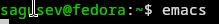
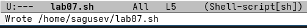
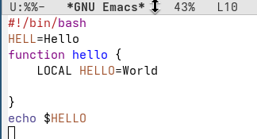
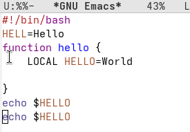
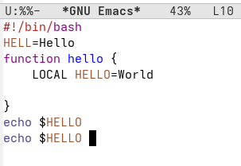
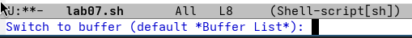
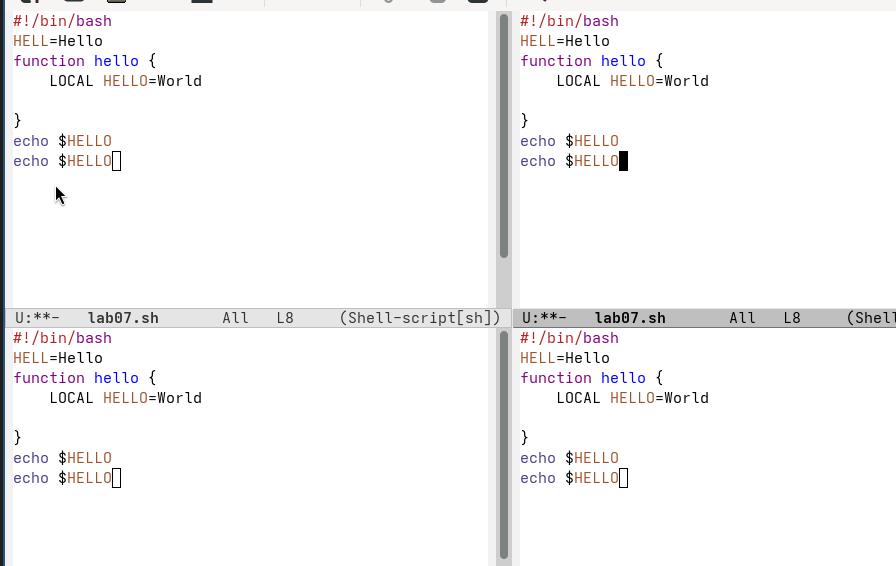
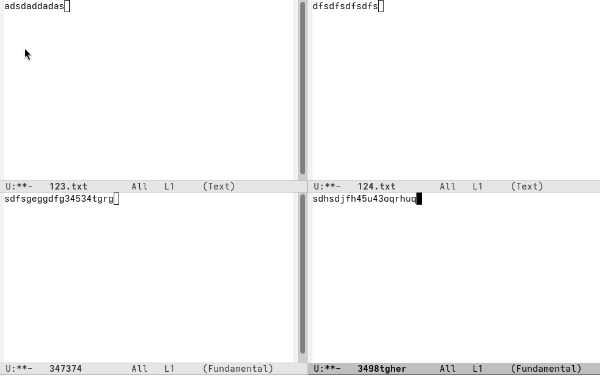
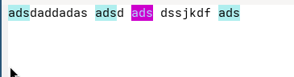

---
## Authors
author:
  name: Гусев Степан Андреевич
  email: 1032242444@rudn.ru
  affiliation:
    - name: Российский университет дружбы народов
      country: Российская Федерация
      postal-code: 117198
      city: Москва
      address: ул. Миклухо-Маклая, д. 6
## Title
title: "Презентация по лабораторной работе №11"
subtitle: "Дисциплина: Архитектура компьютеров и операционные системы"
license: CC BY
date: today
date-format: "YYYY-MM-DD" # Example: 2025-09-06
---

# Информация

##

:::::::::::::: {.columns align=center}
::: {.column width="100%"}

**Презентация по лабораторной работе №11**

---

**Автор:**
Гусев Степан Андреевич

**Преподаватель:**
Кулябов Дмитрий Сергеевич, д.ф.-м.н., профессор кафедры теории вероятностей и кибербезопасности

Российский университет дружбы народов

:::
::::::::::::::

## Докладчик

:::::::::::::: {.columns align=center}
::: {.column width="70%"}

  * Гусев Степан Андреевич
  * Студент программы "Бизнес-информатика"
  * Российский университет дружбы народов им. П. Лумумбы
  * [1032242444@rudn.ru](mailto:1032242444@rudn.ru)
  * <https://github.com/stepagusev>

:::
::: {.column width="30%"}

:::
::::::::::::::

## Цель

Познакомиться с операционной системой Linux. Получить практические навыки работы с редактором Emacs.

## Задание

1) Ознакомиться с теоретическим материалом.
2) Ознакомиться с редактором emacs.
3) Выполнить упражнения.
4) Ответить на контрольные вопросы.

# Выполнение лабораторной работы

## Выполнение лабораторной работы

Открыл emacs.

{#fig-001 width=70%}

## Выполнение лабораторной работы

Создал файл lab07.sh.

{#fig-002 width=70%}

## Выполнение лабораторной работы

Ввёл нужный текст.

{#fig-003 width=70%}

## Выполнение лабораторной работы

Сохранил файл.

{#fig-004 width=70%}

## Выполнение лабораторной работы

Вырезал строку и вставил её в конец файла.

{#fig-005 width=70%}

## Выполнение лабораторной работы

Выделил область текста.

{#fig-006 width=70%}

## Выполнение лабораторной работы

Скопировал её и вставил в конец файла.

{#fig-007 width=70%}

## Выполнение лабораторной работы

Снова выделил эту область и вырезал её.

{#fig-008 width=70%}

## Выполнение лабораторной работы

Отменил последнее действие.

{#fig-009 width=70%}

## Выполнение лабораторной работы

Переместил курсор в начало строки.

{#fig-010 width=70%}

## Выполнение лабораторной работы

Переместил курсор в конец строки.

{#fig-011 width=70%}

## Выполнение лабораторной работы

Переместил курсор в начало буфера.

{#fig-012 width=70%}

## Выполнение лабораторной работы

Переместил курсор в конец буфера.

{#fig-013 width=70%}

## Выполнение лабораторной работы

Вывел список активных буферов на экран.

{#fig-014 width=70%}

## Выполнение лабораторной работы

Переместился во вновь открытое окно и закрыл его.

{#fig-015 width=70%}

## Выполнение лабораторной работы

Поделил фрейм на четыре части.

{#fig-016 width=70%}

## Выполнение лабораторной работы

В каждом окне создал новый буфер и ввёл в них текст.

{#fig-017 width=70%}

## Выполнение лабораторной работы

Переключился в режим поиска, нажав ctrl+s, и нашёл слово.

{#fig-018 width=70%}

## Выполнение лабораторной работы

Переключаюсь между результатами поиска.

{#fig-019 width=70%}

## Выполнение лабораторной работы

Вышел из режима поиска.

{#fig-020 width=70%}

## Выполнение лабораторной работы

Попробовал другой режим поиска, нажав alt+s, o. Этот режим отключается тем, что это поиск по регулярным выражениям.

{#fig-021 width=70%}

# Выводы

## Выводы

Я получил практические навыки работы с редактором Emacs.
