---
## Author
author:
  name: Степан Андреевич Гусев
  email: 1032242444@rudn.ru
  affiliation:
    - name: Российский университет дружбы народов
      country: Российская Федерация
      postal-code: 117198
      city: Москва
      address: ул. Миклухо-Маклая, д. 6

## Title
title: "Отчёт по лабораторной работе №11"
subtitle: "Архитектура компьютеров и операционные системы"
license: "CC BY"
---

# Цель работы

Познакомиться с операционной системой Linux. Получить практические навыки работы с редактором Emacs.

# Задание

1) Ознакомиться с теоретическим материалом.
2) Ознакомиться с редактором emacs.
3) Выполнить упражнения.
4) Ответить на контрольные вопросы.

# Теоретическое введение

Emacs — один из наиболее мощных и широко распространённых редакторов, используемых в мире UNIX. По популярности он соперничает с редактором vi и его клонами. В зависимости от ситуации, Emacs может быть:

- текстовым редактором;
- программой для чтения почты и новостей Usenet;
- интегрированной средой разработки (IDE);
- операционной системой;

Всё это разнообразие достигается благодаря архитектуре Emacs, которая позволяет расширять возможности редактора при помощи языка Emacs Lisp. На языке C написаны лишь самые базовые и низкоуровневые части Emacs, включая полнофункциональный интерпретатор языка Lisp. Таким образом, Emacs имеет встроенный язык программирования, который может использоваться для настройки, расширения и изменения поведения редактора. В действительности, большая часть того редактора, с которым пользователи Emacs работают в наши дни, написана на языке Lisp.

Первая версия редактора Emacs была написана в 70-х годах 20-го столетия Richard Stallman (Ричардом Столманом) как набор макросов для редактора TECO . В дальнейшем, уже будучи основателем Фонда Свободного программного обеспечения Free Software Foundation и проекта GNU, Stallman разработал GNU Emacs в развитие оригинального Emacs и до сих пор сопровождает эту программу. Emacs является одним из старейших редакторов. Он использовался тысячами программистов на протяжении последних 20 с лишним лет, для него создано много дополнительных пакетов расширений. Эти дополнения позволяют делать с помощью Emacs такие вещи, которые Stallman , вероятно, даже не считал возможными в начале своей работы над редактором.

# Выполнение лабораторной работы

Открыл emacs ([рис. @fig-001]).

{#fig-001 width=70%}

Создал файл lab07.sh ([рис. @fig-002]).

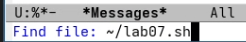{#fig-002 width=70%}

Ввёл нужный текст ([рис. @fig-003]).

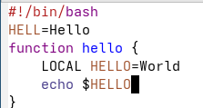{#fig-003 width=70%}

Сохранил файл ([рис. @fig-004]).

{#fig-004 width=70%}

Вырезал строку и вставил её в конец файла ([рис. @fig-005]).

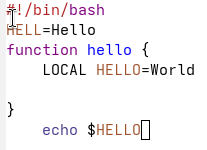{#fig-005 width=70%}

Выделил область текста ([рис. @fig-006]).

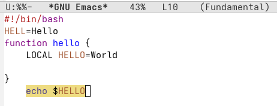{#fig-006 width=70%}

Скопировал её и вставил в конец файла ([рис. @fig-007]).

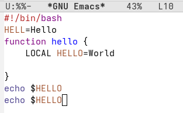{#fig-007 width=70%}

Снова выделил эту область и вырезал её ([рис. @fig-008]).

{#fig-008 width=70%}

Отменил последнее действие ([рис. @fig-009]).

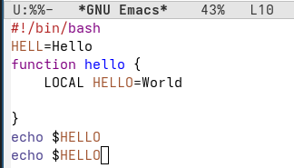{#fig-009 width=70%}

Переместил курсор в начало строки ([рис. @fig-010]).

{#fig-010 width=70%}

Переместил курсор в конец строки ([рис. @fig-011]).

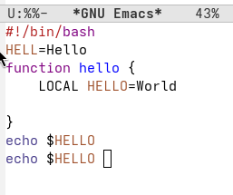{#fig-011 width=70%}

Переместил курсор в начало буфера ([рис. @fig-012]).

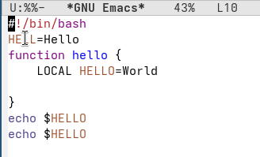{#fig-012 width=70%}

Переместил курсор в конец буфера ([рис. @fig-013]).

{#fig-013 width=70%}

Вывел список активных буферов на экран ([рис. @fig-014]).

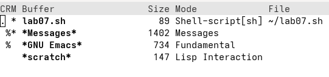{#fig-014 width=70%}

Переместился во вновь открытое окно и закрыл его ([рис. @fig-015]).

{#fig-015 width=70%}

Поделил фрейм на четыре части ([рис. @fig-016]).

{#fig-016 width=70%}

В каждом окне создал новый буфер и ввёл в них текст ([рис. @fig-017]).

{#fig-017 width=70%}

Переключился в режим поиска, нажав ctrl+s, и нашёл слово ([рис. @fig-018]).

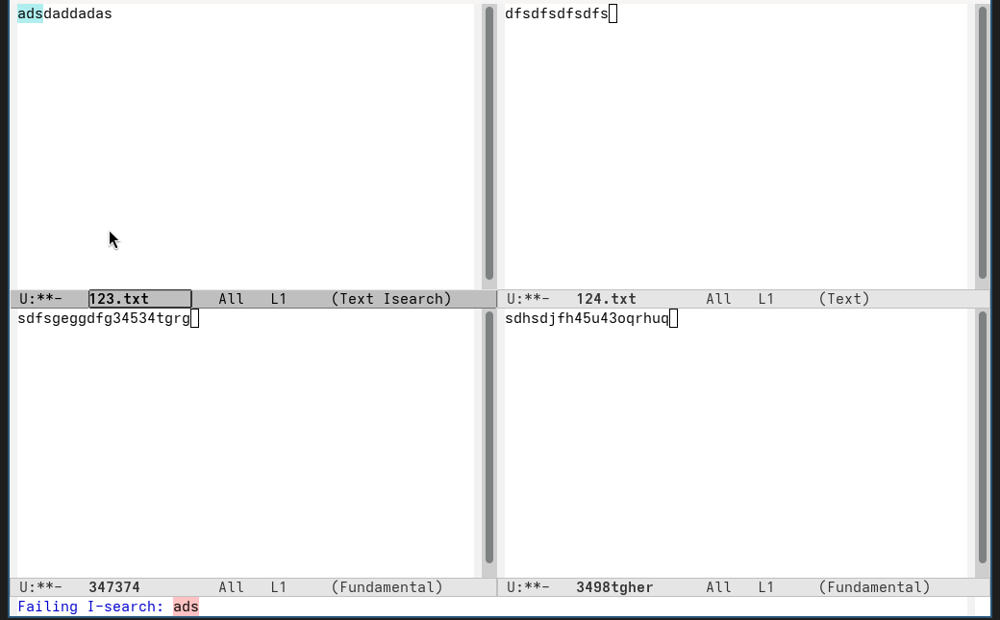{#fig-018 width=70%}

Переключаюсь между результатами поиска ([рис. @fig-019]).

{#fig-019 width=70%}

Вышел из режима поиска ([рис. @fig-020]).

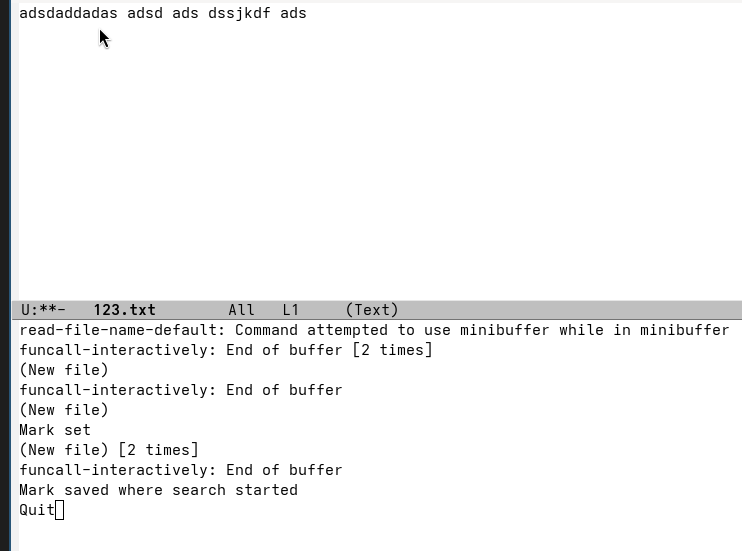{#fig-020 width=70%}

Попробовал другой режим поиска, нажав alt+s, o ([рис. @fig-021]). Этот режим отключается тем, что это поиск по регулярным выражениям.

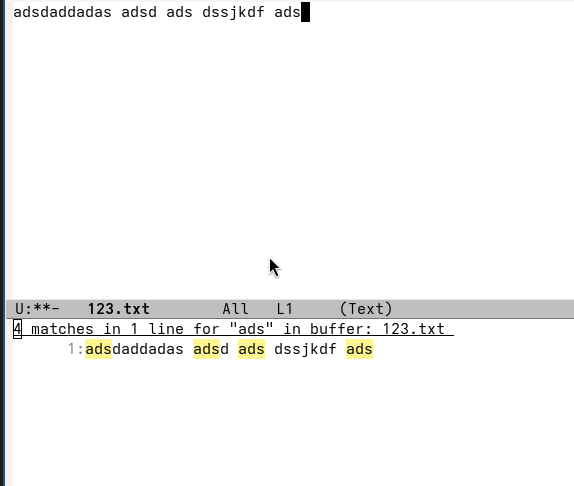{#fig-021 width=70%}

# Выводы

Я получил практические навыки работы с редактором Emacs.

# Ответы на контрольные вопросы

1) Emacs — один из наиболее мощных и широко распространённых редакторов, используемых в мире UNIX. Написан на языке высокого уровня Lisp.

2) Большое разнообразие сложных комбинаций клавиш, которые необходимы для редактирования файла и в принципе для работа с Emacs.

3) Буфер - это объект в виде текста. Окно - это прямоугольная область, в которой отображен буфер.

4) Да, можно.

5) Emacs использует буферы с именами, начинающимися с пробела, для внутренних целей. Отчасти он обращается с буферами с такими именами особенным образом — например, по умолчанию в них не записывается информация для отмены изменений.

6) Ctrl + c, а потом | и Ctrl + c Ctrl + |

7) С помощью команды Ctrl + x 3 (по вертикали) и Ctrl + x 2 (по горизонтали).

8) Настройки emacs хранятся в файле . emacs, который хранится в домашней дирректории пользователя. Кроме этого файла есть ещё папка . emacs.

9) Выполняет функцию стереть, думаю можно переназначить.

10) Для меня удобнее был редактор Emacs, так как у него есть командая оболочка. А vi открывается в терминале, и выглядит своеобразно.

# Список литературы

1. https://esystem.rudn.ru/pluginfile.php/3097179/mod_resource/content/5/009-lab_emacs.pdf
