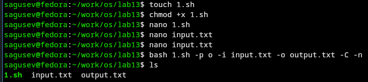
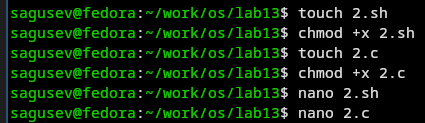
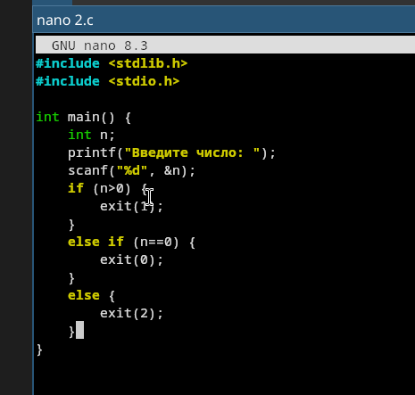
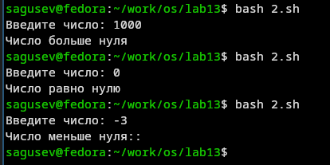
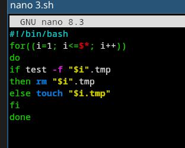

---
## Authors
author:
  name: Гусев Степан Андреевич
  email: 1032242444@rudn.ru
  affiliation:
    - name: Российский университет дружбы народов
      country: Российская Федерация
      postal-code: 117198
      city: Москва
      address: ул. Миклухо-Маклая, д. 6
## Title
title: "Презентация по лабораторной работе №13"
subtitle: "Дисциплина: Архитектура компьютеров и операционные системы"
license: CC BY
date: today
date-format: "YYYY-MM-DD" # Example: 2025-09-06
---

# Информация

##

:::::::::::::: {.columns align=center}
::: {.column width="100%"}

**Презентация по лабораторной работе №13**

---

**Автор:**
Гусев Степан Андреевич

**Преподаватель:**
Кулябов Дмитрий Сергеевич, д.ф.-м.н., профессор кафедры теории вероятностей и кибербезопасности

Российский университет дружбы народов

:::
::::::::::::::

## Докладчик

:::::::::::::: {.columns align=center}
::: {.column width="70%"}

  * Гусев Степан Андреевич
  * Студент программы "Бизнес-информатика"
  * Российский университет дружбы народов им. П. Лумумбы
  * [1032242444@rudn.ru](mailto:1032242444@rudn.ru)
  * <https://github.com/stepagusev>

:::
::: {.column width="30%"}

:::
::::::::::::::

## Цель

Изучить основы программирования в оболочке ОС UNIX. Научится писать более сложные командные файлы с использованием логических управляющих конструкций и циклов.

## Задание

1) Используя команды getopts grep, написать командный файл, который анализирует командную строку с ключами, а затем ищет в указанном файле нужные строки, определяемые ключом -p.
2) Написать на языке Си программу, которая вводит число и определяет, является ли оно больше нуля, меньше нуля или равно нулю. Командный файл должен вызывать эту программу и выдать сообщение о том, какое число было введено.
3) Написать командный файл, создающий указанное число файлов, умеющий удалять все созданные им файлы.
4) Написать командный файл, который с помощью команды tar запаковывает в архив все файлы в указанной директории, изменённые менее недели тому назад.

# Выполнение лабораторной работы

## Скрипт 1

Создал файл 1.sh, дал права на выполнение, ввёл код и запустил скрипт.

{#fig-001 width=70%}

## Скрипт 1

Текст скрипта 1.sh.

{#fig-002 width=70%}

## Скрипт 1

Текст input.txt.

{#fig-003 width=70%}

## Скрипт 1

Результат работы скрипта.

{#fig-004 width=70%}

## Скрипт 2

Создал файл 2.sh, дал права на выполнение, создал файл 2.с, дал права на выполнение.

{#fig-005 width=70%}

## Скрипт 2

Текст скрипта 2.sh.

{#fig-006 width=70%}

## Скрипт 2

Текст кода на Си.

{#fig-007 width=70%}

## Скрипт 2

Запустил скрипт несколько раз, чтобы проверить все варианты.

{#fig-008 width=70%}

## Скрипт 3

Создал файл 3.sh, дал права на выполнение, ввёл код и запустил скрипт.

{#fig-009 width=70%}

## Скрипт 3

Текст скрипта 3.sh.

{#fig-010 width=70%}

## Скрипт 4

Создал файл 4.sh, дал права на выполнение, открыл файл.

{#fig-011 width=70%}

## Скрипт 4

Текст скрипта 4.sh.

{#fig-012 width=70%}

## Скрипт 4

Запустил скрипт и проверил, что всё сработало корректно.

{#fig-013 width=70%}

# Выводы

## Выводы

Я изучил основы программирования в оболочке ОС UNIX и научился писать более сложные командные файлы с использованием логических управляющих конструкций и циклов.
