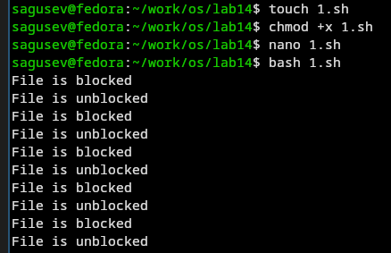
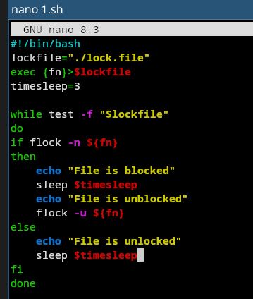
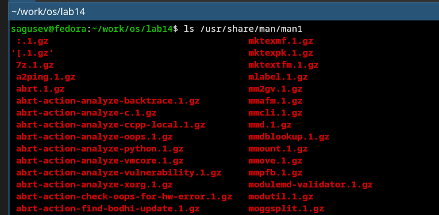
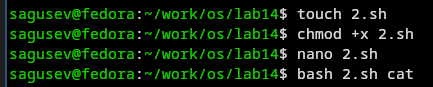
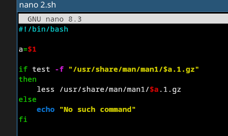
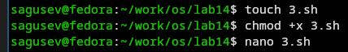
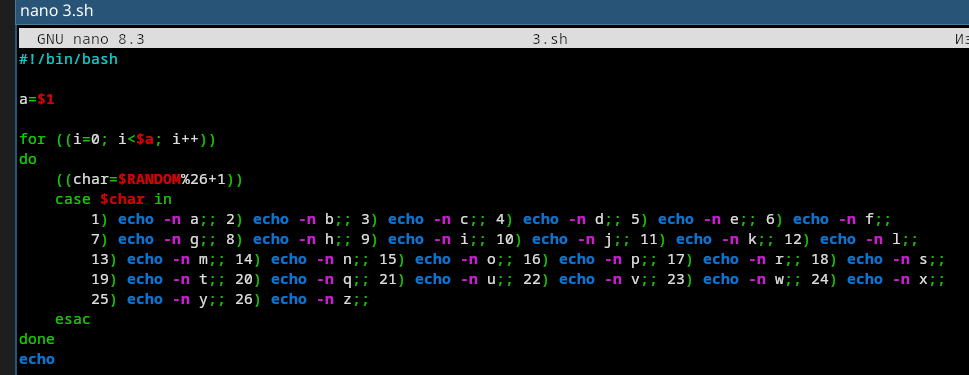

---
## Authors
author:
  name: Гусев Степан Андреевич
  email: 1032242444@rudn.ru
  affiliation:
    - name: Российский университет дружбы народов
      country: Российская Федерация
      postal-code: 117198
      city: Москва
      address: ул. Миклухо-Маклая, д. 6
## Title
title: "Презентация по лабораторной работе №14"
subtitle: "Дисциплина: Архитектура компьютеров и операционные системы"
license: CC BY
date: today
date-format: "YYYY-MM-DD" # Example: 2025-09-06
---

# Информация

##

:::::::::::::: {.columns align=center}
::: {.column width="100%"}

**Презентация по лабораторной работе №14**

---

**Автор:**
Гусев Степан Андреевич

**Преподаватель:**
Кулябов Дмитрий Сергеевич, д.ф.-м.н., профессор кафедры теории вероятностей и кибербезопасности

Российский университет дружбы народов

:::
::::::::::::::

## Докладчик

:::::::::::::: {.columns align=center}
::: {.column width="70%"}

  * Гусев Степан Андреевич
  * Студент программы "Бизнес-информатика"
  * Российский университет дружбы народов им. П. Лумумбы
  * [1032242444@rudn.ru](mailto:1032242444@rudn.ru)
  * <https://github.com/stepagusev>

:::
::: {.column width="30%"}

:::
::::::::::::::

## Цель

Изучить основы программирования в оболочке ОС UNIX. Научится писать более сложные командные файлы с использованием логических управляющих конструкций и циклов.

## Задание

1) Написать командный файл, реализующий упрощённый механизм семафоров. Командный файл должен в течение некоторого времени t1 дожидаться освобождения ресурса, выдавая об этом сообщение, а дождавшись его освобождения, использовать его в течение некоторого времени t2<>t1, также выдавая информацию о том, что ресурс используется соответствующим командным файлом (процессом).
2) Реализовать команду man с помощью командного файла.
3) Используя встроенную переменную $RANDOM, напишите командный файл, генерирующий случайную последовательность букв латинского алфавита.

# Выполнение лабораторной работы

## Первый скрипт

Создал файл 1.sh, дал права на выполнение, ввёл код и запустил скрипт.

{#fig-001 width=70%}

## Первый скрипт

Текст скрипта 1.sh.

{#fig-002 width=70%}

## Второй скрипт

Изучил содержимое каталога /usr/sher/man/man1.

{#fig-003 width=70%}

## Второй скрипт

Создал файл 2.sh, дал права на выполнение.

{#fig-004 width=70%}

## Второй скрипт

Текст скрипта 2.sh.

{#fig-005 width=70%}

## Второй скрипт

После запуска открылось окно со справкой для команды cat.

{#fig-006 width=70%}

## Третий скрипт

Создал файл 3.sh, дал права на выполнение, открыл файл.

{#fig-007 width=70%}

## Третий скрипт

Ввёл текст скрипта 3.sh.

{#fig-008 width=70%}

## Третий скрипт

Запустил скрипт 3 и проверил, что всё сработало корректно.

{#fig-009 width=70%}

# Выводы

## Выводы

Я изучил основы программирования в оболочке ОС UNIX и научился писать более сложные командные файлы с использованием логических управляющих конструкций и циклов.
