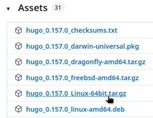
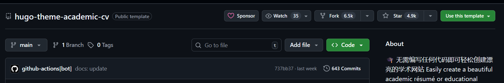
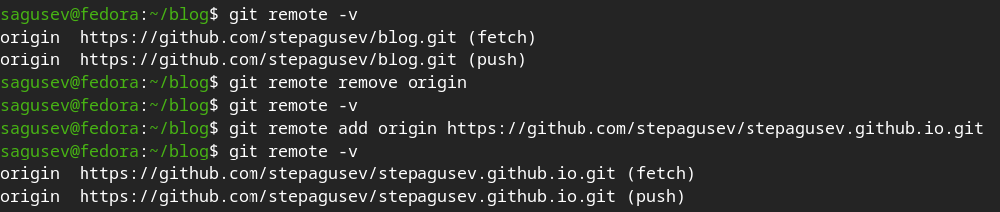
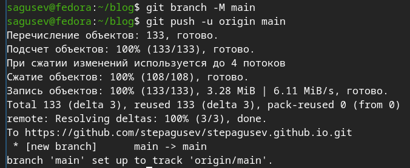
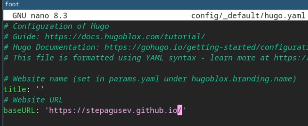
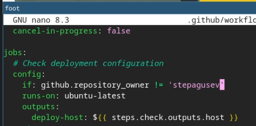
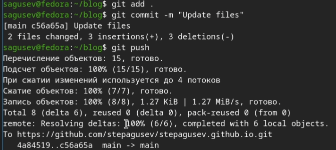
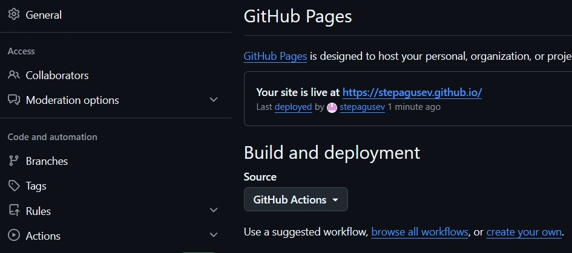

---
## Authors
author:
  name: Гусев Степан Андреевич
  email: 1032242444@rudn.ru
  affiliation:
    - name: Российский университет дружбы народов
      country: Российская Федерация
      postal-code: 117198
      city: Москва
      address: ул. Миклухо-Маклая, д. 6
## Title
title: "Презентация по 1-ому этапу индивидуального проекта"
subtitle: "Дисциплина: Архитектура компьютеров и операционные системы"
license: CC BY
date: today
date-format: "YYYY-MM-DD" # Example: 2025-09-06
---

# Информация

##

:::::::::::::: {.columns align=center}
::: {.column width="100%"}

**Презентация по лабораторной работе №1**

---

**Автор:**
Гусев Степан Андреевич

**Преподаватель:**
Кулябов Дмитрий Сергеевич, д.ф.-м.н., профессор кафедры теории вероятностей и кибербезопасности

Российский университет дружбы народов

:::
::::::::::::::

## Докладчик

:::::::::::::: {.columns align=center}
::: {.column width="70%"}

  * Гусев Степан Андреевич
  * Студент программы "Бизнес-информатика"
  * Российский университет дружбы народов им. П. Лумумбы
  * [1032242444@rudn.ru](mailto:1032242444@rudn.ru)
  * <https://github.com/stepagusev>

:::
::: {.column width="30%"}

:::
::::::::::::::

## Цель

Разместить на Github pages заготовку для персонального сайта, выполнить 1-ый этап индивидуального проекта.

## Задание

1) Установить необходимое программное обеспечение.
2) Скачать шаблон темы сайта.
3) Разместить его на хостинге git.
4) Установить параметр для URLs сайта.
5) Разместить заготовку сайта на Github pages.

# Выполнение этапа индивидуального проекта

## Установка необходимого программного обеспечения

Открыл браузер.

{#fig-001 width=70%}

## Установка необходимого программного обеспечения

Скачал генератор статических сайтов Hugo.

{#fig-002 width=70%}

## Установка необходимого программного обеспечения

Распаковал архив.

{#fig-003 width=70%}

## Установка необходимого программного обеспечения

Переместил Hugo в домашний каталог.

{#fig-004 width=70%}

## Скачивание шаблона темы сайта

Перешёл в репозиторий git с темой сайта и нажал "Use this template".

{#fig-005 width=70%}

## Скачивание шаблона темы сайта

Задал имя для репозитория и создал его.

{#fig-006 width=70%}

## Скачивание шаблона темы сайта

Клонировал репозиторий на виртуальную машину.

{#fig-007 width=70%}

## Размещение сайта на хостинге git

Создал новый пустой репозиторий.

{#fig-008 width=70%}

## Размещение сайта на хостинге git

В папке с клонированным репозиторием удалил связь со старым удалённым репозиторием и добавил связь с новым пустым с помощью git remote.

{#fig-009 width=70%}

## Размещение сайта на хостинге git

Запушил локальный каталог на удалённый репозиторий.

{#fig-010 width=70%}

## Установка параметра для URLs сайта

Открыл файл конфигурации hugo.yaml с помощью текстового редактора nano.

{#fig-011 width=70%}

## Установка параметра для URLs сайта

Заменил параметр Baseurl на свой url и сохранил файл.

{#fig-012 width=70%}

## Установка параметра для URLs сайта

Открыл файл конфигурации deploy.yml.

{#fig-013 width=70%}

## Установка параметра для URLs сайта

Заменил имя пользователя на своё.

{#fig-014 width=70%}

## Установка параметра для URLs сайта

Выгрузил изменения в удалённый репозиторий.

{#fig-016 width=70%}

## Размещение заготовки сайта на Github pages

В настройках репозитория, во вкладке Github pages поменял значение параметра Source на GitHub Actions.

{#fig-017 width=70%}

## Размещение заготовки сайта на Github pages

В GitHub Actions проверил что деплой прошёл успешно.

{#fig-018 width=70%}

## Размещение заготовки сайта на Github pages

Перешёл на сайт и проверил, что он работает.

{#fig-019 width=70%}

# Выводы

## Выводы

Я научился размещать на Github pages заготовку для персонального сайта, тем самым выполнив 1-ый этап индивидуального проекта.

