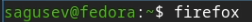
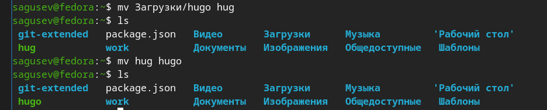
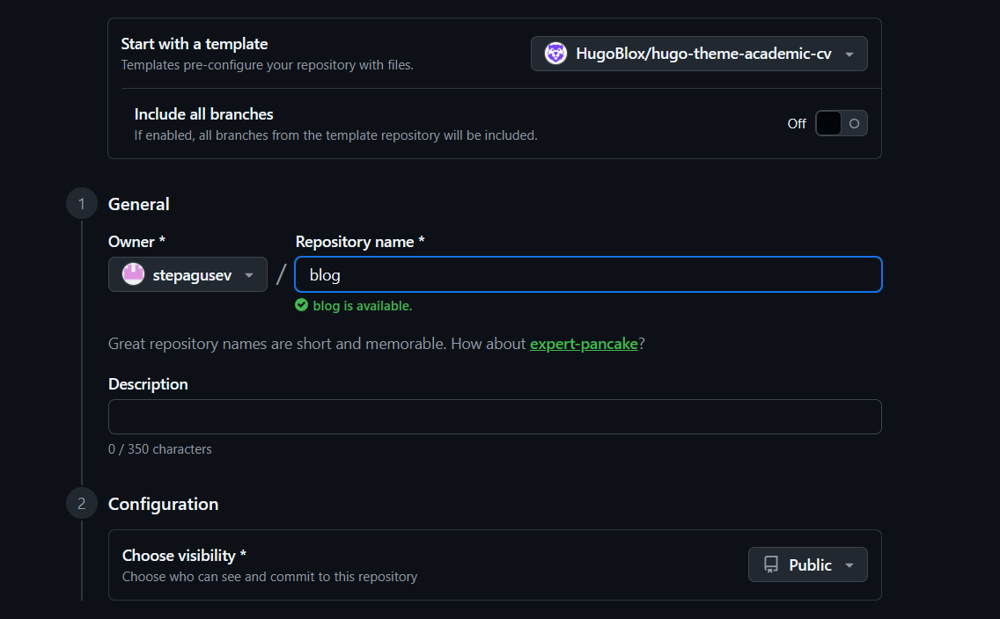
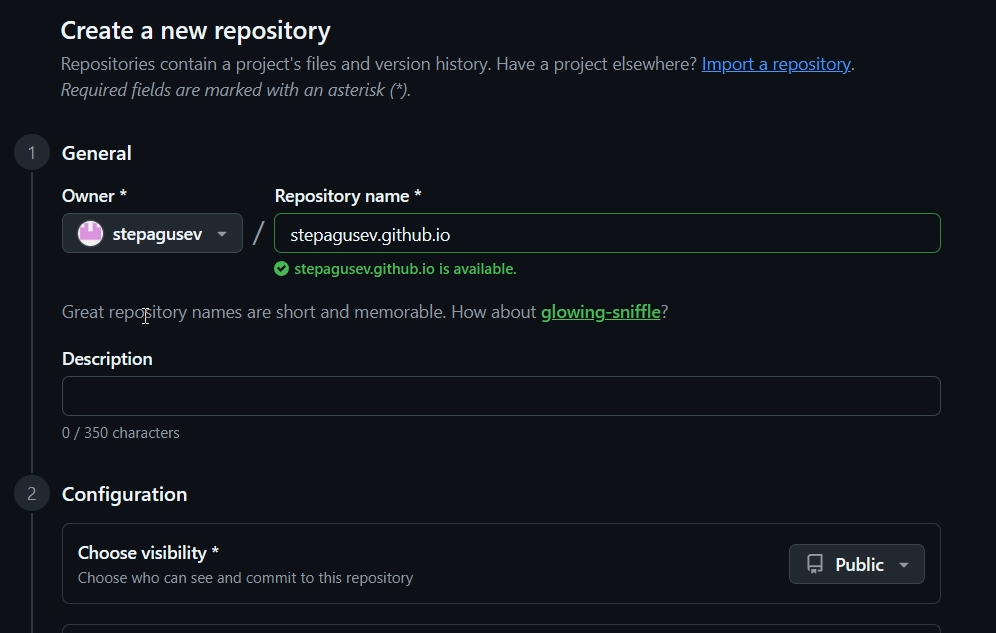
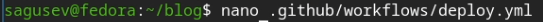
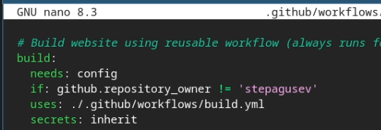
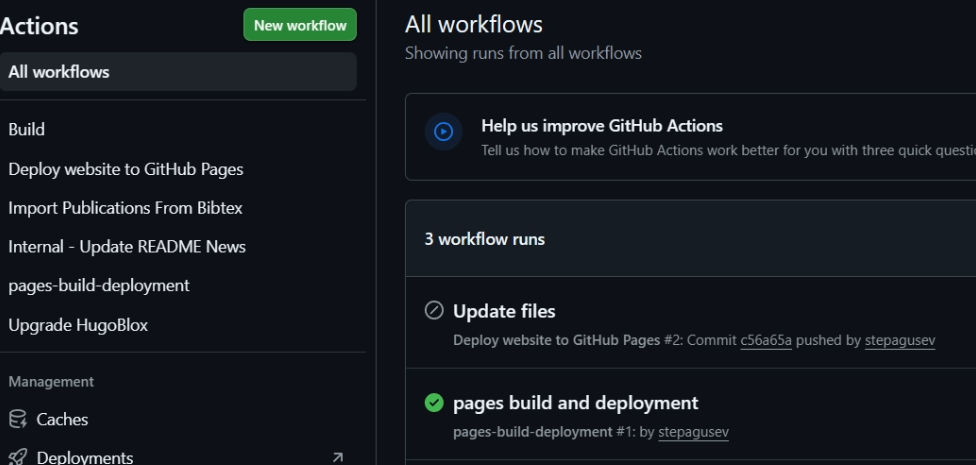
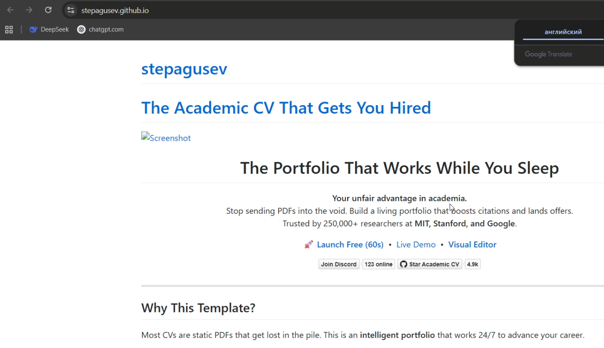

---
## Author
author:
  name: Степан Андреевич Гусев
  email: 1032242444@rudn.ru
  affiliation:
    - name: Российский университет дружбы народов
      country: Российская Федерация
      postal-code: 117198
      city: Москва
      address: ул. Миклухо-Маклая, д. 6

## Title
title: "Отчёт о выполнении 1-ого этапа индивидуального проекта"
subtitle: "Архитектура компьютеров и операционные системы"
license: "CC BY"
---

# Цель работы

Разместить на Github pages заготовку для персонального сайта, выполнить 1-ый этап индивидуального проекта.

# Задание

1) Установить необходимое программное обеспечение.
2) Скачать шаблон темы сайта.
3) Разместить его на хостинге git.
4) Установить параметр для URLs сайта.
5) Разместить заготовку сайта на Github pages.

# Выполнение этапа индивидуального проекта

## Установка необходимого программного обеспечения

Открыл браузер ([рис. @fig-001]).

{#fig-001 width=70%}

Скачал генератор статических сайтов Hugo ([рис. @fig-002]).

{#fig-002 width=70%}

Распаковал архив ([рис. @fig-003]).

{#fig-003 width=70%}

Переместил Hugo в домашний каталог ([рис. @fig-004]).

{#fig-004 width=70%}

## Скачивание шаблона темы сайта

Перешёл в репозиторий git с темой сайта и нажал "Use this template" ([рис. @fig-005]).

{#fig-005 width=70%}

Задал имя для репозитория и создал его ([рис. @fig-006]).

{#fig-006 width=70%}

Клонировал репозиторий на виртуальную машину ([рис. @fig-007]).

{#fig-007 width=70%}

## Размещение сайта на хостинге git

Создал новый пустой репозиторий ([рис. @fig-008]).

{#fig-008 width=70%}

В папке с клонированным репозиторием удалил связь со старым удалённым репозиторием и добавил связь с новым пустым с помощью git remote ([рис. @fig-009]).

{#fig-009 width=70%}

Запушил локальный каталог на удалённый репозиторий ([рис. @fig-010]).

{#fig-010 width=70%}

## Установка параметра для URLs сайта.

Открыл файл конфигурации hugo.yaml с помощью текстового редактора nano ([рис. @fig-011]).

{#fig-011 width=70%}

Заменил параметр Baseurl на свой url и сохранил файл ([рис. @fig-012]).

{#fig-012 width=70%}

Открыл файл конфигурации deploy.yml ([рис. @fig-013]).

{#fig-013 width=70%}

Заменил имя пользователя на своё ([рис. @fig-014]), ([рис. @fig-015]).

{#fig-014 width=70%}

{#fig-015 width=70%}

Выгрузил изменения в удалённый репозиторий ([рис. @fig-016]).

{#fig-016 width=70%}

## Размещение заготовки сайта на Github pages

В настройках репозитория, во вкладке Github pages поменял значение параметра Source на GitHub Actions ([рис. @fig-017]).

{#fig-017 width=70%}

В GitHub Actions проверил что деплой прошёл успешно ([рис. @fig-018]).

{#fig-018 width=70%}

Перешёл на сайт и проверил, что он работает ([рис. @fig-019]).

{#fig-019 width=70%}

# Выводы

Я научился размещать на Github pages заготовку для персонального сайта, тем самым выполнив 1-ый этап индивидуального проекта.

# Список литературы

1) https://esystem.rudn.ru/mod/page/view.php?id=1358311
2) https://esystem.rudn.ru/mod/page/view.php?id=1358312
