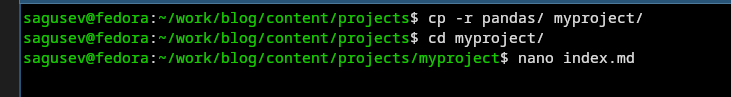
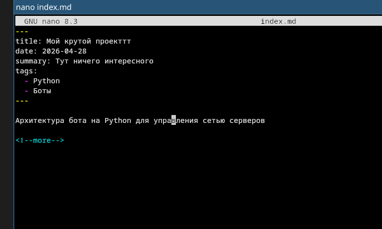

---
## Authors
author:
  name: Гусев Степан Андреевич
  email: 1032242444@rudn.ru
  affiliation:
    - name: Российский университет дружбы народов
      country: Российская Федерация
      postal-code: 117198
      city: Москва
      address: ул. Миклухо-Маклая, д. 6
## Title
title: "Презентация по 5-ому этапу индивидуального проекта"
subtitle: "Дисциплина: Архитектура компьютеров и операционные системы"
license: CC BY
date: today
date-format: "YYYY-MM-DD" # Example: 2025-09-06
---

# Информация

##

:::::::::::::: {.columns align=center}
::: {.column width="100%"}

**Презентация по 5-ому этапу индивидуального проекта**

---

**Автор:**
Гусев Степан Андреевич

**Преподаватель:**
Кулябов Дмитрий Сергеевич, д.ф.-м.н., профессор кафедры теории вероятностей и кибербезопасности

Российский университет дружбы народов

:::
::::::::::::::

## Докладчик

:::::::::::::: {.columns align=center}
::: {.column width="70%"}

  * Гусев Степан Андреевич
  * Студент программы "Бизнес-информатика"
  * Российский университет дружбы народов им. П. Лумумбы
  * [1032242444@rudn.ru](mailto:1032242444@rudn.ru)
  * <https://github.com/stepagusev>

:::
::: {.column width="30%"}

:::
::::::::::::::

## Цель

Продолжить работу над 5-ым этапом индивидуального проекта, сделать записи для персональных проектов.

## Задание

1) Сделать записи для персональных проектов.
2) Создать пост по прошедшей неделе.
3) Создать пост на тему по выбору.

# Выполнение этапа индивидуального проекта

## Создание записей для персональных проектов

В content/projects скопировал pandas в myproject, открыл index.md в myproject.

{#fig-001 width=70%}

## Создание записей для персональных проектов

Добавил информацию о проекте.

{#fig-002 width=70%}

## Создание поста по прошедшей неделе

В каталоге content/blog скопировал 3st-week в 4st-week, открыл index.md в 4st-week.

{#fig-003 width=70%}

## Создание поста по прошедшей неделе

В index.md вписал информацию о посте и сам пост.

{#fig-004 width=70%}

## Создание поста по оформлению отчётов

В каталоге content/blog скопировал markup-languages в science-languages, открыл index.md в science-languages.

{#fig-005 width=70%}

## Создание поста по оформлению отчётов

В index.md вписал информацию о посте и сам пост.

{#fig-006 width=70%}

# Выводы

## Выводы

Сделал записи для персональных проектов, создал 2 поста, тем самым выполнив 5-ый этап индивидуального проекта.
