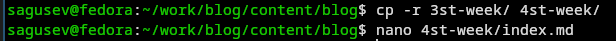
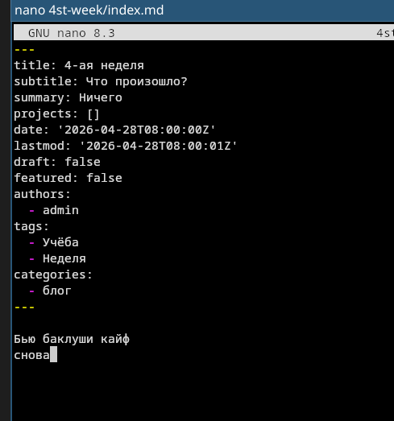
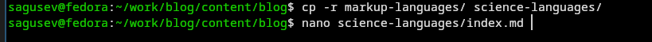
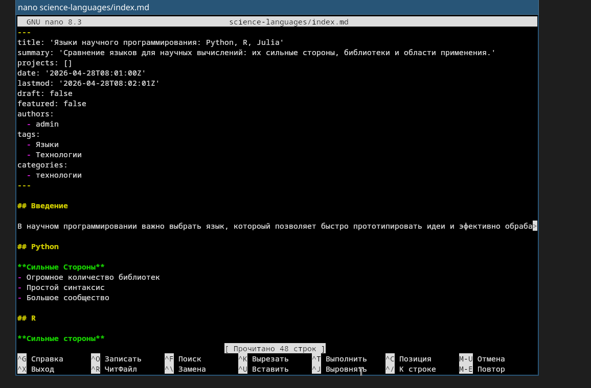

---
## Author
author:
  name: Степан Андреевич Гусев
  email: 1032242444@rudn.ru
  affiliation:
    - name: Российский университет дружбы народов
      country: Российская Федерация
      postal-code: 117198
      city: Москва
      address: ул. Миклухо-Маклая, д. 6

## Title
title: "Отчёт о выполнении 5-ого этапа индивидуального проекта"
subtitle: "Архитектура компьютеров и операционные системы"
license: "CC BY"
---

# Цель работы

Продолжить работу над 5-ым этапом индивидуального проекта, сделать записи для персональных проектов.

# Теоретическое введение

Hugo — генератор статических страниц для интернета.

Коротко: что такое статические сайты 1. Статические сайты состоят из уже готовых HTML-страниц. 2. Эти страницы собираются заранее, а не готовятся для пользователя «на лету». Для этого используют генераторы статичных сайтов. 3. Так как это почти чистый HTML, то такие сайты быстрее загружаются и их проще переносить с сервера на сервер. 4. Минус: если нужно что-то обновить на странице, то сначала это правят в исходном файле, а потом запускают обновление в генераторе. 5. Ещё минус: такие страницы не подходят для интернет-магазинов или сайтов с личным кабинетом, потому что в статике нельзя сформировать страницу для каждого отдельного пользователя.

# Задание

1) Сделать записи для персональных проектов.
2) Создать пост по прошедшей неделе.
3) Создать пост на тему по выбору.

# Выполнение этапа индивидуального проекта

## Создание записей для персональных проектов

В content/projects скопировал pandas в myproject, открыл index.md в myproject ([рис. @fig-001]).

{#fig-001 width=70%}

Добавил информацию о проекте ([рис. @fig-002]).

{#fig-002 width=70%}

## Создание поста по прошедшей неделе

В каталоге content/blog скопировал 3st-week в 4st-week, открыл index.md в 4st-week ([рис. @fig-003]).

{#fig-003 width=70%}

В index.md вписал информацию о посте и сам пост ([рис. @fig-004]).

{#fig-004 width=70%}

## Создание поста по оформлению отчётов

В каталоге content/blog скопировал markup-languages в science-languages, открыл index.md в science-languages ([рис. @fig-005]).

{#fig-005 width=70%}

В index.md вписал информацию о посте и сам пост ([рис. @fig-006]).

{#fig-006 width=70%}

# Выводы

Сделал записи для персональных проектов, создал 2 поста, тем самым выполнив 5-ый этап индивидуального проекта.

# Список литературы

1) https://esystem.rudn.ru/mod/page/view.php?id=1358311
2) https://esystem.rudn.ru/mod/page/view.php?id=1358312
